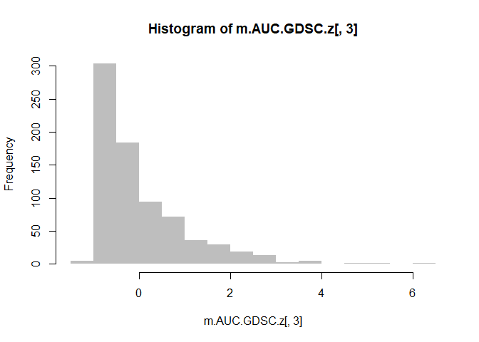

Processing GDSC drug response and functional genomics data
================
John P. Lloyd
16 September 2019

  - [Purpose](#purpose)
  - [Import utilities](#import-utilities)
  - [Section 1: Drug response](#section-1-drug-response)
      - [Initial data import](#initial-data-import)
      - [Develop drug X cell line
        matrix](#develop-drug-x-cell-line-matrix)
      - [Clean up cell line IDs](#clean-up-cell-line-ids)
      - [Convert AUC to 1-AUC](#convert-auc-to-1-auc)
      - [Z-transform drug response
        data](#z-transform-drug-response-data)
      - [Save cleaned up and transcformed
        data](#save-cleaned-up-and-transcformed-data)
      - [Filter to drugs in TNBC
        dataset](#filter-to-drugs-in-tnbc-dataset)
  - [Section 2: Cell line tissues and
    IDs](#section-2-cell-line-tissues-and-ids)
      - [Import cell line annotations](#import-cell-line-annotations)
      - [Clean up cell line names](#clean-up-cell-line-names)
      - [Save clean cell line version](#save-clean-cell-line-version)
  - [Section 3: RNA expression data](#section-3-rna-expression-data)
      - [Initial data import](#initial-data-import-1)
      - [Replace COSMIC IDs with cell line
        names](#replace-cosmic-ids-with-cell-line-names)
      - [Replace gene symbols with ENSG
        IDs](#replace-gene-symbols-with-ensg-ids)
      - [Cell lines in common among tissue, drug, and RNA
        data](#cell-lines-in-common-among-tissue-drug-and-rna-data)

# Purpose

Provide a reproducible description of the processing of drug response
and functional genomics data downloaded from the GDSC cell line
database.

# Import utilities

``` r
util <- "C:/Users/johnp/OneDrive/_Projects/R_utils.R"
#fn <- "F0_preprocess_fn.R"

source(util)
#source(fn)
```

# Section 1: Drug response

Drug response data was provided as an Excel spreadsheet that could be
downloaded directly from cancerrxgene.org (part of GDSC database)
<https://www.cancerrxgene.org/downloads/bulk_download> \> Drug Screening
- IC50s \> GDSC2-dataset

Direct link to file:
<ftp://ftp.sanger.ac.uk/pub/project/cancerrxgene/releases/release-8.0/GDSC1_fitted_dose_response_17Jul19.xlsx>

The drug response file was from the 8.0 release (file uploaded: 18 July
2019) and downloaded by JPL on 16 September 2019.

The spreadsheet was opened in Excel and saved as a tab-delimited text
file, as I find fewer hiccups when importing text files into R. No
changes were made to the original spreadsheet file (other than
conversion to text file).

## Initial data import

``` r
FILE.drug_response <- "../data/GDSC/0_original_retrievals/GDSC2_fitted_dose_response_17Jul19.txt"
m.drug_response <- read.table( file = FILE.drug_response, header = T, sep = "\t", comment.char = "", stringsAsFactors = F )

dim(m.drug_response)
```

    ## [1] 118595     19

``` r
head(m.drug_response)
```

    ##   DATASET NLME_RESULT_ID NLME_CURVE_ID COSMIC_ID CELL_LINE_NAME SANGER_MODEL_ID
    ## 1   GDSC2            262      12605935    909751           SW48       SIDM00837
    ## 2   GDSC2            262      12605949    905962          SW620       SIDM00841
    ## 3   GDSC2            262      12605963    910927         CAL-51       SIDM00933
    ## 4   GDSC2            262      12605996    908442       NCI-H508       SIDM00777
    ## 5   GDSC2            262      12606017    909740        SNU-C2B       SIDM00781
    ## 6   GDSC2            262      12606031    909718        SK-CO-1       SIDM01096
    ##   TCGA_DESC DRUG_ID    DRUG_NAME PUTATIVE_TARGET    PATHWAY_NAME COMPANY_ID
    ## 1    COREAD    1003 Camptothecin            TOP1 DNA replication       1046
    ## 2    COREAD    1003 Camptothecin            TOP1 DNA replication       1046
    ## 3      BRCA    1003 Camptothecin            TOP1 DNA replication       1046
    ## 4    COREAD    1003 Camptothecin            TOP1 DNA replication       1046
    ## 5    COREAD    1003 Camptothecin            TOP1 DNA replication       1046
    ## 6    COREAD    1003 Camptothecin            TOP1 DNA replication       1046
    ##   WEBRELEASE MIN_CONC MAX_CONC   LN_IC50      AUC     RMSE   Z_SCORE
    ## 1          Y  9.8e-05      0.1 -3.683719 0.706775 0.126397 -0.765768
    ## 2          Y  9.8e-05      0.1 -3.004225 0.775083 0.096246 -0.468137
    ## 3          Y  9.8e-05      0.1 -3.556128 0.767213 0.086042 -0.709881
    ## 4          Y  9.8e-05      0.1 -3.218983 0.730769 0.100553 -0.562205
    ## 5          Y  9.8e-05      0.1  0.686464 0.921919 0.080253  1.148459
    ## 6          Y  9.8e-05      0.1 -5.334952 0.551439 0.138997 -1.489041

``` r
#saveRDS( object = m.drug_response, file = "../data/GDSC/GDSC2_fitted_dose_response_17Jul19.RDS" )

keep_names.IC50_AUC <- c( "CELL_LINE_NAME", "TCGA_DESC", "DRUG_NAME", "PUTATIVE_TARGET", "PATHWAY_NAME", "LN_IC50", "AUC", "RMSE" )
m.drug_response.IC50_AUC <- m.drug_response[ keep_names.IC50_AUC ]

dim(m.drug_response.IC50_AUC)
```

    ## [1] 118595      8

``` r
head(m.drug_response.IC50_AUC)
```

    ##   CELL_LINE_NAME TCGA_DESC    DRUG_NAME PUTATIVE_TARGET    PATHWAY_NAME
    ## 1           SW48    COREAD Camptothecin            TOP1 DNA replication
    ## 2          SW620    COREAD Camptothecin            TOP1 DNA replication
    ## 3         CAL-51      BRCA Camptothecin            TOP1 DNA replication
    ## 4       NCI-H508    COREAD Camptothecin            TOP1 DNA replication
    ## 5        SNU-C2B    COREAD Camptothecin            TOP1 DNA replication
    ## 6        SK-CO-1    COREAD Camptothecin            TOP1 DNA replication
    ##     LN_IC50      AUC     RMSE
    ## 1 -3.683719 0.706775 0.126397
    ## 2 -3.004225 0.775083 0.096246
    ## 3 -3.556128 0.767213 0.086042
    ## 4 -3.218983 0.730769 0.100553
    ## 5  0.686464 0.921919 0.080253
    ## 6 -5.334952 0.551439 0.138997

``` r
# https://www.cancerrxgene.org/faq
# "Where the RMSE is > 0.3 the fit is considered poor and the results have been filtered from further analysis."
length(which(m.drug_response.IC50_AUC[,8] > 0.3))
```

    ## [1] 0

``` r
# CANCER TYPES
length(unique(m.drug_response.IC50_AUC[,2]))
```

    ## [1] 32

``` r
unique(m.drug_response.IC50_AUC[,2])
```

    ##  [1] "COREAD"       "BRCA"         "UNCLASSIFIED" "BLCA"         "OV"          
    ##  [6] "DLBC"         "GBM"          "SKCM"         "HNSC"         "NB"          
    ## [11] "LUAD"         "PRAD"         "STAD"         "LUSC"         "MM"          
    ## [16] "MESO"         "LAML"         "PAAD"         "ESCA"         "THCA"        
    ## [21] "MB"           "ALL"          "LIHC"         "SCLC"         "KIRC"        
    ## [26] "LCML"         "LGG"          "UCEC"         "ACC"          "CESC"        
    ## [31] "CLL"          ""

``` r
# DRUG TABLE
drug_table <- table(m.drug_response.IC50_AUC[,3])
drug_table
```

    ## 
    ##           5-Fluorouracil                   ABT737                 Acetalax 
    ##                      807                      752                      729 
    ##                 Afatinib              Afuresertib                 AGI-5198 
    ##                      807                      752                      753 
    ##                 AGI-6780                Alisertib                Alpelisib 
    ##                      729                      731                      805 
    ##                  AMG-319                  AT13148                 Axitinib 
    ##                      748                      745                       50 
    ##                   AZ6102                    AZ960                  AZD3759 
    ##                      746                      726                      761 
    ##                  AZD4547                  AZD5363                  AZD5582 
    ##                      758                      753                      717 
    ##                  AZD6482                  AZD6738                  AZD7762 
    ##                       48                      753                      765 
    ##                  AZD8055                  AZD8186             BDP-00009066 
    ##                       96                      753                      753 
    ##                  BI-2536                BIBR-1532               BMS-345541 
    ##                       45                      750                      729 
    ##               BMS-536924               BMS-754807               Bortezomib 
    ##                      753                       46                      757 
    ##             BPD-00008900               Buparlisib             Camptothecin 
    ##                      753                      753                      809 
    ##               Carmustine                Cediranib                Cisplatin 
    ##                      729                      753                      769 
    ##               Crizotinib         Cyclophosphamide               Cytarabine 
    ##                      738                      752                      753 
    ##                 CZC24832               Dabrafenib             Dactinomycin 
    ##                      729                      758                     1470 
    ##               Dactolisib                Daporinad                Dasatinib 
    ##                      753                      382                      761 
    ##          Dihydrorotenone               Dinaciclib                Docetaxel 
    ##                      727                      728                     1446 
    ##              Doramapimod               Elephantin               Entinostat 
    ##                       47                      729                      736 
    ##            Entospletinib               Epirubicin                EPZ004777 
    ##                      729                      753                      802 
    ##                  EPZ5676                Erlotinib              Fludarabine 
    ##                      802                      753                      729 
    ##                Foretinib              Fulvestrant      Gallibiscoquinazole 
    ##                      751                     1494                      729 
    ##                  GDC0810                Gefitinib              Gemcitabine 
    ##                      753                      753                      757 
    ##                  GNE-317              GSK1904529A              GSK2578215A 
    ##                      739                      802                      753 
    ##               GSK2606414               GSK269962A                   GSK343 
    ##                      722                       49                      728 
    ##                   GSK591                I-BET-762                   I-BRD9 
    ##                      745                      728                      753 
    ##                Ibrutinib              Ipatasertib               Irinotecan 
    ##                      728                      753                      802 
    ##                    IWP-2                      JQ1 KRAS (G12C) Inhibitor-12 
    ##                      728                       48                      729 
    ##                 KU-55933                Lapatinib                   LCL161 
    ##                       49                      758                      728 
    ##              Leflunomide                   LGK974               Linsitinib 
    ##                      729                      805                      805 
    ##                   LJI308               Luminespib                LY2109761 
    ##                      746                      805                      729 
    ##                     MIM1                   MIRA-1                    Mirin 
    ##                      753                      752                      729 
    ##             Mitoxantrone                  MK-1775                  MK-2206 
    ##                      729                      771                      772 
    ##                  MK-8776                    ML323                    MN-64 
    ##                      750                      729                      729 
    ##               Navitoclax               Nelarabine                Nilotinib 
    ##                      751                      728                      758 
    ##                Niraparib                   NU7441            Nutlin-3a (-) 
    ##                      729                       48                      774 
    ##               NVP-ADW742       Obatoclax Mesylate                     OF-1 
    ##                      753                      729                      729 
    ##                 Olaparib                  OSI-027              Osimertinib 
    ##                      763                      265                      753 
    ##                   OTX015              Oxaliplatin                   P22077 
    ##                      729                     1532                      753 
    ##               Paclitaxel              Palbociclib                PCI-34051 
    ##                      758                      771                      729 
    ##                PD0325901                 PD173074             Pevonedistat 
    ##                      805                      759                      751 
    ##               PF-4708671                     PFI3          Picolinici-acid 
    ##                       49                      729                      729 
    ##               Pictilisib                 PLX-4720  Podophyllotoxin bromide 
    ##                      767                      798                      729 
    ##               PRIMA-1MET                PRT062607             Pyridostatin 
    ##                      729                      729                      751 
    ##                Rapamycin               Ribociclib                  RO-3306 
    ##                      745                       47                       49 
    ##              Ruxolitinib                  RVX-208               Sabutoclax 
    ##                      729                      728                      727 
    ##                Sapatinib              Savolitinib                 SB216763 
    ##                      805                      752                       96 
    ##                 SB505124                SCH772984     Sepantronium bromide 
    ##                       47                      805                      753 
    ##                Sinularin                Sorafenib              Talazoparib 
    ##                      729                      758                      750 
    ##                Tamoxifen                Taselisib  Telomerase Inhibitor IX 
    ##                      757                      806                      753 
    ##             Temozolomide               Teniposide                Topotecan 
    ##                      751                      729                      729 
    ##               Tozasertib               Trametinib              Ulixertinib 
    ##                       49                      772                     1503 
    ##                   UMI-77               Uprosertib                   VE-822 
    ##                      753                     1481                      729 
    ##                    VE821               Venetoclax              Vinblastine 
    ##                      744                      757                      752 
    ##              Vincristine              Vinorelbine               Vorinostat 
    ##                      727                      751                      759 
    ##                   VX-11e           Wee1 Inhibitor                 WEHI-539 
    ##                      746                      756                      753 
    ##                    WIKI4                  Wnt-C59                   WZ4003 
    ##                      752                      729                      729 
    ##                   XAV939                 YK-4-279                 ZM447439 
    ##                      729                      753                       48 
    ##              Zoledronate 
    ##                      729

``` r
length(drug_table)
```

    ## [1] 169

``` r
# TOTAL # OF CELL LINES
length(unique(m.drug_response.IC50_AUC[,1]))
```

    ## [1] 810

``` r
# Full drug X cell line matrix should be 169 X 810
```

## Develop drug X cell line matrix

The drug response data in the original file are provided in a single
column for all drugs, while the drug is provided in a separate column. I
will next convert this single column into a matrix. Note that there are
810 unique cell lines, not all of which have response data for each drug
so NAs will need to be inserted for missing data.

The function to perform the conversion is here:

``` r
convert_drug_response_column <- function( X, cell_line_index, drug_index, response_index){
  
  # head(m.drug_response.IC50_AUC)
  # X <- m.drug_response.IC50_AUC
  # cell_line_index <- 1
  # drug_index <- 3
  # response_index <- 6
  
  full_cell_lines <- sort(unique(X[,cell_line_index]))
  full_cell_lines
  length(full_cell_lines)
  
  full_drugs <- unique(X[,drug_index])
  full_drugs
  length(full_drugs)
  
  df_response <- data.frame( row.names = full_cell_lines )
  for(i in 1:length(full_drugs)){
    drug <- full_drugs[i]
    drug
    
    drug_i <- which(X[,drug_index] == drug)
    
    name_vec <- X[ drug_i, cell_line_index ]
    drug_vec <- X[ drug_i, drug_index ]
    response_vec <- X[ drug_i, response_index ]
    
    length(name_vec)
    
    head(name_vec)
    unique(drug_vec)
    head(response_vec)
    
    names(response_vec) <- name_vec
    
    head(response_vec)
    
    if(length(name_vec) < length(full_cell_lines)){
      missing_IDs <- setdiff(full_cell_lines, name_vec)
      missing_vec <- rep( NA, length(missing_IDs) )
      names(missing_vec) <- missing_IDs
      head(missing_vec)
      
      response_vec <- c( response_vec, missing_vec )
    }
    
    head(response_vec)
    tail(response_vec)
    
    response_vec <- response_vec[ full_cell_lines ]
    
    all.equal( row.names(df_response), names(response_vec) )
    
    df_response <- cbind( df_response, response_vec )
    names(df_response)[i] <- drug
    
    head(df_response)
  }
  
  #corner(df_response)
  
  return(df_response)
}
```

The convert\_drug\_response\_column() function is applied to get the
drug X cell line matrix:

``` r
head(m.drug_response.IC50_AUC)
```

    ##   CELL_LINE_NAME TCGA_DESC    DRUG_NAME PUTATIVE_TARGET    PATHWAY_NAME
    ## 1           SW48    COREAD Camptothecin            TOP1 DNA replication
    ## 2          SW620    COREAD Camptothecin            TOP1 DNA replication
    ## 3         CAL-51      BRCA Camptothecin            TOP1 DNA replication
    ## 4       NCI-H508    COREAD Camptothecin            TOP1 DNA replication
    ## 5        SNU-C2B    COREAD Camptothecin            TOP1 DNA replication
    ## 6        SK-CO-1    COREAD Camptothecin            TOP1 DNA replication
    ##     LN_IC50      AUC     RMSE
    ## 1 -3.683719 0.706775 0.126397
    ## 2 -3.004225 0.775083 0.096246
    ## 3 -3.556128 0.767213 0.086042
    ## 4 -3.218983 0.730769 0.100553
    ## 5  0.686464 0.921919 0.080253
    ## 6 -5.334952 0.551439 0.138997

``` r
m.IC50.GDSC <- convert_drug_response_column(X = m.drug_response.IC50_AUC, cell_line_index = 1, drug_index = 3, response_index = 6)
m.AUC.GDSC <- convert_drug_response_column(X = m.drug_response.IC50_AUC, cell_line_index = 1, drug_index = 3, response_index = 7)

dim(m.IC50.GDSC)
```

    ## [1] 810 169

``` r
corner(m.IC50.GDSC)
```

    ##          Camptothecin Vinblastine Cisplatin Cytarabine Docetaxel Gefitinib
    ## 22RV1       -3.088959   -4.427017  3.780543   4.054741 -3.740801  4.226509
    ## 23132-87    -3.287031   -4.797669  3.945475   0.092905 -5.670911  1.892283
    ## 42-MG-BA    -2.866439   -4.758450  2.669456   1.090188 -5.125669  4.077029
    ## 5637        -2.179687   -4.025469  2.108244   2.731311 -6.047125  2.003978
    ## 639-V       -5.115794   -3.974135  0.650567   2.809281 -5.428906  2.603784
    ## 647-V       -4.388052   -1.807267  1.404071   1.172735 -4.989264  3.690247
    ## 697         -5.005254   -6.322124 -0.109080  -5.327608 -6.833859  2.314801
    ## 769-P       -2.136084   -4.058359  3.322275   0.570417 -3.872181  1.447769
    ## 786-0       -3.500020   -4.172036  1.537941   0.876038 -5.343272  4.021185
    ## 8-MG-BA     -4.585322   -5.089616  1.907037  -0.472235 -5.526080  2.543839
    ##          Navitoclax Vorinostat Nilotinib Olaparib
    ## 22RV1      4.134429   0.875139  4.104886 5.464438
    ## 23132-87   0.603895   0.855746  3.791602 5.103018
    ## 42-MG-BA   2.559374   1.844368  2.095185 3.304224
    ## 5637       3.152027   1.500778  4.826558 4.496365
    ## 639-V      1.337486   2.779226  4.019070 2.738660
    ## 647-V      1.629850   1.932135  4.784731 1.882621
    ## 697       -1.926127  -0.144785  1.304726 0.330048
    ## 769-P      1.230697   1.159319  1.458889 4.598261
    ## 786-0      1.580587   2.246663  3.877129 3.648327
    ## 8-MG-BA    2.380413   1.317949  2.735153 1.909974

``` r
dim(m.AUC.GDSC)
```

    ## [1] 810 169

``` r
corner(m.AUC.GDSC)
```

    ##          Camptothecin Vinblastine Cisplatin Cytarabine Docetaxel Gefitinib
    ## 22RV1        0.774481    0.645841  0.939831   0.969894  0.876482  0.972662
    ## 23132-87     0.780213    0.616308  0.963992   0.815101  0.750281  0.930267
    ## 42-MG-BA     0.818728    0.621155  0.920477   0.889372  0.802960  0.983684
    ## 5637         0.843498    0.686687  0.863504   0.937618  0.692452  0.909757
    ## 639-V        0.581540    0.719171  0.788263   0.970196  0.785841  0.965316
    ## 647-V        0.665022    0.896634  0.843513   0.895707  0.816278  0.979348
    ## 697          0.606113    0.419908  0.732097   0.157827  0.641142  0.987881
    ## 769-P        0.876485    0.702505  0.948162   0.855970  0.898025  0.911557
    ## 786-0        0.757500    0.686938  0.849529   0.872675  0.780297  0.981743
    ## 8-MG-BA      0.654217    0.588716  0.906385   0.787066  0.789357  0.974749
    ##          Navitoclax Vorinostat Nilotinib Olaparib
    ## 22RV1      0.931166   0.716167  0.970728 0.966345
    ## 23132-87   0.707184   0.734026  0.979862 0.975313
    ## 42-MG-BA   0.880524   0.827630  0.938900 0.921954
    ## 5637       0.887282   0.772562  0.980268 0.942504
    ## 639-V      0.793939   0.907256  0.988174 0.904869
    ## 647-V      0.810539   0.836149  0.990473 0.832109
    ## 697        0.390500   0.641762  0.959684 0.706809
    ## 769-P      0.773865   0.766843  0.912137 0.966950
    ## 786-0      0.802172   0.856022  0.979874 0.934118
    ## 8-MG-BA    0.898378   0.806105  0.978610 0.861958

``` r
test_CL_i <- which( m.drug_response.IC50_AUC[,1] == "22RV1" )
test_drug_i <- which( m.drug_response.IC50_AUC[,3] == "Camptothecin" )
test_CL_drug_i <- intersect(test_CL_i, test_drug_i)
test_CL_drug_i
```

    ## [1] 428

``` r
m.drug_response.IC50_AUC[ test_CL_drug_i, ]
```

    ##     CELL_LINE_NAME TCGA_DESC    DRUG_NAME PUTATIVE_TARGET    PATHWAY_NAME
    ## 428          22RV1      PRAD Camptothecin            TOP1 DNA replication
    ##       LN_IC50      AUC     RMSE
    ## 428 -3.088959 0.774481 0.084214

``` r
corner(m.IC50.GDSC)
```

    ##          Camptothecin Vinblastine Cisplatin Cytarabine Docetaxel Gefitinib
    ## 22RV1       -3.088959   -4.427017  3.780543   4.054741 -3.740801  4.226509
    ## 23132-87    -3.287031   -4.797669  3.945475   0.092905 -5.670911  1.892283
    ## 42-MG-BA    -2.866439   -4.758450  2.669456   1.090188 -5.125669  4.077029
    ## 5637        -2.179687   -4.025469  2.108244   2.731311 -6.047125  2.003978
    ## 639-V       -5.115794   -3.974135  0.650567   2.809281 -5.428906  2.603784
    ## 647-V       -4.388052   -1.807267  1.404071   1.172735 -4.989264  3.690247
    ## 697         -5.005254   -6.322124 -0.109080  -5.327608 -6.833859  2.314801
    ## 769-P       -2.136084   -4.058359  3.322275   0.570417 -3.872181  1.447769
    ## 786-0       -3.500020   -4.172036  1.537941   0.876038 -5.343272  4.021185
    ## 8-MG-BA     -4.585322   -5.089616  1.907037  -0.472235 -5.526080  2.543839
    ##          Navitoclax Vorinostat Nilotinib Olaparib
    ## 22RV1      4.134429   0.875139  4.104886 5.464438
    ## 23132-87   0.603895   0.855746  3.791602 5.103018
    ## 42-MG-BA   2.559374   1.844368  2.095185 3.304224
    ## 5637       3.152027   1.500778  4.826558 4.496365
    ## 639-V      1.337486   2.779226  4.019070 2.738660
    ## 647-V      1.629850   1.932135  4.784731 1.882621
    ## 697       -1.926127  -0.144785  1.304726 0.330048
    ## 769-P      1.230697   1.159319  1.458889 4.598261
    ## 786-0      1.580587   2.246663  3.877129 3.648327
    ## 8-MG-BA    2.380413   1.317949  2.735153 1.909974

``` r
corner(m.AUC.GDSC)
```

    ##          Camptothecin Vinblastine Cisplatin Cytarabine Docetaxel Gefitinib
    ## 22RV1        0.774481    0.645841  0.939831   0.969894  0.876482  0.972662
    ## 23132-87     0.780213    0.616308  0.963992   0.815101  0.750281  0.930267
    ## 42-MG-BA     0.818728    0.621155  0.920477   0.889372  0.802960  0.983684
    ## 5637         0.843498    0.686687  0.863504   0.937618  0.692452  0.909757
    ## 639-V        0.581540    0.719171  0.788263   0.970196  0.785841  0.965316
    ## 647-V        0.665022    0.896634  0.843513   0.895707  0.816278  0.979348
    ## 697          0.606113    0.419908  0.732097   0.157827  0.641142  0.987881
    ## 769-P        0.876485    0.702505  0.948162   0.855970  0.898025  0.911557
    ## 786-0        0.757500    0.686938  0.849529   0.872675  0.780297  0.981743
    ## 8-MG-BA      0.654217    0.588716  0.906385   0.787066  0.789357  0.974749
    ##          Navitoclax Vorinostat Nilotinib Olaparib
    ## 22RV1      0.931166   0.716167  0.970728 0.966345
    ## 23132-87   0.707184   0.734026  0.979862 0.975313
    ## 42-MG-BA   0.880524   0.827630  0.938900 0.921954
    ## 5637       0.887282   0.772562  0.980268 0.942504
    ## 639-V      0.793939   0.907256  0.988174 0.904869
    ## 647-V      0.810539   0.836149  0.990473 0.832109
    ## 697        0.390500   0.641762  0.959684 0.706809
    ## 769-P      0.773865   0.766843  0.912137 0.966950
    ## 786-0      0.802172   0.856022  0.979874 0.934118
    ## 8-MG-BA    0.898378   0.806105  0.978610 0.861958

``` r
test_CL_i2 <- which( m.drug_response.IC50_AUC[,1] == "786-0" )
test_drug_i2 <- which( m.drug_response.IC50_AUC[,3] == "Nilotinib" )
test_CL_drug_i2 <- intersect(test_CL_i2, test_drug_i2)
test_CL_drug_i2
```

    ## [1] 6227

``` r
m.drug_response.IC50_AUC[ test_CL_drug_i2, ]
```

    ##      CELL_LINE_NAME TCGA_DESC DRUG_NAME PUTATIVE_TARGET  PATHWAY_NAME  LN_IC50
    ## 6227          786-0      KIRC Nilotinib             ABL ABL signaling 3.877129
    ##           AUC     RMSE
    ## 6227 0.979874 0.069249

``` r
corner(m.IC50.GDSC)
```

    ##          Camptothecin Vinblastine Cisplatin Cytarabine Docetaxel Gefitinib
    ## 22RV1       -3.088959   -4.427017  3.780543   4.054741 -3.740801  4.226509
    ## 23132-87    -3.287031   -4.797669  3.945475   0.092905 -5.670911  1.892283
    ## 42-MG-BA    -2.866439   -4.758450  2.669456   1.090188 -5.125669  4.077029
    ## 5637        -2.179687   -4.025469  2.108244   2.731311 -6.047125  2.003978
    ## 639-V       -5.115794   -3.974135  0.650567   2.809281 -5.428906  2.603784
    ## 647-V       -4.388052   -1.807267  1.404071   1.172735 -4.989264  3.690247
    ## 697         -5.005254   -6.322124 -0.109080  -5.327608 -6.833859  2.314801
    ## 769-P       -2.136084   -4.058359  3.322275   0.570417 -3.872181  1.447769
    ## 786-0       -3.500020   -4.172036  1.537941   0.876038 -5.343272  4.021185
    ## 8-MG-BA     -4.585322   -5.089616  1.907037  -0.472235 -5.526080  2.543839
    ##          Navitoclax Vorinostat Nilotinib Olaparib
    ## 22RV1      4.134429   0.875139  4.104886 5.464438
    ## 23132-87   0.603895   0.855746  3.791602 5.103018
    ## 42-MG-BA   2.559374   1.844368  2.095185 3.304224
    ## 5637       3.152027   1.500778  4.826558 4.496365
    ## 639-V      1.337486   2.779226  4.019070 2.738660
    ## 647-V      1.629850   1.932135  4.784731 1.882621
    ## 697       -1.926127  -0.144785  1.304726 0.330048
    ## 769-P      1.230697   1.159319  1.458889 4.598261
    ## 786-0      1.580587   2.246663  3.877129 3.648327
    ## 8-MG-BA    2.380413   1.317949  2.735153 1.909974

``` r
corner(m.AUC.GDSC)
```

    ##          Camptothecin Vinblastine Cisplatin Cytarabine Docetaxel Gefitinib
    ## 22RV1        0.774481    0.645841  0.939831   0.969894  0.876482  0.972662
    ## 23132-87     0.780213    0.616308  0.963992   0.815101  0.750281  0.930267
    ## 42-MG-BA     0.818728    0.621155  0.920477   0.889372  0.802960  0.983684
    ## 5637         0.843498    0.686687  0.863504   0.937618  0.692452  0.909757
    ## 639-V        0.581540    0.719171  0.788263   0.970196  0.785841  0.965316
    ## 647-V        0.665022    0.896634  0.843513   0.895707  0.816278  0.979348
    ## 697          0.606113    0.419908  0.732097   0.157827  0.641142  0.987881
    ## 769-P        0.876485    0.702505  0.948162   0.855970  0.898025  0.911557
    ## 786-0        0.757500    0.686938  0.849529   0.872675  0.780297  0.981743
    ## 8-MG-BA      0.654217    0.588716  0.906385   0.787066  0.789357  0.974749
    ##          Navitoclax Vorinostat Nilotinib Olaparib
    ## 22RV1      0.931166   0.716167  0.970728 0.966345
    ## 23132-87   0.707184   0.734026  0.979862 0.975313
    ## 42-MG-BA   0.880524   0.827630  0.938900 0.921954
    ## 5637       0.887282   0.772562  0.980268 0.942504
    ## 639-V      0.793939   0.907256  0.988174 0.904869
    ## 647-V      0.810539   0.836149  0.990473 0.832109
    ## 697        0.390500   0.641762  0.959684 0.706809
    ## 769-P      0.773865   0.766843  0.912137 0.966950
    ## 786-0      0.802172   0.856022  0.979874 0.934118
    ## 8-MG-BA    0.898378   0.806105  0.978610 0.861958

## Clean up cell line IDs

In order to match cell lines across data modalities (e.g. RNA / DNA) and
across databases, cell line names are simplified by removing
non-alphanumeric characters.

``` r
# DEFINE FUNCTION TO REMOVE NON-ALPHANUMERIC CHARACTERS
remove_nonAlphaNumeric <- function(x){
  
  #x <- row.names(m.IC50.GDSC)
  
  alphanumeric <- c( LETTERS, letters, 0:9 )
  alphanumeric
  
  x.split <- strsplit(x = x, split = "")
  x.split[1:5]
  
  AN_only <- c()
  for(i in 1:length(x.split)){
    splt <- x.split[[i]]
    splt
    
    rm_i <- which( !splt %in% alphanumeric )
    if(length(rm_i) > 0){
      splt2 <- splt[-rm_i]
    }else{
      splt2 <- splt
    }
    splt2
    
    AN_only <- c(AN_only, paste(splt2, collapse = ""))
  }
  
  return(AN_only)
}

# REMOVE NON-ALPHANUMERIC CHARACTERS IN CELL LINE NAMES
head(row.names(m.IC50.GDSC))
```

    ## [1] "22RV1"    "23132-87" "42-MG-BA" "5637"     "639-V"    "647-V"

``` r
head(row.names(m.AUC.GDSC))
```

    ## [1] "22RV1"    "23132-87" "42-MG-BA" "5637"     "639-V"    "647-V"

``` r
all.equal(row.names(m.IC50.GDSC), row.names(m.AUC.GDSC))
```

    ## [1] TRUE

``` r
CL_alphaNumeric <- remove_nonAlphaNumeric(x = row.names(m.IC50.GDSC))

head(row.names(m.IC50.GDSC))
```

    ## [1] "22RV1"    "23132-87" "42-MG-BA" "5637"     "639-V"    "647-V"

``` r
head(CL_alphaNumeric)
```

    ## [1] "22RV1"   "2313287" "42MGBA"  "5637"    "639V"    "647V"

``` r
tail(row.names(m.IC50.GDSC))
```

    ## [1] "WSU-DLCL2" "WSU-NHL"   "YAPC"      "YH-13"     "YT"        "ZR-75-30"

``` r
tail(CL_alphaNumeric)
```

    ## [1] "WSUDLCL2" "WSUNHL"   "YAPC"     "YH13"     "YT"       "ZR7530"

``` r
# ADD SAMPLE_ PREFIX
CL_alphaNumeric.prefix <- paste( "SAMPLE", CL_alphaNumeric, sep = "_" )
head(CL_alphaNumeric.prefix)
```

    ## [1] "SAMPLE_22RV1"   "SAMPLE_2313287" "SAMPLE_42MGBA"  "SAMPLE_5637"   
    ## [5] "SAMPLE_639V"    "SAMPLE_647V"

``` r
tail(CL_alphaNumeric.prefix)
```

    ## [1] "SAMPLE_WSUDLCL2" "SAMPLE_WSUNHL"   "SAMPLE_YAPC"     "SAMPLE_YH13"    
    ## [5] "SAMPLE_YT"       "SAMPLE_ZR7530"

``` r
# CAPITALIZE ALL LETTERS
CL_alphaNumeric.prefix <- toupper(CL_alphaNumeric.prefix)

# CHECK FOR DUPLICATE CELL LINE NAMES
length(unique(CL_alphaNumeric.prefix))
```

    ## [1] 809

``` r
which(duplicated(CL_alphaNumeric.prefix))
```

    ## [1] 777

``` r
CL_alphaNumeric.prefix[777]
```

    ## [1] "SAMPLE_TT"

``` r
which(CL_alphaNumeric.prefix == "SAMPLE_TT")
```

    ## [1] 754 777

``` r
row.names(m.IC50.GDSC)[c(754, 777)]
```

    ## [1] "T-T" "TT"

``` r
# T.T: Esophageal squamous cell carcinoma, male, 67Y (https://web.expasy.org/cellosaurus/CVCL_3174)
# TT: thyroid/medulla, female, 77Y (https://www.atcc.org/products/all/CRL-1803.aspx)
# Exclude both cell lines to ensure no later confusion

dim(m.IC50.GDSC)
```

    ## [1] 810 169

``` r
m.IC50.GDSC <- m.IC50.GDSC[ -c(754, 777), ]
dim(m.IC50.GDSC)
```

    ## [1] 808 169

``` r
dim(m.AUC.GDSC)
```

    ## [1] 810 169

``` r
m.AUC.GDSC <- m.AUC.GDSC[ -c(754, 777), ]
dim(m.AUC.GDSC)
```

    ## [1] 808 169

``` r
length(CL_alphaNumeric.prefix)
```

    ## [1] 810

``` r
CL_alphaNumeric.prefix <- CL_alphaNumeric.prefix[-c(754, 777)]
length(CL_alphaNumeric.prefix)
```

    ## [1] 808

``` r
row.names(m.IC50.GDSC)[ c(754, 777) ]
```

    ## [1] "T47D" "TUR"

``` r
CL_alphaNumeric.prefix[ c(754, 777) ]
```

    ## [1] "SAMPLE_T47D" "SAMPLE_TUR"

``` r
# REPLACE ROW NAMES WITH CLEANED CELL LINE NAMES
length(row.names(m.IC50.GDSC))
```

    ## [1] 808

``` r
length(CL_alphaNumeric.prefix)
```

    ## [1] 808

``` r
head( cbind(row.names(m.IC50.GDSC), CL_alphaNumeric.prefix), 25 )
```

    ##                  CL_alphaNumeric.prefix
    ##  [1,] "22RV1"    "SAMPLE_22RV1"        
    ##  [2,] "23132-87" "SAMPLE_2313287"      
    ##  [3,] "42-MG-BA" "SAMPLE_42MGBA"       
    ##  [4,] "5637"     "SAMPLE_5637"         
    ##  [5,] "639-V"    "SAMPLE_639V"         
    ##  [6,] "647-V"    "SAMPLE_647V"         
    ##  [7,] "697"      "SAMPLE_697"          
    ##  [8,] "769-P"    "SAMPLE_769P"         
    ##  [9,] "786-0"    "SAMPLE_7860"         
    ## [10,] "8-MG-BA"  "SAMPLE_8MGBA"        
    ## [11,] "8305C"    "SAMPLE_8305C"        
    ## [12,] "8505C"    "SAMPLE_8505C"        
    ## [13,] "A101D"    "SAMPLE_A101D"        
    ## [14,] "A172"     "SAMPLE_A172"         
    ## [15,] "A204"     "SAMPLE_A204"         
    ## [16,] "A2058"    "SAMPLE_A2058"        
    ## [17,] "A253"     "SAMPLE_A253"         
    ## [18,] "A2780"    "SAMPLE_A2780"        
    ## [19,] "A3-KAW"   "SAMPLE_A3KAW"        
    ## [20,] "A375"     "SAMPLE_A375"         
    ## [21,] "A4-Fuk"   "SAMPLE_A4FUK"        
    ## [22,] "A427"     "SAMPLE_A427"         
    ## [23,] "A498"     "SAMPLE_A498"         
    ## [24,] "A549"     "SAMPLE_A549"         
    ## [25,] "A673"     "SAMPLE_A673"

``` r
tail( cbind(row.names(m.IC50.GDSC), CL_alphaNumeric.prefix), 25 )
```

    ##                    CL_alphaNumeric.prefix
    ## [784,] "U251"      "SAMPLE_U251"         
    ## [785,] "UACC-257"  "SAMPLE_UACC257"      
    ## [786,] "UACC-62"   "SAMPLE_UACC62"       
    ## [787,] "UACC-812"  "SAMPLE_UACC812"      
    ## [788,] "UACC-893"  "SAMPLE_UACC893"      
    ## [789,] "UM-UC-3"   "SAMPLE_UMUC3"        
    ## [790,] "UMC-11"    "SAMPLE_UMC11"        
    ## [791,] "VA-ES-BJ"  "SAMPLE_VAESBJ"       
    ## [792,] "VAL"       "SAMPLE_VAL"          
    ## [793,] "VCaP"      "SAMPLE_VCAP"         
    ## [794,] "VM-CUB-1"  "SAMPLE_VMCUB1"       
    ## [795,] "VMRC-LCD"  "SAMPLE_VMRCLCD"      
    ## [796,] "VMRC-RCZ"  "SAMPLE_VMRCRCZ"      
    ## [797,] "WIL2-NS"   "SAMPLE_WIL2NS"       
    ## [798,] "WM-115"    "SAMPLE_WM115"        
    ## [799,] "WM1552C"   "SAMPLE_WM1552C"      
    ## [800,] "WM278"     "SAMPLE_WM278"        
    ## [801,] "WM35"      "SAMPLE_WM35"         
    ## [802,] "WM793B"    "SAMPLE_WM793B"       
    ## [803,] "WSU-DLCL2" "SAMPLE_WSUDLCL2"     
    ## [804,] "WSU-NHL"   "SAMPLE_WSUNHL"       
    ## [805,] "YAPC"      "SAMPLE_YAPC"         
    ## [806,] "YH-13"     "SAMPLE_YH13"         
    ## [807,] "YT"        "SAMPLE_YT"           
    ## [808,] "ZR-75-30"  "SAMPLE_ZR7530"

``` r
row.names(m.IC50.GDSC) <- CL_alphaNumeric.prefix
row.names(m.AUC.GDSC) <- CL_alphaNumeric.prefix
```

## Convert AUC to 1-AUC

The Merajver lab AUC data is area under the 1-IC50 curve, where high
values indicate sensitivity and low values indicate resistance. To make
the GDSC AUC data consistent with this, I will convert the AUC drug
response matrix to 1-AUC.

``` r
m.AUC.GDSC.orig <- m.AUC.GDSC[,]

dim(m.AUC.GDSC.orig)
```

    ## [1] 808 169

``` r
corner(m.AUC.GDSC.orig)
```

    ##                Camptothecin Vinblastine Cisplatin Cytarabine Docetaxel
    ## SAMPLE_22RV1       0.774481    0.645841  0.939831   0.969894  0.876482
    ## SAMPLE_2313287     0.780213    0.616308  0.963992   0.815101  0.750281
    ## SAMPLE_42MGBA      0.818728    0.621155  0.920477   0.889372  0.802960
    ## SAMPLE_5637        0.843498    0.686687  0.863504   0.937618  0.692452
    ## SAMPLE_639V        0.581540    0.719171  0.788263   0.970196  0.785841
    ## SAMPLE_647V        0.665022    0.896634  0.843513   0.895707  0.816278
    ## SAMPLE_697         0.606113    0.419908  0.732097   0.157827  0.641142
    ## SAMPLE_769P        0.876485    0.702505  0.948162   0.855970  0.898025
    ## SAMPLE_7860        0.757500    0.686938  0.849529   0.872675  0.780297
    ## SAMPLE_8MGBA       0.654217    0.588716  0.906385   0.787066  0.789357
    ##                Gefitinib Navitoclax Vorinostat Nilotinib Olaparib
    ## SAMPLE_22RV1    0.972662   0.931166   0.716167  0.970728 0.966345
    ## SAMPLE_2313287  0.930267   0.707184   0.734026  0.979862 0.975313
    ## SAMPLE_42MGBA   0.983684   0.880524   0.827630  0.938900 0.921954
    ## SAMPLE_5637     0.909757   0.887282   0.772562  0.980268 0.942504
    ## SAMPLE_639V     0.965316   0.793939   0.907256  0.988174 0.904869
    ## SAMPLE_647V     0.979348   0.810539   0.836149  0.990473 0.832109
    ## SAMPLE_697      0.987881   0.390500   0.641762  0.959684 0.706809
    ## SAMPLE_769P     0.911557   0.773865   0.766843  0.912137 0.966950
    ## SAMPLE_7860     0.981743   0.802172   0.856022  0.979874 0.934118
    ## SAMPLE_8MGBA    0.974749   0.898378   0.806105  0.978610 0.861958

``` r
m.AUC.GDSC <- 1-m.AUC.GDSC.orig

dim(m.AUC.GDSC)
```

    ## [1] 808 169

``` r
corner(m.AUC.GDSC)
```

    ##                Camptothecin Vinblastine Cisplatin Cytarabine Docetaxel
    ## SAMPLE_22RV1       0.225519    0.354159  0.060169   0.030106  0.123518
    ## SAMPLE_2313287     0.219787    0.383692  0.036008   0.184899  0.249719
    ## SAMPLE_42MGBA      0.181272    0.378845  0.079523   0.110628  0.197040
    ## SAMPLE_5637        0.156502    0.313313  0.136496   0.062382  0.307548
    ## SAMPLE_639V        0.418460    0.280829  0.211737   0.029804  0.214159
    ## SAMPLE_647V        0.334978    0.103366  0.156487   0.104293  0.183722
    ## SAMPLE_697         0.393887    0.580092  0.267903   0.842173  0.358858
    ## SAMPLE_769P        0.123515    0.297495  0.051838   0.144030  0.101975
    ## SAMPLE_7860        0.242500    0.313062  0.150471   0.127325  0.219703
    ## SAMPLE_8MGBA       0.345783    0.411284  0.093615   0.212934  0.210643
    ##                Gefitinib Navitoclax Vorinostat Nilotinib Olaparib
    ## SAMPLE_22RV1    0.027338   0.068834   0.283833  0.029272 0.033655
    ## SAMPLE_2313287  0.069733   0.292816   0.265974  0.020138 0.024687
    ## SAMPLE_42MGBA   0.016316   0.119476   0.172370  0.061100 0.078046
    ## SAMPLE_5637     0.090243   0.112718   0.227438  0.019732 0.057496
    ## SAMPLE_639V     0.034684   0.206061   0.092744  0.011826 0.095131
    ## SAMPLE_647V     0.020652   0.189461   0.163851  0.009527 0.167891
    ## SAMPLE_697      0.012119   0.609500   0.358238  0.040316 0.293191
    ## SAMPLE_769P     0.088443   0.226135   0.233157  0.087863 0.033050
    ## SAMPLE_7860     0.018257   0.197828   0.143978  0.020126 0.065882
    ## SAMPLE_8MGBA    0.025251   0.101622   0.193895  0.021390 0.138042

``` r
corner(m.IC50.GDSC)
```

    ##                Camptothecin Vinblastine Cisplatin Cytarabine Docetaxel
    ## SAMPLE_22RV1      -3.088959   -4.427017  3.780543   4.054741 -3.740801
    ## SAMPLE_2313287    -3.287031   -4.797669  3.945475   0.092905 -5.670911
    ## SAMPLE_42MGBA     -2.866439   -4.758450  2.669456   1.090188 -5.125669
    ## SAMPLE_5637       -2.179687   -4.025469  2.108244   2.731311 -6.047125
    ## SAMPLE_639V       -5.115794   -3.974135  0.650567   2.809281 -5.428906
    ## SAMPLE_647V       -4.388052   -1.807267  1.404071   1.172735 -4.989264
    ## SAMPLE_697        -5.005254   -6.322124 -0.109080  -5.327608 -6.833859
    ## SAMPLE_769P       -2.136084   -4.058359  3.322275   0.570417 -3.872181
    ## SAMPLE_7860       -3.500020   -4.172036  1.537941   0.876038 -5.343272
    ## SAMPLE_8MGBA      -4.585322   -5.089616  1.907037  -0.472235 -5.526080
    ##                Gefitinib Navitoclax Vorinostat Nilotinib Olaparib
    ## SAMPLE_22RV1    4.226509   4.134429   0.875139  4.104886 5.464438
    ## SAMPLE_2313287  1.892283   0.603895   0.855746  3.791602 5.103018
    ## SAMPLE_42MGBA   4.077029   2.559374   1.844368  2.095185 3.304224
    ## SAMPLE_5637     2.003978   3.152027   1.500778  4.826558 4.496365
    ## SAMPLE_639V     2.603784   1.337486   2.779226  4.019070 2.738660
    ## SAMPLE_647V     3.690247   1.629850   1.932135  4.784731 1.882621
    ## SAMPLE_697      2.314801  -1.926127  -0.144785  1.304726 0.330048
    ## SAMPLE_769P     1.447769   1.230697   1.159319  1.458889 4.598261
    ## SAMPLE_7860     4.021185   1.580587   2.246663  3.877129 3.648327
    ## SAMPLE_8MGBA    2.543839   2.380413   1.317949  2.735153 1.909974

## Z-transform drug response data

Drug response distributions are highly variable in range across drugs,
likely due in part to differences in drug concentrations tested and
non-specific drug toxicity. I will z-transform the drug response
distributions, with the expectation that with \>600 cell lines, true
sensitive and resistant values for each drug are present.

``` r
boxplot(log(m.IC50.GDSC+1e-10), las = 2, outline = F)
```

    ## Warning in FUN(X[[i]], ...): NaNs produced
    
    ## Warning in FUN(X[[i]], ...): NaNs produced
    
    ## Warning in FUN(X[[i]], ...): NaNs produced
    
    ## Warning in FUN(X[[i]], ...): NaNs produced
    
    ## Warning in FUN(X[[i]], ...): NaNs produced
    
    ## Warning in FUN(X[[i]], ...): NaNs produced
    
    ## Warning in FUN(X[[i]], ...): NaNs produced
    
    ## Warning in FUN(X[[i]], ...): NaNs produced
    
    ## Warning in FUN(X[[i]], ...): NaNs produced
    
    ## Warning in FUN(X[[i]], ...): NaNs produced
    
    ## Warning in FUN(X[[i]], ...): NaNs produced
    
    ## Warning in FUN(X[[i]], ...): NaNs produced
    
    ## Warning in FUN(X[[i]], ...): NaNs produced
    
    ## Warning in FUN(X[[i]], ...): NaNs produced
    
    ## Warning in FUN(X[[i]], ...): NaNs produced
    
    ## Warning in FUN(X[[i]], ...): NaNs produced
    
    ## Warning in FUN(X[[i]], ...): NaNs produced
    
    ## Warning in FUN(X[[i]], ...): NaNs produced
    
    ## Warning in FUN(X[[i]], ...): NaNs produced
    
    ## Warning in FUN(X[[i]], ...): NaNs produced
    
    ## Warning in FUN(X[[i]], ...): NaNs produced
    
    ## Warning in FUN(X[[i]], ...): NaNs produced
    
    ## Warning in FUN(X[[i]], ...): NaNs produced
    
    ## Warning in FUN(X[[i]], ...): NaNs produced
    
    ## Warning in FUN(X[[i]], ...): NaNs produced
    
    ## Warning in FUN(X[[i]], ...): NaNs produced
    
    ## Warning in FUN(X[[i]], ...): NaNs produced
    
    ## Warning in FUN(X[[i]], ...): NaNs produced
    
    ## Warning in FUN(X[[i]], ...): NaNs produced
    
    ## Warning in FUN(X[[i]], ...): NaNs produced
    
    ## Warning in FUN(X[[i]], ...): NaNs produced
    
    ## Warning in FUN(X[[i]], ...): NaNs produced
    
    ## Warning in FUN(X[[i]], ...): NaNs produced
    
    ## Warning in FUN(X[[i]], ...): NaNs produced
    
    ## Warning in FUN(X[[i]], ...): NaNs produced
    
    ## Warning in FUN(X[[i]], ...): NaNs produced
    
    ## Warning in FUN(X[[i]], ...): NaNs produced
    
    ## Warning in FUN(X[[i]], ...): NaNs produced
    
    ## Warning in FUN(X[[i]], ...): NaNs produced
    
    ## Warning in FUN(X[[i]], ...): NaNs produced
    
    ## Warning in FUN(X[[i]], ...): NaNs produced
    
    ## Warning in FUN(X[[i]], ...): NaNs produced
    
    ## Warning in FUN(X[[i]], ...): NaNs produced
    
    ## Warning in FUN(X[[i]], ...): NaNs produced
    
    ## Warning in FUN(X[[i]], ...): NaNs produced
    
    ## Warning in FUN(X[[i]], ...): NaNs produced
    
    ## Warning in FUN(X[[i]], ...): NaNs produced
    
    ## Warning in FUN(X[[i]], ...): NaNs produced
    
    ## Warning in FUN(X[[i]], ...): NaNs produced
    
    ## Warning in FUN(X[[i]], ...): NaNs produced
    
    ## Warning in FUN(X[[i]], ...): NaNs produced
    
    ## Warning in FUN(X[[i]], ...): NaNs produced
    
    ## Warning in FUN(X[[i]], ...): NaNs produced
    
    ## Warning in FUN(X[[i]], ...): NaNs produced
    
    ## Warning in FUN(X[[i]], ...): NaNs produced
    
    ## Warning in FUN(X[[i]], ...): NaNs produced
    
    ## Warning in FUN(X[[i]], ...): NaNs produced
    
    ## Warning in FUN(X[[i]], ...): NaNs produced
    
    ## Warning in FUN(X[[i]], ...): NaNs produced
    
    ## Warning in FUN(X[[i]], ...): NaNs produced
    
    ## Warning in FUN(X[[i]], ...): NaNs produced
    
    ## Warning in FUN(X[[i]], ...): NaNs produced
    
    ## Warning in FUN(X[[i]], ...): NaNs produced
    
    ## Warning in FUN(X[[i]], ...): NaNs produced
    
    ## Warning in FUN(X[[i]], ...): NaNs produced
    
    ## Warning in FUN(X[[i]], ...): NaNs produced
    
    ## Warning in FUN(X[[i]], ...): NaNs produced
    
    ## Warning in FUN(X[[i]], ...): NaNs produced
    
    ## Warning in FUN(X[[i]], ...): NaNs produced
    
    ## Warning in FUN(X[[i]], ...): NaNs produced
    
    ## Warning in FUN(X[[i]], ...): NaNs produced
    
    ## Warning in FUN(X[[i]], ...): NaNs produced
    
    ## Warning in FUN(X[[i]], ...): NaNs produced
    
    ## Warning in FUN(X[[i]], ...): NaNs produced
    
    ## Warning in FUN(X[[i]], ...): NaNs produced
    
    ## Warning in FUN(X[[i]], ...): NaNs produced
    
    ## Warning in FUN(X[[i]], ...): NaNs produced
    
    ## Warning in FUN(X[[i]], ...): NaNs produced
    
    ## Warning in FUN(X[[i]], ...): NaNs produced
    
    ## Warning in FUN(X[[i]], ...): NaNs produced
    
    ## Warning in FUN(X[[i]], ...): NaNs produced
    
    ## Warning in FUN(X[[i]], ...): NaNs produced
    
    ## Warning in FUN(X[[i]], ...): NaNs produced
    
    ## Warning in FUN(X[[i]], ...): NaNs produced
    
    ## Warning in FUN(X[[i]], ...): NaNs produced
    
    ## Warning in FUN(X[[i]], ...): NaNs produced
    
    ## Warning in FUN(X[[i]], ...): NaNs produced
    
    ## Warning in FUN(X[[i]], ...): NaNs produced
    
    ## Warning in FUN(X[[i]], ...): NaNs produced
    
    ## Warning in FUN(X[[i]], ...): NaNs produced
    
    ## Warning in FUN(X[[i]], ...): NaNs produced
    
    ## Warning in FUN(X[[i]], ...): NaNs produced
    
    ## Warning in FUN(X[[i]], ...): NaNs produced
    
    ## Warning in FUN(X[[i]], ...): NaNs produced
    
    ## Warning in FUN(X[[i]], ...): NaNs produced
    
    ## Warning in FUN(X[[i]], ...): NaNs produced
    
    ## Warning in FUN(X[[i]], ...): NaNs produced
    
    ## Warning in FUN(X[[i]], ...): NaNs produced
    
    ## Warning in FUN(X[[i]], ...): NaNs produced
    
    ## Warning in FUN(X[[i]], ...): NaNs produced
    
    ## Warning in FUN(X[[i]], ...): NaNs produced
    
    ## Warning in FUN(X[[i]], ...): NaNs produced
    
    ## Warning in FUN(X[[i]], ...): NaNs produced
    
    ## Warning in FUN(X[[i]], ...): NaNs produced
    
    ## Warning in FUN(X[[i]], ...): NaNs produced
    
    ## Warning in FUN(X[[i]], ...): NaNs produced
    
    ## Warning in FUN(X[[i]], ...): NaNs produced
    
    ## Warning in FUN(X[[i]], ...): NaNs produced
    
    ## Warning in FUN(X[[i]], ...): NaNs produced
    
    ## Warning in FUN(X[[i]], ...): NaNs produced
    
    ## Warning in FUN(X[[i]], ...): NaNs produced
    
    ## Warning in FUN(X[[i]], ...): NaNs produced
    
    ## Warning in FUN(X[[i]], ...): NaNs produced
    
    ## Warning in FUN(X[[i]], ...): NaNs produced
    
    ## Warning in FUN(X[[i]], ...): NaNs produced
    
    ## Warning in FUN(X[[i]], ...): NaNs produced
    
    ## Warning in FUN(X[[i]], ...): NaNs produced
    
    ## Warning in FUN(X[[i]], ...): NaNs produced
    
    ## Warning in FUN(X[[i]], ...): NaNs produced

<!-- -->

``` r
boxplot(m.AUC.GDSC, las = 2, outline = F)
```

<!-- -->

``` r
m.IC50.GDSC.z <- data.frame(apply(X = m.IC50.GDSC, MARGIN = 2, FUN = function(x) (x-mean(x, na.rm = T) ) / sd( x, na.rm = T ) ))
m.AUC.GDSC.z <- data.frame(apply(X = m.AUC.GDSC, MARGIN = 2, FUN = function(x) (x-mean(x, na.rm = T) ) / sd( x, na.rm = T ) ))

dim(m.IC50.GDSC.z)
```

    ## [1] 808 169

``` r
corner(m.IC50.GDSC.z)
```

    ##                Camptothecin Vinblastine   Cisplatin Cytarabine  Docetaxel
    ## SAMPLE_22RV1    -0.46513284  -0.4361473  0.14084875  0.9727783  0.2113778
    ## SAMPLE_2313287  -0.55767339  -0.5953107  0.21819942 -0.6480392 -0.8240238
    ## SAMPLE_42MGBA   -0.36117001  -0.5784695 -0.38023469 -0.2400431 -0.5315304
    ## SAMPLE_5637     -0.04031491  -0.2637166 -0.64343485  0.4313529 -1.0258427
    ## SAMPLE_639V     -1.41208363  -0.2416730 -1.32706388  0.4632511 -0.6942010
    ## SAMPLE_647V     -1.07207773   0.6888122 -0.97368161 -0.2062725 -0.4583564
    ## SAMPLE_697      -1.36043861  -1.2499343 -1.68332713 -2.8656127 -1.4478837
    ## SAMPLE_769P     -0.01994330  -0.2778400 -0.07407219 -0.4526854  0.1408994
    ## SAMPLE_7860     -0.65718327  -0.3266546 -0.91089855 -0.3276535 -0.6482629
    ## SAMPLE_8MGBA    -1.16424358  -0.7206771 -0.73779796 -0.8792423 -0.7463297
    ##                 Gefitinib Navitoclax  Vorinostat  Nilotinib    Olaparib
    ## SAMPLE_22RV1    0.6600933  0.9956098 -0.60007131  0.2652721  0.69508335
    ## SAMPLE_2313287 -1.0352864 -0.6116635 -0.61588121  0.1011943  0.44550006
    ## SAMPLE_42MGBA   0.5515240  0.2785671  0.19008050 -0.7872786 -0.79668062
    ## SAMPLE_5637    -0.9541608  0.5483720 -0.09002695  0.6432369  0.02656791
    ## SAMPLE_639V    -0.5185136 -0.2776966  0.95221178  0.2203272 -1.18723822
    ## SAMPLE_647V     0.2705990 -0.1445981  0.26163145  0.6213307 -1.77838712
    ## SAMPLE_697     -0.7284059 -1.7634543 -1.43155159 -1.2012696 -2.85053667
    ## SAMPLE_769P    -1.3581429 -0.3263123 -0.36839712 -1.1205290  0.09693352
    ## SAMPLE_7860     0.5109637 -0.1670251  0.51804646  0.1459878 -0.55905580
    ## SAMPLE_8MGBA   -0.5620525  0.1970952 -0.23907600 -0.4521050 -1.75949815

``` r
dim(m.AUC.GDSC.z)
```

    ## [1] 808 169

``` r
corner(m.AUC.GDSC.z)
```

    ##                Camptothecin Vinblastine   Cisplatin  Cytarabine   Docetaxel
    ## SAMPLE_22RV1     0.42581458  0.34365927 -0.29810756 -0.73987856 -0.46742876
    ## SAMPLE_2313287   0.37694394  0.51616061 -0.62942607  0.30152882  0.66128944
    ## SAMPLE_42MGBA    0.04856768  0.48784943 -0.03270718 -0.19814731  0.19013829
    ## SAMPLE_5637     -0.16261965  0.10507906  0.74856054 -0.52273395  1.17850123
    ## SAMPLE_639V      2.07081636 -0.08465897  1.78033639 -0.74191033  0.34324744
    ## SAMPLE_647V      1.35905453 -1.12121483  1.02269607 -0.24076756  0.07102459
    ## SAMPLE_697       1.86130864  1.66332689  2.55053777  4.72349873  1.63740830
    ## SAMPLE_769P     -0.44386456  0.01268662 -0.41235012  0.02657273 -0.66010533
    ## SAMPLE_7860      0.57059342  0.10361298  0.94019898 -0.08581420  0.39283194
    ## SAMPLE_8MGBA     1.45117722  0.67732462  0.16053566  0.49014106  0.31180099
    ##                 Gefitinib  Navitoclax Vorinostat  Nilotinib    Olaparib
    ## SAMPLE_22RV1   -0.2779744 -0.84942425  0.8351455 -0.1783179 -0.47213413
    ## SAMPLE_2313287  0.5122516  0.41727922  0.6108898 -0.2744718 -0.68379877
    ## SAMPLE_42MGBA  -0.4834201 -0.56302446 -0.5644967  0.1567366  0.57559168
    ## SAMPLE_5637     0.8945499 -0.60124353  0.1269928 -0.2787458  0.09056622
    ## SAMPLE_639V    -0.1410478 -0.07335333 -1.5643613 -0.3619726  0.97883548
    ## SAMPLE_647V    -0.4025988 -0.16723265 -0.6714699 -0.3861742  2.69613246
    ## SAMPLE_697     -0.5616505  2.20824779  1.7694499 -0.0620573  5.65348967
    ## SAMPLE_769P     0.8609986  0.04017278  0.1988064  0.4384717 -0.48641347
    ## SAMPLE_7860    -0.4472406 -0.11991408 -0.9210153 -0.2745982  0.28849437
    ## SAMPLE_8MGBA   -0.3168752 -0.66399563 -0.2942070 -0.2612920  1.99163002

``` r
boxplot(m.IC50.GDSC.z, las = 2, outline = F, main = "IC50, z-transformed")
```

<!-- -->

``` r
boxplot(m.AUC.GDSC.z, las = 2, outline = F, main = "1-AUC, z-transformed")
```

<!-- -->

``` r
hist(m.IC50.GDSC[,2], col = "gray", border = NA)
```

<!-- -->

``` r
hist(m.IC50.GDSC.z[,2], col = "gray", border = NA)
```

<!-- -->

``` r
hist(m.IC50.GDSC[,3], col = "gray", border = NA)
```

<!-- -->

``` r
hist(m.IC50.GDSC.z[,3], col = "gray", border = NA)
```

<!-- -->

``` r
hist(m.AUC.GDSC[,2], col = "gray", border = NA)
```

<!-- -->

``` r
hist(m.AUC.GDSC.z[,2], col = "gray", border = NA)
```

<!-- -->

``` r
hist(m.AUC.GDSC[,3], col = "gray", border = NA)
```

<!-- -->

``` r
hist(m.AUC.GDSC.z[,3], col = "gray", border = NA)
```

<!-- -->

## Save cleaned up and transcformed data

With the drug data transformed into a matrix and the cell line names
cleaned up, we will save the original and z-transformed matrices for
downstream analysis

``` r
corner(m.IC50.GDSC)
```

    ##                Camptothecin Vinblastine Cisplatin Cytarabine Docetaxel
    ## SAMPLE_22RV1      -3.088959   -4.427017  3.780543   4.054741 -3.740801
    ## SAMPLE_2313287    -3.287031   -4.797669  3.945475   0.092905 -5.670911
    ## SAMPLE_42MGBA     -2.866439   -4.758450  2.669456   1.090188 -5.125669
    ## SAMPLE_5637       -2.179687   -4.025469  2.108244   2.731311 -6.047125
    ## SAMPLE_639V       -5.115794   -3.974135  0.650567   2.809281 -5.428906
    ## SAMPLE_647V       -4.388052   -1.807267  1.404071   1.172735 -4.989264
    ## SAMPLE_697        -5.005254   -6.322124 -0.109080  -5.327608 -6.833859
    ## SAMPLE_769P       -2.136084   -4.058359  3.322275   0.570417 -3.872181
    ## SAMPLE_7860       -3.500020   -4.172036  1.537941   0.876038 -5.343272
    ## SAMPLE_8MGBA      -4.585322   -5.089616  1.907037  -0.472235 -5.526080
    ##                Gefitinib Navitoclax Vorinostat Nilotinib Olaparib
    ## SAMPLE_22RV1    4.226509   4.134429   0.875139  4.104886 5.464438
    ## SAMPLE_2313287  1.892283   0.603895   0.855746  3.791602 5.103018
    ## SAMPLE_42MGBA   4.077029   2.559374   1.844368  2.095185 3.304224
    ## SAMPLE_5637     2.003978   3.152027   1.500778  4.826558 4.496365
    ## SAMPLE_639V     2.603784   1.337486   2.779226  4.019070 2.738660
    ## SAMPLE_647V     3.690247   1.629850   1.932135  4.784731 1.882621
    ## SAMPLE_697      2.314801  -1.926127  -0.144785  1.304726 0.330048
    ## SAMPLE_769P     1.447769   1.230697   1.159319  1.458889 4.598261
    ## SAMPLE_7860     4.021185   1.580587   2.246663  3.877129 3.648327
    ## SAMPLE_8MGBA    2.543839   2.380413   1.317949  2.735153 1.909974

``` r
dim(m.IC50.GDSC)
```

    ## [1] 808 169

``` r
corner(m.AUC.GDSC)
```

    ##                Camptothecin Vinblastine Cisplatin Cytarabine Docetaxel
    ## SAMPLE_22RV1       0.225519    0.354159  0.060169   0.030106  0.123518
    ## SAMPLE_2313287     0.219787    0.383692  0.036008   0.184899  0.249719
    ## SAMPLE_42MGBA      0.181272    0.378845  0.079523   0.110628  0.197040
    ## SAMPLE_5637        0.156502    0.313313  0.136496   0.062382  0.307548
    ## SAMPLE_639V        0.418460    0.280829  0.211737   0.029804  0.214159
    ## SAMPLE_647V        0.334978    0.103366  0.156487   0.104293  0.183722
    ## SAMPLE_697         0.393887    0.580092  0.267903   0.842173  0.358858
    ## SAMPLE_769P        0.123515    0.297495  0.051838   0.144030  0.101975
    ## SAMPLE_7860        0.242500    0.313062  0.150471   0.127325  0.219703
    ## SAMPLE_8MGBA       0.345783    0.411284  0.093615   0.212934  0.210643
    ##                Gefitinib Navitoclax Vorinostat Nilotinib Olaparib
    ## SAMPLE_22RV1    0.027338   0.068834   0.283833  0.029272 0.033655
    ## SAMPLE_2313287  0.069733   0.292816   0.265974  0.020138 0.024687
    ## SAMPLE_42MGBA   0.016316   0.119476   0.172370  0.061100 0.078046
    ## SAMPLE_5637     0.090243   0.112718   0.227438  0.019732 0.057496
    ## SAMPLE_639V     0.034684   0.206061   0.092744  0.011826 0.095131
    ## SAMPLE_647V     0.020652   0.189461   0.163851  0.009527 0.167891
    ## SAMPLE_697      0.012119   0.609500   0.358238  0.040316 0.293191
    ## SAMPLE_769P     0.088443   0.226135   0.233157  0.087863 0.033050
    ## SAMPLE_7860     0.018257   0.197828   0.143978  0.020126 0.065882
    ## SAMPLE_8MGBA    0.025251   0.101622   0.193895  0.021390 0.138042

``` r
dim(m.AUC.GDSC)
```

    ## [1] 808 169

``` r
corner(m.IC50.GDSC.z)
```

    ##                Camptothecin Vinblastine   Cisplatin Cytarabine  Docetaxel
    ## SAMPLE_22RV1    -0.46513284  -0.4361473  0.14084875  0.9727783  0.2113778
    ## SAMPLE_2313287  -0.55767339  -0.5953107  0.21819942 -0.6480392 -0.8240238
    ## SAMPLE_42MGBA   -0.36117001  -0.5784695 -0.38023469 -0.2400431 -0.5315304
    ## SAMPLE_5637     -0.04031491  -0.2637166 -0.64343485  0.4313529 -1.0258427
    ## SAMPLE_639V     -1.41208363  -0.2416730 -1.32706388  0.4632511 -0.6942010
    ## SAMPLE_647V     -1.07207773   0.6888122 -0.97368161 -0.2062725 -0.4583564
    ## SAMPLE_697      -1.36043861  -1.2499343 -1.68332713 -2.8656127 -1.4478837
    ## SAMPLE_769P     -0.01994330  -0.2778400 -0.07407219 -0.4526854  0.1408994
    ## SAMPLE_7860     -0.65718327  -0.3266546 -0.91089855 -0.3276535 -0.6482629
    ## SAMPLE_8MGBA    -1.16424358  -0.7206771 -0.73779796 -0.8792423 -0.7463297
    ##                 Gefitinib Navitoclax  Vorinostat  Nilotinib    Olaparib
    ## SAMPLE_22RV1    0.6600933  0.9956098 -0.60007131  0.2652721  0.69508335
    ## SAMPLE_2313287 -1.0352864 -0.6116635 -0.61588121  0.1011943  0.44550006
    ## SAMPLE_42MGBA   0.5515240  0.2785671  0.19008050 -0.7872786 -0.79668062
    ## SAMPLE_5637    -0.9541608  0.5483720 -0.09002695  0.6432369  0.02656791
    ## SAMPLE_639V    -0.5185136 -0.2776966  0.95221178  0.2203272 -1.18723822
    ## SAMPLE_647V     0.2705990 -0.1445981  0.26163145  0.6213307 -1.77838712
    ## SAMPLE_697     -0.7284059 -1.7634543 -1.43155159 -1.2012696 -2.85053667
    ## SAMPLE_769P    -1.3581429 -0.3263123 -0.36839712 -1.1205290  0.09693352
    ## SAMPLE_7860     0.5109637 -0.1670251  0.51804646  0.1459878 -0.55905580
    ## SAMPLE_8MGBA   -0.5620525  0.1970952 -0.23907600 -0.4521050 -1.75949815

``` r
dim(m.IC50.GDSC.z)
```

    ## [1] 808 169

``` r
corner(m.AUC.GDSC.z)
```

    ##                Camptothecin Vinblastine   Cisplatin  Cytarabine   Docetaxel
    ## SAMPLE_22RV1     0.42581458  0.34365927 -0.29810756 -0.73987856 -0.46742876
    ## SAMPLE_2313287   0.37694394  0.51616061 -0.62942607  0.30152882  0.66128944
    ## SAMPLE_42MGBA    0.04856768  0.48784943 -0.03270718 -0.19814731  0.19013829
    ## SAMPLE_5637     -0.16261965  0.10507906  0.74856054 -0.52273395  1.17850123
    ## SAMPLE_639V      2.07081636 -0.08465897  1.78033639 -0.74191033  0.34324744
    ## SAMPLE_647V      1.35905453 -1.12121483  1.02269607 -0.24076756  0.07102459
    ## SAMPLE_697       1.86130864  1.66332689  2.55053777  4.72349873  1.63740830
    ## SAMPLE_769P     -0.44386456  0.01268662 -0.41235012  0.02657273 -0.66010533
    ## SAMPLE_7860      0.57059342  0.10361298  0.94019898 -0.08581420  0.39283194
    ## SAMPLE_8MGBA     1.45117722  0.67732462  0.16053566  0.49014106  0.31180099
    ##                 Gefitinib  Navitoclax Vorinostat  Nilotinib    Olaparib
    ## SAMPLE_22RV1   -0.2779744 -0.84942425  0.8351455 -0.1783179 -0.47213413
    ## SAMPLE_2313287  0.5122516  0.41727922  0.6108898 -0.2744718 -0.68379877
    ## SAMPLE_42MGBA  -0.4834201 -0.56302446 -0.5644967  0.1567366  0.57559168
    ## SAMPLE_5637     0.8945499 -0.60124353  0.1269928 -0.2787458  0.09056622
    ## SAMPLE_639V    -0.1410478 -0.07335333 -1.5643613 -0.3619726  0.97883548
    ## SAMPLE_647V    -0.4025988 -0.16723265 -0.6714699 -0.3861742  2.69613246
    ## SAMPLE_697     -0.5616505  2.20824779  1.7694499 -0.0620573  5.65348967
    ## SAMPLE_769P     0.8609986  0.04017278  0.1988064  0.4384717 -0.48641347
    ## SAMPLE_7860    -0.4472406 -0.11991408 -0.9210153 -0.2745982  0.28849437
    ## SAMPLE_8MGBA   -0.3168752 -0.66399563 -0.2942070 -0.2612920  1.99163002

``` r
dim(m.AUC.GDSC.z)
```

    ## [1] 808 169

``` r
saveRDS(object = m.IC50.GDSC, file = "../data/GDSC/1_processed_class_data/class.LN_IC50.RDS")
saveRDS(object = m.AUC.GDSC, file = "../data/GDSC/1_processed_class_data/class.1_AUC.RDS")
saveRDS(object = m.IC50.GDSC.z, file = "../data/GDSC/1_processed_class_data/class.LN_IC50.z.RDS")
saveRDS(object = m.AUC.GDSC.z, file = "../data/GDSC/1_processed_class_data/class.1_AUC.z.RDS")
```

## Filter to drugs in TNBC dataset

``` r
m.AUC.TNBC <- readRDS( file = "../data/TNBC_Merajver/TNBC_2D.mAUC.RDS" )
m.AUC.GDSC <- readRDS( file = "../data/GDSC/1_processed_class_data/class.1_AUC.RDS" )

colnames(m.AUC.TNBC)
```

    ##  [1] "DRUG_LAPATINIB"    "DRUG_PACLITAXEL"   "DRUG_SORAFENIB"   
    ##  [4] "DRUG_5FU"          "DRUG_AFATINIB"     "DRUG_BORTEZOMIB"  
    ##  [7] "DRUG_CISPLATIN"    "DRUG_DOCETAXEL"    "DRUG_SELUMETINIB" 
    ## [10] "DRUG_TRAMETINIB"   "DRUG_ALISERTIB"    "DRUG_AZD1775"     
    ## [13] "DRUG_AZD4547"      "DRUG_AZD8186"      "DRUG_BOSUTINIB"   
    ## [16] "DRUG_CEDIRANIB"    "DRUG_DASATINIB"    "DRUG_DOXORUBICIN" 
    ## [19] "DRUG_ENTINOSTAT"   "DRUG_IBRUTINIB"    "DRUG_NAVITOCLAX"  
    ## [22] "DRUG_NIRAPARIB"    "DRUG_OLAPARIB"     "DRUG_OSIMERTINIB" 
    ## [25] "DRUG_SUNITINIB"    "DRUG_TEMSIROLIMUS" "DRUG_VX970"

``` r
colnames(m.AUC.GDSC)
```

    ##   [1] "Camptothecin"             "Vinblastine"             
    ##   [3] "Cisplatin"                "Cytarabine"              
    ##   [5] "Docetaxel"                "Gefitinib"               
    ##   [7] "Navitoclax"               "Vorinostat"              
    ##   [9] "Nilotinib"                "Olaparib"                
    ##  [11] "Axitinib"                 "AZD7762"                 
    ##  [13] "SB216763"                 "KU-55933"                
    ##  [15] "Afatinib"                 "PLX-4720"                
    ##  [17] "NU7441"                   "Doramapimod"             
    ##  [19] "Wee1 Inhibitor"           "Nutlin-3a (-)"           
    ##  [21] "Mirin"                    "PD173074"                
    ##  [23] "ZM447439"                 "Alisertib"               
    ##  [25] "RO-3306"                  "MK-2206"                 
    ##  [27] "Palbociclib"              "Dactolisib"              
    ##  [29] "Pictilisib"               "AZD8055"                 
    ##  [31] "PD0325901"                "Obatoclax Mesylate"      
    ##  [33] "5-Fluorouracil"           "Dasatinib"               
    ##  [35] "Paclitaxel"               "Crizotinib"              
    ##  [37] "Rapamycin"                "Sorafenib"               
    ##  [39] "BI-2536"                  "Irinotecan"              
    ##  [41] "Oxaliplatin"              "BMS-536924"              
    ##  [43] "GSK1904529A"              "Tozasertib"              
    ##  [45] "PF-4708671"               "PRIMA-1MET"              
    ##  [47] "Erlotinib"                "Niraparib"               
    ##  [49] "MK-1775"                  "Dinaciclib"              
    ##  [51] "Gemcitabine"              "Bortezomib"              
    ##  [53] "GSK269962A"               "SB505124"                
    ##  [55] "Tamoxifen"                "Fulvestrant"             
    ##  [57] "EPZ004777"                "YK-4-279"                
    ##  [59] "Daporinad"                "BMS-345541"              
    ##  [61] "AZ960"                    "Talazoparib"             
    ##  [63] "XAV939"                   "Trametinib"              
    ##  [65] "Dabrafenib"               "Temozolomide"            
    ##  [67] "Ruxolitinib"              "Linsitinib"              
    ##  [69] "Epirubicin"               "Cyclophosphamide"        
    ##  [71] "Pevonedistat"             "Sapatinib"               
    ##  [73] "Uprosertib"               "LCL161"                  
    ##  [75] "Lapatinib"                "Luminespib"              
    ##  [77] "Alpelisib"                "Taselisib"               
    ##  [79] "EPZ5676"                  "SCH772984"               
    ##  [81] "IWP-2"                    "Leflunomide"             
    ##  [83] "Entinostat"               "OSI-027"                 
    ##  [85] "LGK974"                   "VE-822"                  
    ##  [87] "WZ4003"                   "CZC24832"                
    ##  [89] "AZD5582"                  "GSK2606414"              
    ##  [91] "PFI3"                     "PCI-34051"               
    ##  [93] "Wnt-C59"                  "I-BET-762"               
    ##  [95] "RVX-208"                  "OTX015"                  
    ##  [97] "GSK343"                   "ML323"                   
    ##  [99] "Entospletinib"            "PRT062607"               
    ## [101] "Ribociclib"               "AGI-6780"                
    ## [103] "Picolinici-acid"          "AZD4547"                 
    ## [105] "Ibrutinib"                "Zoledronate"             
    ## [107] "Acetalax"                 "Carmustine"              
    ## [109] "Topotecan"                "Teniposide"              
    ## [111] "Mitoxantrone"             "Dactinomycin"            
    ## [113] "Fludarabine"              "Nelarabine"              
    ## [115] "Vincristine"              "Podophyllotoxin bromide" 
    ## [117] "Dihydrorotenone"          "Gallibiscoquinazole"     
    ## [119] "Elephantin"               "Sinularin"               
    ## [121] "Sabutoclax"               "LY2109761"               
    ## [123] "OF-1"                     "MN-64"                   
    ## [125] "KRAS (G12C) Inhibitor-12" "BDP-00009066"            
    ## [127] "Buparlisib"               "Ulixertinib"             
    ## [129] "Venetoclax"               "ABT737"                  
    ## [131] "Afuresertib"              "AGI-5198"                
    ## [133] "AZD3759"                  "AZD5363"                 
    ## [135] "AZD6738"                  "AZD8186"                 
    ## [137] "Osimertinib"              "Cediranib"               
    ## [139] "Ipatasertib"              "GDC0810"                 
    ## [141] "GNE-317"                  "GSK2578215A"             
    ## [143] "I-BRD9"                   "Telomerase Inhibitor IX" 
    ## [145] "MIRA-1"                   "NVP-ADW742"              
    ## [147] "P22077"                   "Savolitinib"             
    ## [149] "UMI-77"                   "WIKI4"                   
    ## [151] "Sepantronium bromide"     "MIM1"                    
    ## [153] "WEHI-539"                 "BPD-00008900"            
    ## [155] "Foretinib"                "BIBR-1532"               
    ## [157] "Pyridostatin"             "AMG-319"                 
    ## [159] "MK-8776"                  "Vinorelbine"             
    ## [161] "VX-11e"                   "LJI308"                  
    ## [163] "AZ6102"                   "GSK591"                  
    ## [165] "VE821"                    "AZD6482"                 
    ## [167] "AT13148"                  "BMS-754807"              
    ## [169] "JQ1"

``` r
rename_drugs <- function(x){
  #x <- names(m.AUC)
  
  originalColNames <- x
  
  updatedColNames1 <- remove_nonAlphaNumeric(originalColNames)
  #rbind(originalColNames, updatedColNames1)
  
  updatedColNames2 <- toupper(updatedColNames1)
  #rbind(originalColNames, updatedColNames2)
  
  updatedColNames3 <- gsub( "^X", "",  updatedColNames2)
  #rbind(originalColNames, updatedColNames3)
  
  updatedColNames4 <- paste("DRUG_", updatedColNames3, sep = "")
  #rbind(originalColNames, updatedColNames4)
  
  return(updatedColNames4)
}

drug_names.update <- rename_drugs(x = colnames(m.AUC.GDSC))
drug_names.update
```

    ##   [1] "DRUG_CAMPTOTHECIN"           "DRUG_VINBLASTINE"           
    ##   [3] "DRUG_CISPLATIN"              "DRUG_CYTARABINE"            
    ##   [5] "DRUG_DOCETAXEL"              "DRUG_GEFITINIB"             
    ##   [7] "DRUG_NAVITOCLAX"             "DRUG_VORINOSTAT"            
    ##   [9] "DRUG_NILOTINIB"              "DRUG_OLAPARIB"              
    ##  [11] "DRUG_AXITINIB"               "DRUG_AZD7762"               
    ##  [13] "DRUG_SB216763"               "DRUG_KU55933"               
    ##  [15] "DRUG_AFATINIB"               "DRUG_PLX4720"               
    ##  [17] "DRUG_NU7441"                 "DRUG_DORAMAPIMOD"           
    ##  [19] "DRUG_WEE1INHIBITOR"          "DRUG_NUTLIN3A"              
    ##  [21] "DRUG_MIRIN"                  "DRUG_PD173074"              
    ##  [23] "DRUG_ZM447439"               "DRUG_ALISERTIB"             
    ##  [25] "DRUG_RO3306"                 "DRUG_MK2206"                
    ##  [27] "DRUG_PALBOCICLIB"            "DRUG_DACTOLISIB"            
    ##  [29] "DRUG_PICTILISIB"             "DRUG_AZD8055"               
    ##  [31] "DRUG_PD0325901"              "DRUG_OBATOCLAXMESYLATE"     
    ##  [33] "DRUG_5FLUOROURACIL"          "DRUG_DASATINIB"             
    ##  [35] "DRUG_PACLITAXEL"             "DRUG_CRIZOTINIB"            
    ##  [37] "DRUG_RAPAMYCIN"              "DRUG_SORAFENIB"             
    ##  [39] "DRUG_BI2536"                 "DRUG_IRINOTECAN"            
    ##  [41] "DRUG_OXALIPLATIN"            "DRUG_BMS536924"             
    ##  [43] "DRUG_GSK1904529A"            "DRUG_TOZASERTIB"            
    ##  [45] "DRUG_PF4708671"              "DRUG_PRIMA1MET"             
    ##  [47] "DRUG_ERLOTINIB"              "DRUG_NIRAPARIB"             
    ##  [49] "DRUG_MK1775"                 "DRUG_DINACICLIB"            
    ##  [51] "DRUG_GEMCITABINE"            "DRUG_BORTEZOMIB"            
    ##  [53] "DRUG_GSK269962A"             "DRUG_SB505124"              
    ##  [55] "DRUG_TAMOXIFEN"              "DRUG_FULVESTRANT"           
    ##  [57] "DRUG_EPZ004777"              "DRUG_YK4279"                
    ##  [59] "DRUG_DAPORINAD"              "DRUG_BMS345541"             
    ##  [61] "DRUG_AZ960"                  "DRUG_TALAZOPARIB"           
    ##  [63] "DRUG_AV939"                  "DRUG_TRAMETINIB"            
    ##  [65] "DRUG_DABRAFENIB"             "DRUG_TEMOZOLOMIDE"          
    ##  [67] "DRUG_RUXOLITINIB"            "DRUG_LINSITINIB"            
    ##  [69] "DRUG_EPIRUBICIN"             "DRUG_CYCLOPHOSPHAMIDE"      
    ##  [71] "DRUG_PEVONEDISTAT"           "DRUG_SAPATINIB"             
    ##  [73] "DRUG_UPROSERTIB"             "DRUG_LCL161"                
    ##  [75] "DRUG_LAPATINIB"              "DRUG_LUMINESPIB"            
    ##  [77] "DRUG_ALPELISIB"              "DRUG_TASELISIB"             
    ##  [79] "DRUG_EPZ5676"                "DRUG_SCH772984"             
    ##  [81] "DRUG_IWP2"                   "DRUG_LEFLUNOMIDE"           
    ##  [83] "DRUG_ENTINOSTAT"             "DRUG_OSI027"                
    ##  [85] "DRUG_LGK974"                 "DRUG_VE822"                 
    ##  [87] "DRUG_WZ4003"                 "DRUG_CZC24832"              
    ##  [89] "DRUG_AZD5582"                "DRUG_GSK2606414"            
    ##  [91] "DRUG_PFI3"                   "DRUG_PCI34051"              
    ##  [93] "DRUG_WNTC59"                 "DRUG_IBET762"               
    ##  [95] "DRUG_RVX208"                 "DRUG_OTX015"                
    ##  [97] "DRUG_GSK343"                 "DRUG_ML323"                 
    ##  [99] "DRUG_ENTOSPLETINIB"          "DRUG_PRT062607"             
    ## [101] "DRUG_RIBOCICLIB"             "DRUG_AGI6780"               
    ## [103] "DRUG_PICOLINICIACID"         "DRUG_AZD4547"               
    ## [105] "DRUG_IBRUTINIB"              "DRUG_ZOLEDRONATE"           
    ## [107] "DRUG_ACETALAX"               "DRUG_CARMUSTINE"            
    ## [109] "DRUG_TOPOTECAN"              "DRUG_TENIPOSIDE"            
    ## [111] "DRUG_MITOXANTRONE"           "DRUG_DACTINOMYCIN"          
    ## [113] "DRUG_FLUDARABINE"            "DRUG_NELARABINE"            
    ## [115] "DRUG_VINCRISTINE"            "DRUG_PODOPHYLLOTOXINBROMIDE"
    ## [117] "DRUG_DIHYDROROTENONE"        "DRUG_GALLIBISCOQUINAZOLE"   
    ## [119] "DRUG_ELEPHANTIN"             "DRUG_SINULARIN"             
    ## [121] "DRUG_SABUTOCLAX"             "DRUG_LY2109761"             
    ## [123] "DRUG_OF1"                    "DRUG_MN64"                  
    ## [125] "DRUG_KRASG12CINHIBITOR12"    "DRUG_BDP00009066"           
    ## [127] "DRUG_BUPARLISIB"             "DRUG_ULIXERTINIB"           
    ## [129] "DRUG_VENETOCLAX"             "DRUG_ABT737"                
    ## [131] "DRUG_AFURESERTIB"            "DRUG_AGI5198"               
    ## [133] "DRUG_AZD3759"                "DRUG_AZD5363"               
    ## [135] "DRUG_AZD6738"                "DRUG_AZD8186"               
    ## [137] "DRUG_OSIMERTINIB"            "DRUG_CEDIRANIB"             
    ## [139] "DRUG_IPATASERTIB"            "DRUG_GDC0810"               
    ## [141] "DRUG_GNE317"                 "DRUG_GSK2578215A"           
    ## [143] "DRUG_IBRD9"                  "DRUG_TELOMERASEINHIBITORIX" 
    ## [145] "DRUG_MIRA1"                  "DRUG_NVPADW742"             
    ## [147] "DRUG_P22077"                 "DRUG_SAVOLITINIB"           
    ## [149] "DRUG_UMI77"                  "DRUG_WIKI4"                 
    ## [151] "DRUG_SEPANTRONIUMBROMIDE"    "DRUG_MIM1"                  
    ## [153] "DRUG_WEHI539"                "DRUG_BPD00008900"           
    ## [155] "DRUG_FORETINIB"              "DRUG_BIBR1532"              
    ## [157] "DRUG_PYRIDOSTATIN"           "DRUG_AMG319"                
    ## [159] "DRUG_MK8776"                 "DRUG_VINORELBINE"           
    ## [161] "DRUG_VX11E"                  "DRUG_LJI308"                
    ## [163] "DRUG_AZ6102"                 "DRUG_GSK591"                
    ## [165] "DRUG_VE821"                  "DRUG_AZD6482"               
    ## [167] "DRUG_AT13148"                "DRUG_BMS754807"             
    ## [169] "DRUG_JQ1"

``` r
colnames(m.AUC.GDSC) <- drug_names.update
colnames(m.AUC.GDSC)
```

    ##   [1] "DRUG_CAMPTOTHECIN"           "DRUG_VINBLASTINE"           
    ##   [3] "DRUG_CISPLATIN"              "DRUG_CYTARABINE"            
    ##   [5] "DRUG_DOCETAXEL"              "DRUG_GEFITINIB"             
    ##   [7] "DRUG_NAVITOCLAX"             "DRUG_VORINOSTAT"            
    ##   [9] "DRUG_NILOTINIB"              "DRUG_OLAPARIB"              
    ##  [11] "DRUG_AXITINIB"               "DRUG_AZD7762"               
    ##  [13] "DRUG_SB216763"               "DRUG_KU55933"               
    ##  [15] "DRUG_AFATINIB"               "DRUG_PLX4720"               
    ##  [17] "DRUG_NU7441"                 "DRUG_DORAMAPIMOD"           
    ##  [19] "DRUG_WEE1INHIBITOR"          "DRUG_NUTLIN3A"              
    ##  [21] "DRUG_MIRIN"                  "DRUG_PD173074"              
    ##  [23] "DRUG_ZM447439"               "DRUG_ALISERTIB"             
    ##  [25] "DRUG_RO3306"                 "DRUG_MK2206"                
    ##  [27] "DRUG_PALBOCICLIB"            "DRUG_DACTOLISIB"            
    ##  [29] "DRUG_PICTILISIB"             "DRUG_AZD8055"               
    ##  [31] "DRUG_PD0325901"              "DRUG_OBATOCLAXMESYLATE"     
    ##  [33] "DRUG_5FLUOROURACIL"          "DRUG_DASATINIB"             
    ##  [35] "DRUG_PACLITAXEL"             "DRUG_CRIZOTINIB"            
    ##  [37] "DRUG_RAPAMYCIN"              "DRUG_SORAFENIB"             
    ##  [39] "DRUG_BI2536"                 "DRUG_IRINOTECAN"            
    ##  [41] "DRUG_OXALIPLATIN"            "DRUG_BMS536924"             
    ##  [43] "DRUG_GSK1904529A"            "DRUG_TOZASERTIB"            
    ##  [45] "DRUG_PF4708671"              "DRUG_PRIMA1MET"             
    ##  [47] "DRUG_ERLOTINIB"              "DRUG_NIRAPARIB"             
    ##  [49] "DRUG_MK1775"                 "DRUG_DINACICLIB"            
    ##  [51] "DRUG_GEMCITABINE"            "DRUG_BORTEZOMIB"            
    ##  [53] "DRUG_GSK269962A"             "DRUG_SB505124"              
    ##  [55] "DRUG_TAMOXIFEN"              "DRUG_FULVESTRANT"           
    ##  [57] "DRUG_EPZ004777"              "DRUG_YK4279"                
    ##  [59] "DRUG_DAPORINAD"              "DRUG_BMS345541"             
    ##  [61] "DRUG_AZ960"                  "DRUG_TALAZOPARIB"           
    ##  [63] "DRUG_AV939"                  "DRUG_TRAMETINIB"            
    ##  [65] "DRUG_DABRAFENIB"             "DRUG_TEMOZOLOMIDE"          
    ##  [67] "DRUG_RUXOLITINIB"            "DRUG_LINSITINIB"            
    ##  [69] "DRUG_EPIRUBICIN"             "DRUG_CYCLOPHOSPHAMIDE"      
    ##  [71] "DRUG_PEVONEDISTAT"           "DRUG_SAPATINIB"             
    ##  [73] "DRUG_UPROSERTIB"             "DRUG_LCL161"                
    ##  [75] "DRUG_LAPATINIB"              "DRUG_LUMINESPIB"            
    ##  [77] "DRUG_ALPELISIB"              "DRUG_TASELISIB"             
    ##  [79] "DRUG_EPZ5676"                "DRUG_SCH772984"             
    ##  [81] "DRUG_IWP2"                   "DRUG_LEFLUNOMIDE"           
    ##  [83] "DRUG_ENTINOSTAT"             "DRUG_OSI027"                
    ##  [85] "DRUG_LGK974"                 "DRUG_VE822"                 
    ##  [87] "DRUG_WZ4003"                 "DRUG_CZC24832"              
    ##  [89] "DRUG_AZD5582"                "DRUG_GSK2606414"            
    ##  [91] "DRUG_PFI3"                   "DRUG_PCI34051"              
    ##  [93] "DRUG_WNTC59"                 "DRUG_IBET762"               
    ##  [95] "DRUG_RVX208"                 "DRUG_OTX015"                
    ##  [97] "DRUG_GSK343"                 "DRUG_ML323"                 
    ##  [99] "DRUG_ENTOSPLETINIB"          "DRUG_PRT062607"             
    ## [101] "DRUG_RIBOCICLIB"             "DRUG_AGI6780"               
    ## [103] "DRUG_PICOLINICIACID"         "DRUG_AZD4547"               
    ## [105] "DRUG_IBRUTINIB"              "DRUG_ZOLEDRONATE"           
    ## [107] "DRUG_ACETALAX"               "DRUG_CARMUSTINE"            
    ## [109] "DRUG_TOPOTECAN"              "DRUG_TENIPOSIDE"            
    ## [111] "DRUG_MITOXANTRONE"           "DRUG_DACTINOMYCIN"          
    ## [113] "DRUG_FLUDARABINE"            "DRUG_NELARABINE"            
    ## [115] "DRUG_VINCRISTINE"            "DRUG_PODOPHYLLOTOXINBROMIDE"
    ## [117] "DRUG_DIHYDROROTENONE"        "DRUG_GALLIBISCOQUINAZOLE"   
    ## [119] "DRUG_ELEPHANTIN"             "DRUG_SINULARIN"             
    ## [121] "DRUG_SABUTOCLAX"             "DRUG_LY2109761"             
    ## [123] "DRUG_OF1"                    "DRUG_MN64"                  
    ## [125] "DRUG_KRASG12CINHIBITOR12"    "DRUG_BDP00009066"           
    ## [127] "DRUG_BUPARLISIB"             "DRUG_ULIXERTINIB"           
    ## [129] "DRUG_VENETOCLAX"             "DRUG_ABT737"                
    ## [131] "DRUG_AFURESERTIB"            "DRUG_AGI5198"               
    ## [133] "DRUG_AZD3759"                "DRUG_AZD5363"               
    ## [135] "DRUG_AZD6738"                "DRUG_AZD8186"               
    ## [137] "DRUG_OSIMERTINIB"            "DRUG_CEDIRANIB"             
    ## [139] "DRUG_IPATASERTIB"            "DRUG_GDC0810"               
    ## [141] "DRUG_GNE317"                 "DRUG_GSK2578215A"           
    ## [143] "DRUG_IBRD9"                  "DRUG_TELOMERASEINHIBITORIX" 
    ## [145] "DRUG_MIRA1"                  "DRUG_NVPADW742"             
    ## [147] "DRUG_P22077"                 "DRUG_SAVOLITINIB"           
    ## [149] "DRUG_UMI77"                  "DRUG_WIKI4"                 
    ## [151] "DRUG_SEPANTRONIUMBROMIDE"    "DRUG_MIM1"                  
    ## [153] "DRUG_WEHI539"                "DRUG_BPD00008900"           
    ## [155] "DRUG_FORETINIB"              "DRUG_BIBR1532"              
    ## [157] "DRUG_PYRIDOSTATIN"           "DRUG_AMG319"                
    ## [159] "DRUG_MK8776"                 "DRUG_VINORELBINE"           
    ## [161] "DRUG_VX11E"                  "DRUG_LJI308"                
    ## [163] "DRUG_AZ6102"                 "DRUG_GSK591"                
    ## [165] "DRUG_VE821"                  "DRUG_AZD6482"               
    ## [167] "DRUG_AT13148"                "DRUG_BMS754807"             
    ## [169] "DRUG_JQ1"

``` r
drug_names.update.inTNBC1 <- intersect(drug_names.update, colnames(m.AUC.TNBC))
sort(drug_names.update.inTNBC1)
```

    ##  [1] "DRUG_AFATINIB"    "DRUG_ALISERTIB"   "DRUG_AZD4547"     "DRUG_AZD8186"    
    ##  [5] "DRUG_BORTEZOMIB"  "DRUG_CEDIRANIB"   "DRUG_CISPLATIN"   "DRUG_DASATINIB"  
    ##  [9] "DRUG_DOCETAXEL"   "DRUG_ENTINOSTAT"  "DRUG_IBRUTINIB"   "DRUG_LAPATINIB"  
    ## [13] "DRUG_NAVITOCLAX"  "DRUG_NIRAPARIB"   "DRUG_OLAPARIB"    "DRUG_OSIMERTINIB"
    ## [17] "DRUG_PACLITAXEL"  "DRUG_SORAFENIB"   "DRUG_TRAMETINIB"

``` r
length(drug_names.update.inTNBC1)
```

    ## [1] 19

``` r
m.AUC.GDSC.inTNBC1 <- m.AUC.GDSC[ sort(drug_names.update.inTNBC1) ]
dim(m.AUC.GDSC.inTNBC1)
```

    ## [1] 808  19

``` r
drug_names.update2 <- setdiff(drug_names.update, colnames(m.AUC.TNBC))
drug_names.update2
```

    ##   [1] "DRUG_CAMPTOTHECIN"           "DRUG_VINBLASTINE"           
    ##   [3] "DRUG_CYTARABINE"             "DRUG_GEFITINIB"             
    ##   [5] "DRUG_VORINOSTAT"             "DRUG_NILOTINIB"             
    ##   [7] "DRUG_AXITINIB"               "DRUG_AZD7762"               
    ##   [9] "DRUG_SB216763"               "DRUG_KU55933"               
    ##  [11] "DRUG_PLX4720"                "DRUG_NU7441"                
    ##  [13] "DRUG_DORAMAPIMOD"            "DRUG_WEE1INHIBITOR"         
    ##  [15] "DRUG_NUTLIN3A"               "DRUG_MIRIN"                 
    ##  [17] "DRUG_PD173074"               "DRUG_ZM447439"              
    ##  [19] "DRUG_RO3306"                 "DRUG_MK2206"                
    ##  [21] "DRUG_PALBOCICLIB"            "DRUG_DACTOLISIB"            
    ##  [23] "DRUG_PICTILISIB"             "DRUG_AZD8055"               
    ##  [25] "DRUG_PD0325901"              "DRUG_OBATOCLAXMESYLATE"     
    ##  [27] "DRUG_5FLUOROURACIL"          "DRUG_CRIZOTINIB"            
    ##  [29] "DRUG_RAPAMYCIN"              "DRUG_BI2536"                
    ##  [31] "DRUG_IRINOTECAN"             "DRUG_OXALIPLATIN"           
    ##  [33] "DRUG_BMS536924"              "DRUG_GSK1904529A"           
    ##  [35] "DRUG_TOZASERTIB"             "DRUG_PF4708671"             
    ##  [37] "DRUG_PRIMA1MET"              "DRUG_ERLOTINIB"             
    ##  [39] "DRUG_MK1775"                 "DRUG_DINACICLIB"            
    ##  [41] "DRUG_GEMCITABINE"            "DRUG_GSK269962A"            
    ##  [43] "DRUG_SB505124"               "DRUG_TAMOXIFEN"             
    ##  [45] "DRUG_FULVESTRANT"            "DRUG_EPZ004777"             
    ##  [47] "DRUG_YK4279"                 "DRUG_DAPORINAD"             
    ##  [49] "DRUG_BMS345541"              "DRUG_AZ960"                 
    ##  [51] "DRUG_TALAZOPARIB"            "DRUG_AV939"                 
    ##  [53] "DRUG_DABRAFENIB"             "DRUG_TEMOZOLOMIDE"          
    ##  [55] "DRUG_RUXOLITINIB"            "DRUG_LINSITINIB"            
    ##  [57] "DRUG_EPIRUBICIN"             "DRUG_CYCLOPHOSPHAMIDE"      
    ##  [59] "DRUG_PEVONEDISTAT"           "DRUG_SAPATINIB"             
    ##  [61] "DRUG_UPROSERTIB"             "DRUG_LCL161"                
    ##  [63] "DRUG_LUMINESPIB"             "DRUG_ALPELISIB"             
    ##  [65] "DRUG_TASELISIB"              "DRUG_EPZ5676"               
    ##  [67] "DRUG_SCH772984"              "DRUG_IWP2"                  
    ##  [69] "DRUG_LEFLUNOMIDE"            "DRUG_OSI027"                
    ##  [71] "DRUG_LGK974"                 "DRUG_VE822"                 
    ##  [73] "DRUG_WZ4003"                 "DRUG_CZC24832"              
    ##  [75] "DRUG_AZD5582"                "DRUG_GSK2606414"            
    ##  [77] "DRUG_PFI3"                   "DRUG_PCI34051"              
    ##  [79] "DRUG_WNTC59"                 "DRUG_IBET762"               
    ##  [81] "DRUG_RVX208"                 "DRUG_OTX015"                
    ##  [83] "DRUG_GSK343"                 "DRUG_ML323"                 
    ##  [85] "DRUG_ENTOSPLETINIB"          "DRUG_PRT062607"             
    ##  [87] "DRUG_RIBOCICLIB"             "DRUG_AGI6780"               
    ##  [89] "DRUG_PICOLINICIACID"         "DRUG_ZOLEDRONATE"           
    ##  [91] "DRUG_ACETALAX"               "DRUG_CARMUSTINE"            
    ##  [93] "DRUG_TOPOTECAN"              "DRUG_TENIPOSIDE"            
    ##  [95] "DRUG_MITOXANTRONE"           "DRUG_DACTINOMYCIN"          
    ##  [97] "DRUG_FLUDARABINE"            "DRUG_NELARABINE"            
    ##  [99] "DRUG_VINCRISTINE"            "DRUG_PODOPHYLLOTOXINBROMIDE"
    ## [101] "DRUG_DIHYDROROTENONE"        "DRUG_GALLIBISCOQUINAZOLE"   
    ## [103] "DRUG_ELEPHANTIN"             "DRUG_SINULARIN"             
    ## [105] "DRUG_SABUTOCLAX"             "DRUG_LY2109761"             
    ## [107] "DRUG_OF1"                    "DRUG_MN64"                  
    ## [109] "DRUG_KRASG12CINHIBITOR12"    "DRUG_BDP00009066"           
    ## [111] "DRUG_BUPARLISIB"             "DRUG_ULIXERTINIB"           
    ## [113] "DRUG_VENETOCLAX"             "DRUG_ABT737"                
    ## [115] "DRUG_AFURESERTIB"            "DRUG_AGI5198"               
    ## [117] "DRUG_AZD3759"                "DRUG_AZD5363"               
    ## [119] "DRUG_AZD6738"                "DRUG_IPATASERTIB"           
    ## [121] "DRUG_GDC0810"                "DRUG_GNE317"                
    ## [123] "DRUG_GSK2578215A"            "DRUG_IBRD9"                 
    ## [125] "DRUG_TELOMERASEINHIBITORIX"  "DRUG_MIRA1"                 
    ## [127] "DRUG_NVPADW742"              "DRUG_P22077"                
    ## [129] "DRUG_SAVOLITINIB"            "DRUG_UMI77"                 
    ## [131] "DRUG_WIKI4"                  "DRUG_SEPANTRONIUMBROMIDE"   
    ## [133] "DRUG_MIM1"                   "DRUG_WEHI539"               
    ## [135] "DRUG_BPD00008900"            "DRUG_FORETINIB"             
    ## [137] "DRUG_BIBR1532"               "DRUG_PYRIDOSTATIN"          
    ## [139] "DRUG_AMG319"                 "DRUG_MK8776"                
    ## [141] "DRUG_VINORELBINE"            "DRUG_VX11E"                 
    ## [143] "DRUG_LJI308"                 "DRUG_AZ6102"                
    ## [145] "DRUG_GSK591"                 "DRUG_VE821"                 
    ## [147] "DRUG_AZD6482"                "DRUG_AT13148"               
    ## [149] "DRUG_BMS754807"              "DRUG_JQ1"

``` r
# 5-FU

drug_names.update2[grep(pattern = "5F", x = drug_names.update2)] # DRUG_5FLUOROURACIL
```

    ## [1] "DRUG_5FLUOROURACIL"

``` r
colnames(m.AUC.TNBC)[grep(pattern = "5F", x = colnames(m.AUC.TNBC))] # DRUG_5FU
```

    ## [1] "DRUG_5FU"

``` r
# Buparlisib

drug_names.update2[grep(pattern = "BUP", x = drug_names.update2)] # DRUG_BUPARLISIB
```

    ## [1] "DRUG_BUPARLISIB"

``` r
colnames(m.AUC.TNBC)[grep(pattern = "BUP", x = colnames(m.AUC.TNBC))] # NOT FOUND, NATE LEFT OUT SOME DRUGS THAT HAD REALLY BAD RESPONSE ACROSS THE BOARD
```

    ## character(0)

``` r
sort(colnames(m.AUC.TNBC))
```

    ##  [1] "DRUG_5FU"          "DRUG_AFATINIB"     "DRUG_ALISERTIB"   
    ##  [4] "DRUG_AZD1775"      "DRUG_AZD4547"      "DRUG_AZD8186"     
    ##  [7] "DRUG_BORTEZOMIB"   "DRUG_BOSUTINIB"    "DRUG_CEDIRANIB"   
    ## [10] "DRUG_CISPLATIN"    "DRUG_DASATINIB"    "DRUG_DOCETAXEL"   
    ## [13] "DRUG_DOXORUBICIN"  "DRUG_ENTINOSTAT"   "DRUG_IBRUTINIB"   
    ## [16] "DRUG_LAPATINIB"    "DRUG_NAVITOCLAX"   "DRUG_NIRAPARIB"   
    ## [19] "DRUG_OLAPARIB"     "DRUG_OSIMERTINIB"  "DRUG_PACLITAXEL"  
    ## [22] "DRUG_SELUMETINIB"  "DRUG_SORAFENIB"    "DRUG_SUNITINIB"   
    ## [25] "DRUG_TEMSIROLIMUS" "DRUG_TRAMETINIB"   "DRUG_VX970"

``` r
# Fulvestrant

drug_names.update2[grep(pattern = "FUL", x = drug_names.update2)] # DRUG_FULVESTRANT
```

    ## [1] "DRUG_FULVESTRANT"

``` r
colnames(m.AUC.TNBC)[grep(pattern = "FUL", x = colnames(m.AUC.TNBC))] # NOT FOUND
```

    ## character(0)

``` r
sort(colnames(m.AUC.TNBC))
```

    ##  [1] "DRUG_5FU"          "DRUG_AFATINIB"     "DRUG_ALISERTIB"   
    ##  [4] "DRUG_AZD1775"      "DRUG_AZD4547"      "DRUG_AZD8186"     
    ##  [7] "DRUG_BORTEZOMIB"   "DRUG_BOSUTINIB"    "DRUG_CEDIRANIB"   
    ## [10] "DRUG_CISPLATIN"    "DRUG_DASATINIB"    "DRUG_DOCETAXEL"   
    ## [13] "DRUG_DOXORUBICIN"  "DRUG_ENTINOSTAT"   "DRUG_IBRUTINIB"   
    ## [16] "DRUG_LAPATINIB"    "DRUG_NAVITOCLAX"   "DRUG_NIRAPARIB"   
    ## [19] "DRUG_OLAPARIB"     "DRUG_OSIMERTINIB"  "DRUG_PACLITAXEL"  
    ## [22] "DRUG_SELUMETINIB"  "DRUG_SORAFENIB"    "DRUG_SUNITINIB"   
    ## [25] "DRUG_TEMSIROLIMUS" "DRUG_TRAMETINIB"   "DRUG_VX970"

``` r
# Palbociclib

drug_names.update2[grep(pattern = "PAL", x = drug_names.update2)] # DRUG_PALBOCICLIB
```

    ## [1] "DRUG_PALBOCICLIB"

``` r
colnames(m.AUC.TNBC)[grep(pattern = "PAL", x = colnames(m.AUC.TNBC))] # NOT FOUND
```

    ## character(0)

``` r
# Sapatinib

drug_names.update2[grep(pattern = "SAP", x = drug_names.update2)] # DRUG_SAPATINIB
```

    ## [1] "DRUG_SAPATINIB"

``` r
colnames(m.AUC.TNBC)[grep(pattern = "SAP", x = colnames(m.AUC.TNBC))] # NOT FOUND
```

    ## character(0)

``` r
# Talazoparib

drug_names.update[grep(pattern = "TAL", x = drug_names.update)] # DRUG_TALAZOPARIB
```

    ## [1] "DRUG_TALAZOPARIB" "DRUG_ACETALAX"

``` r
colnames(m.AUC.TNBC)[grep(pattern = "TAL", x = colnames(m.AUC.TNBC))] # NOT FOUND
```

    ## character(0)

``` r
# AZD-1775 / MK-1775

drug_names.update2[grep(pattern = "MK1", x = drug_names.update2)] # DRUG_MK1775
```

    ## [1] "DRUG_MK1775"

``` r
colnames(m.AUC.TNBC)[grep(pattern = "AZD1", x = colnames(m.AUC.TNBC))] # DRUG_AZD1775
```

    ## [1] "DRUG_AZD1775"

``` r
# VX-970 / VE-822

drug_names.update2[grep(pattern = "VE8", x = drug_names.update2)] # DRUG_VE822
```

    ## [1] "DRUG_VE822" "DRUG_VE821"

``` r
colnames(m.AUC.TNBC)[grep(pattern = "VX", x = colnames(m.AUC.TNBC))] # DRUG_VX970
```

    ## [1] "DRUG_VX970"

``` r
additional_GDSC_drugs <- c( "DRUG_5FLUOROURACIL", "DRUG_MK1775", "DRUG_VE822" )
additional.names_in_TNBC <- c( "DRUG_5FU", "DRUG_AZD1775", "DRUG_VX970" )

m.AUC.GDSC.inTNBC2 <- m.AUC.GDSC[additional_GDSC_drugs]
head(m.AUC.GDSC.inTNBC2)
```

    ##                DRUG_5FLUOROURACIL DRUG_MK1775 DRUG_VE822
    ## SAMPLE_22RV1             0.225050    0.117876   0.043894
    ## SAMPLE_2313287           0.236718    0.379381   0.031723
    ## SAMPLE_42MGBA            0.131982    0.135433   0.021868
    ## SAMPLE_5637              0.157691    0.427962   0.029184
    ## SAMPLE_639V              0.059038    0.264310   0.019974
    ## SAMPLE_647V              0.015176    0.309740   0.012088

``` r
dim(m.AUC.GDSC.inTNBC2)
```

    ## [1] 808   3

``` r
colnames(m.AUC.GDSC.inTNBC2) <- additional.names_in_TNBC
head(m.AUC.GDSC.inTNBC2)
```

    ##                DRUG_5FU DRUG_AZD1775 DRUG_VX970
    ## SAMPLE_22RV1   0.225050     0.117876   0.043894
    ## SAMPLE_2313287 0.236718     0.379381   0.031723
    ## SAMPLE_42MGBA  0.131982     0.135433   0.021868
    ## SAMPLE_5637    0.157691     0.427962   0.029184
    ## SAMPLE_639V    0.059038     0.264310   0.019974
    ## SAMPLE_647V    0.015176     0.309740   0.012088

``` r
dim(m.AUC.GDSC.inTNBC2)
```

    ## [1] 808   3

``` r
intersect( colnames(m.AUC.GDSC.inTNBC2), colnames(m.AUC.TNBC) )
```

    ## [1] "DRUG_5FU"     "DRUG_AZD1775" "DRUG_VX970"

``` r
all.equal(row.names(m.AUC.GDSC.inTNBC1), row.names(m.AUC.GDSC.inTNBC2))
```

    ## [1] TRUE

``` r
m.AUC.GDSC.inTNBC <- cbind(m.AUC.GDSC.inTNBC1, m.AUC.GDSC.inTNBC2)

corner(m.AUC.GDSC.inTNBC)
```

    ##                DRUG_AFATINIB DRUG_ALISERTIB DRUG_AZD4547 DRUG_AZD8186
    ## SAMPLE_22RV1        0.123169       0.064312     0.028960     0.088356
    ## SAMPLE_2313287      0.236168       0.135107     0.064311     0.307810
    ## SAMPLE_42MGBA       0.145771       0.085015     0.077478     0.166654
    ## SAMPLE_5637         0.316371       0.159423     0.037075     0.074997
    ## SAMPLE_639V         0.135730       0.043448     0.041749     0.097014
    ## SAMPLE_647V         0.127485       0.009673     0.024607     0.105308
    ## SAMPLE_697          0.242904       0.594134     0.044331     0.118944
    ## SAMPLE_769P         0.217772       0.024042     0.008473     0.078250
    ## SAMPLE_7860         0.179993       0.081859     0.053770     0.193094
    ## SAMPLE_8MGBA        0.167065       0.087191     0.006520     0.086258
    ##                DRUG_BORTEZOMIB DRUG_CEDIRANIB DRUG_CISPLATIN DRUG_DASATINIB
    ## SAMPLE_22RV1          0.224170       0.183315       0.060169       0.025402
    ## SAMPLE_2313287        0.266629       0.187855       0.036008       0.096308
    ## SAMPLE_42MGBA         0.193332       0.327875       0.079523       0.354232
    ## SAMPLE_5637           0.252994       0.129208       0.136496       0.373908
    ## SAMPLE_639V           0.239415       0.170400       0.211737       0.044491
    ## SAMPLE_647V           0.274219       0.160565       0.156487       0.107798
    ## SAMPLE_697            0.233719       0.163192       0.267903       0.124471
    ## SAMPLE_769P           0.196771       0.191515       0.051838       0.211649
    ## SAMPLE_7860           0.262066       0.226978       0.150471       0.184831
    ## SAMPLE_8MGBA          0.272224       0.141439       0.093615       0.247837
    ##                DRUG_DOCETAXEL DRUG_ENTINOSTAT
    ## SAMPLE_22RV1         0.123518        0.192814
    ## SAMPLE_2313287       0.249719        0.140599
    ## SAMPLE_42MGBA        0.197040        0.135585
    ## SAMPLE_5637          0.307548        0.264035
    ## SAMPLE_639V          0.214159        0.030614
    ## SAMPLE_647V          0.183722        0.085695
    ## SAMPLE_697           0.358858        0.355628
    ## SAMPLE_769P          0.101975        0.083236
    ## SAMPLE_7860          0.219703        0.072207
    ## SAMPLE_8MGBA         0.210643        0.106666

``` r
dim(m.AUC.GDSC.inTNBC)
```

    ## [1] 808  22

``` r
all_overlap <- sort(intersect(colnames(m.AUC.TNBC), colnames(m.AUC.GDSC.inTNBC)))
all_overlap
```

    ##  [1] "DRUG_5FU"         "DRUG_AFATINIB"    "DRUG_ALISERTIB"   "DRUG_AZD1775"    
    ##  [5] "DRUG_AZD4547"     "DRUG_AZD8186"     "DRUG_BORTEZOMIB"  "DRUG_CEDIRANIB"  
    ##  [9] "DRUG_CISPLATIN"   "DRUG_DASATINIB"   "DRUG_DOCETAXEL"   "DRUG_ENTINOSTAT" 
    ## [13] "DRUG_IBRUTINIB"   "DRUG_LAPATINIB"   "DRUG_NAVITOCLAX"  "DRUG_NIRAPARIB"  
    ## [17] "DRUG_OLAPARIB"    "DRUG_OSIMERTINIB" "DRUG_PACLITAXEL"  "DRUG_SORAFENIB"  
    ## [21] "DRUG_TRAMETINIB"  "DRUG_VX970"

``` r
m.AUC.GDSC.inTNBC <- m.AUC.GDSC.inTNBC[all_overlap]
m.AUC.TNBC.inGDSC <- m.AUC.TNBC[all_overlap]

head(m.AUC.GDSC.inTNBC)
```

    ##                DRUG_5FU DRUG_AFATINIB DRUG_ALISERTIB DRUG_AZD1775 DRUG_AZD4547
    ## SAMPLE_22RV1   0.225050      0.123169       0.064312     0.117876     0.028960
    ## SAMPLE_2313287 0.236718      0.236168       0.135107     0.379381     0.064311
    ## SAMPLE_42MGBA  0.131982      0.145771       0.085015     0.135433     0.077478
    ## SAMPLE_5637    0.157691      0.316371       0.159423     0.427962     0.037075
    ## SAMPLE_639V    0.059038      0.135730       0.043448     0.264310     0.041749
    ## SAMPLE_647V    0.015176      0.127485       0.009673     0.309740     0.024607
    ##                DRUG_AZD8186 DRUG_BORTEZOMIB DRUG_CEDIRANIB DRUG_CISPLATIN
    ## SAMPLE_22RV1       0.088356        0.224170       0.183315       0.060169
    ## SAMPLE_2313287     0.307810        0.266629       0.187855       0.036008
    ## SAMPLE_42MGBA      0.166654        0.193332       0.327875       0.079523
    ## SAMPLE_5637        0.074997        0.252994       0.129208       0.136496
    ## SAMPLE_639V        0.097014        0.239415       0.170400       0.211737
    ## SAMPLE_647V        0.105308        0.274219       0.160565       0.156487
    ##                DRUG_DASATINIB DRUG_DOCETAXEL DRUG_ENTINOSTAT DRUG_IBRUTINIB
    ## SAMPLE_22RV1         0.025402       0.123518        0.192814       0.037873
    ## SAMPLE_2313287       0.096308       0.249719        0.140599       0.022602
    ## SAMPLE_42MGBA        0.354232       0.197040        0.135585       0.043277
    ## SAMPLE_5637          0.373908       0.307548        0.264035       0.070909
    ## SAMPLE_639V          0.044491       0.214159        0.030614       0.017484
    ## SAMPLE_647V          0.107798       0.183722        0.085695       0.015896
    ##                DRUG_LAPATINIB DRUG_NAVITOCLAX DRUG_NIRAPARIB DRUG_OLAPARIB
    ## SAMPLE_22RV1         0.077782        0.068834       0.096670      0.033655
    ## SAMPLE_2313287       0.107363        0.292816       0.056867      0.024687
    ## SAMPLE_42MGBA        0.074234        0.119476       0.146998      0.078046
    ## SAMPLE_5637          0.167919        0.112718       0.052024      0.057496
    ## SAMPLE_639V          0.043609        0.206061       0.021802      0.095131
    ## SAMPLE_647V          0.038677        0.189461       0.131404      0.167891
    ##                DRUG_OSIMERTINIB DRUG_PACLITAXEL DRUG_SORAFENIB DRUG_TRAMETINIB
    ## SAMPLE_22RV1           0.035204        0.057533       0.099413        0.079083
    ## SAMPLE_2313287         0.050725        0.083401       0.127121        0.230860
    ## SAMPLE_42MGBA          0.053266        0.064672       0.171459        0.075860
    ## SAMPLE_5637            0.123023        0.134700       0.111227        0.205826
    ## SAMPLE_639V            0.030638        0.076735       0.135307        0.052616
    ## SAMPLE_647V            0.032820        0.010362       0.085079        0.061081
    ##                DRUG_VX970
    ## SAMPLE_22RV1     0.043894
    ## SAMPLE_2313287   0.031723
    ## SAMPLE_42MGBA    0.021868
    ## SAMPLE_5637      0.029184
    ## SAMPLE_639V      0.019974
    ## SAMPLE_647V      0.012088

``` r
head(m.AUC.TNBC.inGDSC)
```

    ##                   DRUG_5FU DRUG_AFATINIB DRUG_ALISERTIB DRUG_AZD1775
    ## SAMPLE_24009040 0.12117831    0.10243634      0.2713517    0.2596099
    ## SAMPLE_BT20     0.04442251    0.20616030      0.2336772    0.3482980
    ## SAMPLE_BT549    0.06843403    0.09988497      0.3223791    0.5101358
    ## SAMPLE_CAL148   0.07365600    0.18074197      0.4337334    0.4656722
    ## SAMPLE_CAL51    0.11450182    0.07057998      0.2347263    0.4723657
    ## SAMPLE_DU4475   0.21202627    0.06278280      0.4537629    0.3162651
    ##                 DRUG_AZD4547 DRUG_AZD8186 DRUG_BORTEZOMIB DRUG_CEDIRANIB
    ## SAMPLE_24009040   0.11671936   0.13207529       0.6383202     0.10787301
    ## SAMPLE_BT20       0.08932191   0.10803992       0.5987381     0.09521153
    ## SAMPLE_BT549      0.20413370   0.30807235       0.7038929     0.18923082
    ## SAMPLE_CAL148     0.08333691   0.15632526       0.6965010     0.14838500
    ## SAMPLE_CAL51      0.12091602   0.18570182       0.7210610     0.18198206
    ## SAMPLE_DU4475     0.13267141   0.09881206       0.7415674     0.12067757
    ##                 DRUG_CISPLATIN DRUG_DASATINIB DRUG_DOCETAXEL DRUG_ENTINOSTAT
    ## SAMPLE_24009040     0.05138513      0.7022237      0.5410368       0.1712758
    ## SAMPLE_BT20         0.15649217      0.3455084      0.4990701       0.2458379
    ## SAMPLE_BT549        0.21855969      0.4914374      0.6380848       0.2670596
    ## SAMPLE_CAL148       0.21798742      0.2756437      0.5863417       0.2978192
    ## SAMPLE_CAL51        0.19969860      0.5002599      0.4709333       0.1617141
    ## SAMPLE_DU4475       0.03552847      0.2532298      0.4141828       0.2537066
    ##                 DRUG_IBRUTINIB DRUG_LAPATINIB DRUG_NAVITOCLAX DRUG_NIRAPARIB
    ## SAMPLE_24009040      0.1129042      0.1197715       0.1193423      0.3664916
    ## SAMPLE_BT20          0.1313838      0.1418754       0.1768555      0.2244493
    ## SAMPLE_BT549         0.1123558      0.0824785       0.2298382      0.1881340
    ## SAMPLE_CAL148        0.1100190      0.1249458       0.3030650      0.4189498
    ## SAMPLE_CAL51         0.1320038      0.1462628       0.1771654      0.3519464
    ## SAMPLE_DU4475        0.1499826      0.1069431       0.1787392      0.3750757
    ##                 DRUG_OLAPARIB DRUG_OSIMERTINIB DRUG_PACLITAXEL DRUG_SORAFENIB
    ## SAMPLE_24009040    0.08667516        0.2032038       0.2386845      0.1750433
    ## SAMPLE_BT20        0.12809324        0.1129758       0.3049726      0.1608796
    ## SAMPLE_BT549       0.08941728        0.2160322       0.4568627      0.1423285
    ## SAMPLE_CAL148      0.20167771        0.1679137       0.6743256      0.1681522
    ## SAMPLE_CAL51       0.18930235        0.1696782       0.3238098      0.1702267
    ## SAMPLE_DU4475      0.23682466        0.1750433       0.4973986      0.2111917
    ##                 DRUG_TRAMETINIB DRUG_VX970
    ## SAMPLE_24009040      0.45447826  0.4351641
    ## SAMPLE_BT20          0.19030383  0.3152257
    ## SAMPLE_BT549         0.05214816  0.4008279
    ## SAMPLE_CAL148        0.08808199  0.3004421
    ## SAMPLE_CAL51         0.31641797  0.3378781
    ## SAMPLE_DU4475        0.30688012  0.1424715

``` r
saveRDS( object = m.AUC.GDSC.inTNBC, file = "../data/GDSC/1_processed_class_data/class.1_AUC.inTNBC.RDS" )
saveRDS( object = m.AUC.TNBC.inGDSC, file = "../data/TNBC_Merajver/TNBC_2D.mAUC.inGDSC.RDS" )
```

# Section 2: Cell line tissues and IDs

Cell line annotation data was downloaded from the bulk data page on
cancerrxgene.org: <https://www.cancerrxgene.org/downloads/bulk_download>
<https://www.cancerrxgene.org/downloads/bulk_download> \> All cell lines
screened \> Cell-line-annotation

Direct link to file:
<ftp://ftp.sanger.ac.uk/pub/project/cancerrxgene/releases/release-8.0/Cell_Lines_Details.xlsx>

The cell line annotation file was from the 8.0 release (file uploaded:
10 July 2019) and downloaded by JPL on 17 September 2019.

The annotation data were present as a multi-tab spreadsheet. Tab 2 of
the spreadsheet contained a 4-column table with cell line name, COSMIC
ID, and two tissue descriptions (site and histology). Tab 2 was saved as
a tab-delimited text file, “Cell\_Lines\_Details.txt”, which is
processed here.

## Import cell line annotations

``` r
FILE.annotation.GDSC <- "../data/GDSC/0_original_retrievals/Cell_Lines_Details.txt"
m.cell_lines.GDSC <- read.table(file = FILE.annotation.GDSC, header = T, sep = "\t", row.names = 1, stringsAsFactors = F)
head(m.cell_lines.GDSC)
```

    ##          COSMIC_ID                      Site          Histology
    ## NCI-H522    905944                      lung          carcinoma
    ## Mewo        908128                      skin malignant_melanoma
    ## C2BBe1      910700           large_intestine          carcinoma
    ## HCC1428    1290905                    breast          carcinoma
    ## COR-L95    1297439                      lung          carcinoma
    ## Ca9-22      753538 upper_aerodigestive_tract          carcinoma

## Clean up cell line names

``` r
# REMOVE NON-ALPHANUMERIC, ADD PREFIX, CAPITALIZE ALL LETTERS
IDs.CL.anno.clean1 <- remove_nonAlphaNumeric( x = row.names(m.cell_lines.GDSC) )
head(IDs.CL.anno.clean1)
```

    ## [1] "NCIH522" "Mewo"    "C2BBe1"  "HCC1428" "CORL95"  "Ca922"

``` r
IDs.CL.anno.clean2 <- paste("SAMPLE", IDs.CL.anno.clean1, sep = "_")
head(IDs.CL.anno.clean2)
```

    ## [1] "SAMPLE_NCIH522" "SAMPLE_Mewo"    "SAMPLE_C2BBe1"  "SAMPLE_HCC1428"
    ## [5] "SAMPLE_CORL95"  "SAMPLE_Ca922"

``` r
IDs.CL.anno.clean3 <- toupper(IDs.CL.anno.clean2)
head(IDs.CL.anno.clean3)
```

    ## [1] "SAMPLE_NCIH522" "SAMPLE_MEWO"    "SAMPLE_C2BBE1"  "SAMPLE_HCC1428"
    ## [5] "SAMPLE_CORL95"  "SAMPLE_CA922"

``` r
# CHECK FOR DUPLICATE CLEAN IDs
length(IDs.CL.anno.clean3)
```

    ## [1] 1029

``` r
length(unique(IDs.CL.anno.clean3))
```

    ## [1] 1027

``` r
IDs.CL.anno.clean3[which(duplicated(IDs.CL.anno.clean3))]
```

    ## [1] "SAMPLE_KMH2" "SAMPLE_TT"

``` r
row.names(m.cell_lines.GDSC)[ which(IDs.CL.anno.clean3 == "SAMPLE_KMH2") ]
```

    ## [1] "KMH-2" "KM-H2"

``` r
# KM-H2: Hodgkin lymphoma, Male, 37Y (https://web.expasy.org/cellosaurus/CVCL_1330)
# KMH-2: Thyroid gland undifferentiated (anaplastic) carcinoma, Male, 71Y (https://web.expasy.org/cellosaurus/CVCL_S641)

#row.names(m.cell_lines.GDSC)[ which(IDs.CL.anno.clean3 == "CL_TT") ]
# TT duplicates described in drug response section (Section 1)

# Both duplicate pairs are excluded to ensure that downstream analyses never accidentally selects different cell lines
rm_ind <- c(which(IDs.CL.anno.clean3 == "SAMPLE_KMH2"), which(IDs.CL.anno.clean3 == "SAMPLE_TT"))
rm_ind
```

    ## [1] 198 855 177 956

``` r
IDs.CL.anno.clean3[rm_ind]
```

    ## [1] "SAMPLE_KMH2" "SAMPLE_KMH2" "SAMPLE_TT"   "SAMPLE_TT"

``` r
row.names(m.cell_lines.GDSC)[rm_ind]
```

    ## [1] "KMH-2" "KM-H2" "TT"    "T-T"

``` r
m.cell_lines.GDSC.nodup <- m.cell_lines.GDSC[ -rm_ind, ]
dim(m.cell_lines.GDSC)
```

    ## [1] 1029    3

``` r
dim(m.cell_lines.GDSC.nodup)
```

    ## [1] 1025    3

``` r
IDs.CL.anno.clean3.nodup <- IDs.CL.anno.clean3[ -rm_ind ]
length(IDs.CL.anno.clean3)
```

    ## [1] 1029

``` r
length(IDs.CL.anno.clean3.nodup)
```

    ## [1] 1025

``` r
# SET CLEAN IDS AS ROW.NAMES
length(row.names(m.cell_lines.GDSC.nodup))
```

    ## [1] 1025

``` r
length(IDs.CL.anno.clean3.nodup)
```

    ## [1] 1025

``` r
head( cbind(row.names(m.cell_lines.GDSC.nodup), IDs.CL.anno.clean3.nodup), 25 )
```

    ##                  IDs.CL.anno.clean3.nodup
    ##  [1,] "NCI-H522" "SAMPLE_NCIH522"        
    ##  [2,] "Mewo"     "SAMPLE_MEWO"           
    ##  [3,] "C2BBe1"   "SAMPLE_C2BBE1"         
    ##  [4,] "HCC1428"  "SAMPLE_HCC1428"        
    ##  [5,] "COR-L95"  "SAMPLE_CORL95"         
    ##  [6,] "Ca9-22"   "SAMPLE_CA922"          
    ##  [7,] "NCI-H747" "SAMPLE_NCIH747"        
    ##  [8,] "D-245MG"  "SAMPLE_D245MG"         
    ##  [9,] "JIMT-1"   "SAMPLE_JIMT1"          
    ## [10,] "OVISE"    "SAMPLE_OVISE"          
    ## [11,] "JHOS-3"   "SAMPLE_JHOS3"          
    ## [12,] "SHP-77"   "SAMPLE_SHP77"          
    ## [13,] "COLO-824" "SAMPLE_COLO824"        
    ## [14,] "DOHH-2"   "SAMPLE_DOHH2"          
    ## [15,] "COLO-684" "SAMPLE_COLO684"        
    ## [16,] "JM1"      "SAMPLE_JM1"            
    ## [17,] "SUP-T1"   "SAMPLE_SUPT1"          
    ## [18,] "SW48"     "SAMPLE_SW48"           
    ## [19,] "HCC1143"  "SAMPLE_HCC1143"        
    ## [20,] "RF-48"    "SAMPLE_RF48"           
    ## [21,] "BT-549"   "SAMPLE_BT549"          
    ## [22,] "T84"      "SAMPLE_T84"            
    ## [23,] "ACN"      "SAMPLE_ACN"            
    ## [24,] "MRK-nu-1" "SAMPLE_MRKNU1"         
    ## [25,] "WM-115"   "SAMPLE_WM115"

``` r
tail( cbind(row.names(m.cell_lines.GDSC.nodup), IDs.CL.anno.clean3.nodup), 25 )
```

    ##                      IDs.CL.anno.clean3.nodup
    ## [1001,] "SW684"      "SAMPLE_SW684"          
    ## [1002,] "HCC-15"     "SAMPLE_HCC15"          
    ## [1003,] "NCI-H2081"  "SAMPLE_NCIH2081"       
    ## [1004,] "D-247MG"    "SAMPLE_D247MG"         
    ## [1005,] "MEL-JUSO"   "SAMPLE_MELJUSO"        
    ## [1006,] "MOLT-13"    "SAMPLE_MOLT13"         
    ## [1007,] "KELLY"      "SAMPLE_KELLY"          
    ## [1008,] "LC-1-sq"    "SAMPLE_LC1SQ"          
    ## [1009,] "SNB75"      "SAMPLE_SNB75"          
    ## [1010,] "BL-41"      "SAMPLE_BL41"           
    ## [1011,] "HCE-4"      "SAMPLE_HCE4"           
    ## [1012,] "HT-1376"    "SAMPLE_HT1376"         
    ## [1013,] "NCI-H69"    "SAMPLE_NCIH69"         
    ## [1014,] "NH-12"      "SAMPLE_NH12"           
    ## [1015,] "PFSK-1"     "SAMPLE_PFSK1"          
    ## [1016,] "SK-GT-4"    "SAMPLE_SKGT4"          
    ## [1017,] "MFE-296"    "SAMPLE_MFE296"         
    ## [1018,] "D-263MG"    "SAMPLE_D263MG"         
    ## [1019,] "LB996-RCC"  "SAMPLE_LB996RCC"       
    ## [1020,] "NCI-H292"   "SAMPLE_NCIH292"        
    ## [1021,] "CAPAN-1"    "SAMPLE_CAPAN1"         
    ## [1022,] "MDA-MB-435" "SAMPLE_MDAMB435"       
    ## [1023,] "NCI-H1944"  "SAMPLE_NCIH1944"       
    ## [1024,] "ESS-1"      "SAMPLE_ESS1"           
    ## [1025,] "VMRC-RCW"   "SAMPLE_VMRCRCW"

``` r
row.names(m.cell_lines.GDSC.nodup) <- IDs.CL.anno.clean3.nodup
head(m.cell_lines.GDSC.nodup)
```

    ##                COSMIC_ID                      Site          Histology
    ## SAMPLE_NCIH522    905944                      lung          carcinoma
    ## SAMPLE_MEWO       908128                      skin malignant_melanoma
    ## SAMPLE_C2BBE1     910700           large_intestine          carcinoma
    ## SAMPLE_HCC1428   1290905                    breast          carcinoma
    ## SAMPLE_CORL95    1297439                      lung          carcinoma
    ## SAMPLE_CA922      753538 upper_aerodigestive_tract          carcinoma

## Save clean cell line version

``` r
head(m.cell_lines.GDSC.nodup)
```

    ##                COSMIC_ID                      Site          Histology
    ## SAMPLE_NCIH522    905944                      lung          carcinoma
    ## SAMPLE_MEWO       908128                      skin malignant_melanoma
    ## SAMPLE_C2BBE1     910700           large_intestine          carcinoma
    ## SAMPLE_HCC1428   1290905                    breast          carcinoma
    ## SAMPLE_CORL95    1297439                      lung          carcinoma
    ## SAMPLE_CA922      753538 upper_aerodigestive_tract          carcinoma

``` r
saveRDS(object = m.cell_lines.GDSC.nodup, file = "../data/GDSC/tissues.GDSC.RDS")

# m.cell_lines.GDSC.nodup <- readRDS(file = "../data/GDSC/tissues.GDSC.RDS")
# head(m.cell_lines.GDSC.nodup)
# dim(m.cell_lines.GDSC.nodup)
# table(m.cell_lines.GDSC.nodup[,2])
```

# Section 3: RNA expression data

Preprocessed RNA data were downloaded from the GDSC1000 resource in
cancerrxgene.org:
<https://www.cancerrxgene.org/gdsc1000/GDSC1000_WebResources/Home.html>

Omic: EXP  
DataType: Preprocessed  
Objects: Cell-lines  
Keywords: RMA normalised expression data for cell-lines  
Details: RMA normalised basal expression profiles for all the
cell-lines  
Data/Link/Accession-number: Pathway Activity Scores
(<https://www.cancerrxgene.org/gdsc1000/GDSC1000_WebResources//Pathway_Activity_Scores.html>)  
Data item: Dataset
(<https://www.cancerrxgene.org/gdsc1000/GDSC1000_WebResources//Data/preprocessed/Cell_line_RMA_proc_basalExp.txt.zip>)  
Help: ?
(<https://www.cancerrxgene.org/gdsc1000/GDSC1000_WebResources//Home_files/Extended%20Methods.html#6>)

The link in paratheses after “Data item: Dataset” above is a direct link
to the file processed here. RNA expression data are from the Affymetrix
human genome U219 array. Data are provided as RMA normalized
intensities. RNA data were downloaded by JPL on 29 January 2020

The microarray targets transcripts corresponding to 20,162 unique
UniGene IDs, 20,086 unique Entrez Gene IDs (or combinations of Gene IDs,
e.g. “340307 /// 441294”), and 19,523 unique Ensembl Gene IDs (or unique
combinations of Ensembl Gene IDs, e.g. “ENSG00000278145 ///
ENSG00000278505 /// OTTHUMG00000188467 /// OTTHUMG00000191246”). These
counts were generated by downloading the U219 microarray annotation data
and removing duplicates (Excel) from the “UniGene ID”, “Entrez Gene”,
and “Ensembl” columns. Annotation file: “HG-U219 Annotations, CSV
format, Release 36 (38 MB, 4/13/16)”,
<http://www.affymetrix.com/Auth/analysis/downloads/na36/ivt/HG-U219.na36.annot.csv.zip>
(Downloaded by JPL on 29 Jan 2020)

The pre-processed text file contains 17,418 rows with unique gene
symbols, and therefore \~2,500-3,000 genes targeted by the microarray
are unaccounted for.

## Initial data import

``` r
FILE.RNA.GDSC <- "../data/GDSC/0_original_retrievals/Cell_line_RMA_proc_basalExp.txt"
FILE.RNA.GDSC
```

    ## [1] "../data/GDSC/0_original_retrievals/Cell_line_RMA_proc_basalExp.txt"

``` r
m.RNA.GDSC.initial <- read.table(file = FILE.RNA.GDSC, header = T, sep = "\t", stringsAsFactors = F)
corner(m.RNA.GDSC.initial)
```

    ##    GENE_SYMBOLS
    ## 1        TSPAN6
    ## 2          TNMD
    ## 3          DPM1
    ## 4         SCYL3
    ## 5      C1orf112
    ## 6           FGR
    ## 7           CFH
    ## 8         FUCA2
    ## 9          GCLC
    ## 10         NFYA
    ##                                                                                               GENE_title
    ## 1                                                           tetraspanin 6 [Source:HGNC Symbol;Acc:11858]
    ## 2                                                             tenomodulin [Source:HGNC Symbol;Acc:17757]
    ## 3  dolichyl-phosphate mannosyltransferase polypeptide 1, catalytic subunit [Source:HGNC Symbol;Acc:3005]
    ## 4                                             SCY1-like 3 (S. cerevisiae) [Source:HGNC Symbol;Acc:19285]
    ## 5                                     chromosome 1 open reading frame 112 [Source:HGNC Symbol;Acc:25565]
    ## 6            Gardner-Rasheed feline sarcoma viral (v-fgr) oncogene homolog [Source:HGNC Symbol;Acc:3697]
    ## 7                                                      complement factor H [Source:HGNC Symbol;Acc:4883]
    ## 8                                           fucosidase, alpha-L- 2, plasma [Source:HGNC Symbol;Acc:4008]
    ## 9                             glutamate-cysteine ligase, catalytic subunit [Source:HGNC Symbol;Acc:4311]
    ## 10                                   nuclear transcription factor Y, alpha [Source:HGNC Symbol;Acc:7804]
    ##    DATA.906826 DATA.687983 DATA.910927 DATA.1240138 DATA.1240139 DATA.906792
    ## 1     7.632023    7.548671    8.712338     7.797142     7.729268    7.074533
    ## 2     2.964585    2.777716    2.643508     2.817923     2.957739    2.889677
    ## 3    10.379553   11.807341    9.880733     9.883471    10.418840    9.773987
    ## 4     3.614794    4.066887    3.956230     4.063701     4.341500    4.270903
    ## 5     3.380681    3.732485    3.236620     3.558414     3.840373    3.815055
    ## 6     3.324692    3.152404    3.241246     3.101247     3.001802    3.298915
    ## 7     3.566350    7.827172    2.931034     7.211707     3.375422    4.336319
    ## 8     8.204530    6.616972    8.191246     8.630643     8.296950    8.838671
    ## 9     5.235118    5.809264    5.426841     5.617714     5.669418    5.656988
    ## 10    5.369039    7.209653    5.120747     4.996434     4.180205    5.479766
    ##    DATA.910688 DATA.1240135
    ## 1     3.285198     6.961606
    ## 2     2.828203     2.874751
    ## 3    10.264385    10.205931
    ## 4     5.968168     3.715033
    ## 5     3.011867     3.268449
    ## 6     9.565308     3.036333
    ## 7     3.209435     5.792784
    ## 8     6.859414     8.607059
    ## 9     5.622999     5.042085
    ## 10    5.113055     4.537562

``` r
dim(m.RNA.GDSC.initial)
```

    ## [1] 10056  1020

``` r
# Only 10,056 rows are being imported, while the original file contains 17,738 rows
# I cannot explain why so many rows are not imported, especially with no errors or warnings from R. I proceed to import the file line by line with readLines() and process it from there

m.RNA.GDSC.initial2 <- readLines(FILE.RNA.GDSC)
length(m.RNA.GDSC.initial2) #[1] 17738; all lines imported here
```

    ## [1] 17738

``` r
saveRDS( object = m.RNA.GDSC.initial2, file = "../data/GDSC/2_processed_feature_data/init.feat_RNA1.RDS" )

head(strsplit(x = m.RNA.GDSC.initial2[1], split = "\t")[[1]], 50)
```

    ##  [1] "GENE_SYMBOLS" "GENE_title"   "DATA.906826"  "DATA.687983"  "DATA.910927" 
    ##  [6] "DATA.1240138" "DATA.1240139" "DATA.906792"  "DATA.910688"  "DATA.1240135"
    ## [11] "DATA.1290812" "DATA.907045"  "DATA.906861"  "DATA.906830"  "DATA.909750" 
    ## [16] "DATA.1240137" "DATA.753552"  "DATA.907065"  "DATA.925338"  "DATA.1290809"
    ## [21] "DATA.949158"  "DATA.924110"  "DATA.1240134" "DATA.907172"  "DATA.687452" 
    ## [26] "DATA.905947"  "DATA.1298134" "DATA.907058"  "DATA.1290814" "DATA.905975" 
    ## [31] "DATA.905939"  "DATA.910704"  "DATA.908460"  "DATA.909745"  "DATA.907173" 
    ## [36] "DATA.905936"  "DATA.1303896" "DATA.907320"  "DATA.688058"  "DATA.905974" 
    ## [41] "DATA.907060"  "DATA.908470"  "DATA.908465"  "DATA.906746"  "DATA.909703" 
    ## [46] "DATA.724855"  "DATA.724831"  "DATA.906813"  "DATA.946359"  "DATA.909707"

``` r
head(strsplit(x = m.RNA.GDSC.initial2[2], split = "\t")[[1]], 50)
```

    ##  [1] "TSPAN6"                                      
    ##  [2] "tetraspanin 6 [Source:HGNC Symbol;Acc:11858]"
    ##  [3] "7.63202317146339"                            
    ##  [4] "7.54867116637172"                            
    ##  [5] "8.71233752103624"                            
    ##  [6] "7.79714221650204"                            
    ##  [7] "7.72926756674919"                            
    ##  [8] "7.07453348620132"                            
    ##  [9] "3.2851981767132"                             
    ## [10] "6.96160630196858"                            
    ## [11] "5.94304600694093"                            
    ## [12] "3.45595060222525"                            
    ## [13] "9.02145756125944"                            
    ## [14] "5.54264479528972"                            
    ## [15] "7.15686715790002"                            
    ## [16] "7.40914810440646"                            
    ## [17] "9.1726272104201"                             
    ## [18] "7.07912060010036"                            
    ## [19] "5.500208905976"                              
    ## [20] "7.10675827401327"                            
    ## [21] "8.55223400778364"                            
    ## [22] "3.09615758971995"                            
    ## [23] "3.2650627670312"                             
    ## [24] "6.53187350197895"                            
    ## [25] "8.66954491285298"                            
    ## [26] "6.60450042228673"                            
    ## [27] "7.761062875091"                              
    ## [28] "6.60528684738225"                            
    ## [29] "6.01813454758324"                            
    ## [30] "7.57267244859109"                            
    ## [31] "7.35612305195708"                            
    ## [32] "6.28045642061528"                            
    ## [33] "8.66393115798911"                            
    ## [34] "6.91533840786132"                            
    ## [35] "6.6713821578544"                             
    ## [36] "7.57116461840565"                            
    ## [37] "3.16665290454421"                            
    ## [38] "7.43811612918177"                            
    ## [39] "6.92261892990957"                            
    ## [40] "7.56930072026948"                            
    ## [41] "7.43441448824798"                            
    ## [42] "6.0706301032975"                             
    ## [43] "8.57810697280649"                            
    ## [44] "6.2622296342284"                             
    ## [45] "3.27967006976578"                            
    ## [46] "6.60749621672243"                            
    ## [47] "6.8938172528511"                             
    ## [48] "7.32517570068053"                            
    ## [49] "5.17813061383019"                            
    ## [50] "7.14333575698527"

``` r
process_readLines_to_table <- function( X, SPLIT ){
  #X <- m.RNA.GDSC.initial2
  #SPLIT <- "\t"
  
  outTable <- strsplit(x = X[1], split = "\t")[[1]]
  for(i in 2:length(X)){
    
    if(i %% 1000 == 0){
      print(i)
    }
    
    lineSplit <- strsplit(x = X[i], split = "\t")[[1]]
    lineSplit
    
    outTable <- rbind(outTable, lineSplit)
  }
  
  rownames(outTable) <- NULL
  outTable[1:10,1:10]
  dim(outTable)
  
  return(outTable)
}

# The process_readLines_to_table() function takes ~1 hr to run
# This command and following conversion to data.frame are commented out so that the file can be knitted efficiently, but all commands that were used remain here

#m.RNA.GDSC.initial3 <- process_readLines_to_table( X = m.RNA.GDSC.initial2, SPLIT = "\t" )

#dim(m.RNA.GDSC.initial3)
#m.RNA.GDSC.initial3[1:10, 1:10]

#m.RNA.GDSC.initial3.df <- data.frame(m.RNA.GDSC.initial3, stringsAsFactors = F)

#corner(m.RNA.GDSC.initial3.df)
#tail(m.RNA.GDSC.initial3.df[1:5], 10)
#m.RNA.GDSC.initial3.df[,1]
#m.RNA.GDSC.initial3.df[,10]

# SAVE INITIAL READLINES -> TABLE CONVERT
#saveRDS( object = m.RNA.GDSC.initial3.df, file = "../data/GDSC/2_processed_feature_data/init.feat_RNA2.RDS" )

m.RNA.GDSC.initial <- readRDS(file = "../data/GDSC/2_processed_feature_data/init.feat_RNA2.RDS")

corner(m.RNA.GDSC.initial)
```

    ##              X1
    ## 1  GENE_SYMBOLS
    ## 2        TSPAN6
    ## 3          TNMD
    ## 4          DPM1
    ## 5         SCYL3
    ## 6      C1orf112
    ## 7           FGR
    ## 8           CFH
    ## 9         FUCA2
    ## 10         GCLC
    ##                                                                                                       X2
    ## 1                                                                                             GENE_title
    ## 2                                                           tetraspanin 6 [Source:HGNC Symbol;Acc:11858]
    ## 3                                                             tenomodulin [Source:HGNC Symbol;Acc:17757]
    ## 4  dolichyl-phosphate mannosyltransferase polypeptide 1, catalytic subunit [Source:HGNC Symbol;Acc:3005]
    ## 5                                             SCY1-like 3 (S. cerevisiae) [Source:HGNC Symbol;Acc:19285]
    ## 6                                     chromosome 1 open reading frame 112 [Source:HGNC Symbol;Acc:25565]
    ## 7            Gardner-Rasheed feline sarcoma viral (v-fgr) oncogene homolog [Source:HGNC Symbol;Acc:3697]
    ## 8                                                      complement factor H [Source:HGNC Symbol;Acc:4883]
    ## 9                                           fucosidase, alpha-L- 2, plasma [Source:HGNC Symbol;Acc:4008]
    ## 10                            glutamate-cysteine ligase, catalytic subunit [Source:HGNC Symbol;Acc:4311]
    ##                  X3               X4               X5               X6
    ## 1       DATA.906826      DATA.687983      DATA.910927     DATA.1240138
    ## 2  7.63202317146339 7.54867116637172 8.71233752103624 7.79714221650204
    ## 3  2.96458512058924 2.77771614989839  2.6435077554121  2.8179230218265
    ## 4  10.3795526353077 11.8073412488458 9.88073281995499 9.88347076381233
    ## 5  3.61479404843988   4.066886747621 3.95622995046262 4.06370139098185
    ## 6  3.38068143582194 3.73248465377029 3.23662007804984 3.55841402145301
    ## 7  3.32469189081249 3.15240438414212 3.24124610651453 3.10124650460458
    ## 8  3.56635031211478  7.8271724820158 2.93103362004211 7.21170650542184
    ## 9  8.20453043072163 6.61697203154834 8.19124618977281 8.63064336093422
    ## 10  5.2351175492262 5.80926370534236 5.42684095421061 5.61771400002356
    ##                  X7               X8               X9              X10
    ## 1      DATA.1240139      DATA.906792      DATA.910688     DATA.1240135
    ## 2  7.72926756674919 7.07453348620132  3.2851981767132 6.96160630196858
    ## 3  2.95773930470788 2.88967694292715  2.8282032650296 2.87475090701981
    ## 4  10.4188397800194 9.77398676657725 10.2643850867555  10.205931284111
    ## 5  4.34150019224863 4.27090270818336 5.96816755766797 3.71503288065243
    ## 6  3.84037288644052 3.81505548634261 3.01186718296762 3.26844877241535
    ## 7  3.00180183524658 3.29891494305773 9.56530789658723 3.03633266537144
    ## 8  3.37542213233378  4.3363190478614 3.20943535964836 5.79278382694569
    ## 9  8.29694977479677 8.83867122142894 6.85941401808548 8.60705869880554
    ## 10 5.66941775963608 5.65698790004983 5.62299917208926 5.04208516017425

``` r
tail(m.RNA.GDSC.initial[1:10], 10)
```

    ##              X1
    ## 17729 LINC00526
    ## 17730      PPY2
    ## 17731          
    ## 17732          
    ## 17733  KRT18P55
    ## 17734          
    ## 17735  POLRMTP1
    ## 17736    UBL5P2
    ## 17737  TBC1D3P5
    ## 17738          
    ##                                                                                              X2
    ## 17729                 long intergenic non-protein coding RNA 526 [Source:HGNC Symbol;Acc:28278]
    ## 17730                                    pancreatic polypeptide 2 [Source:HGNC Symbol;Acc:9328]
    ## 17731                                                                                          
    ## 17732                                                                                          
    ## 17733                                   keratin 18 pseudogene 55 [Source:HGNC Symbol;Acc:26874]
    ## 17734                                               hsa-mir-5195 [Source:miRBase;Acc:MI0018174]
    ## 17735 polymerase (RNA) mitochondrial (DNA directed) pseudogene 1 [Source:HGNC Symbol;Acc:28865]
    ## 17736                              ubiquitin-like 5 pseudogene 2 [Source:HGNC Symbol;Acc:44640]
    ## 17737                  TBC1 domain family, member 3 pseudogene 5 [Source:HGNC Symbol;Acc:43567]
    ## 17738                                                                                          
    ##                     X3               X4               X5               X6
    ## 17729 6.78692491488045 5.31791094799792 3.14300576193166 3.15389557969721
    ## 17730 2.99705393632274 3.26374494813647  3.1121449018173 3.15157623070211
    ## 17731 3.10977396366751 3.05942367887642 2.93025411244565 2.85072559754164
    ## 17732 7.88237656510678 8.68130166146205 8.70788563648754  7.8725352832055
    ## 17733 3.33113425699397 2.99261128142879 2.88657378892397 3.81211918724728
    ## 17734 2.85253711034634 2.77677145394495  2.6853069903436 3.43641238603116
    ## 17735 3.13069614031282 3.26098241600871 3.17623876447918 3.07443204481788
    ## 17736 9.98661583035146 9.00281383106991 9.11324296126693 9.95828381138352
    ## 17737 3.07372352861326 3.00018196887491 2.91627438785763 3.25649962190576
    ## 17738 7.28473262883457 8.50480383203771 7.05909220776774 7.31812545748944
    ##                     X7               X8               X9              X10
    ## 17729  3.6526598792059 5.57432365601612 5.21278339341061  4.1915301337402
    ## 17730 2.91847473760085 3.14189317213636  3.2022370146099 2.99569240474033
    ## 17731 2.84953734664834 2.98729915084441 3.12473023026931 2.83651269081142
    ## 17732 8.94595318939735 8.11443744922019 8.02091323114824 7.99084199501452
    ## 17733 3.41258624400596 2.99963955463577 2.89176829293715 3.45715335367052
    ## 17734 2.95126974050318 3.23338343955382 3.81024615830534 2.79211563907465
    ## 17735 3.21354535758308 3.38211235436966 3.20010609141114 2.82905334648884
    ## 17736 9.93897775370873 8.71482011339257 9.39648358365181 9.77974502421978
    ## 17737  3.3961257899733 3.49743864703606 3.19350478229754 3.25453860799646
    ## 17738 7.72686702378165 7.08559525948629 7.35588635278818 7.25329762356727

``` r
dim(m.RNA.GDSC.initial)
```

    ## [1] 17738  1020

``` r
# REMOVE GENE TITLE
m.RNA.GDSC.initial <- m.RNA.GDSC.initial[,-2]
corner(m.RNA.GDSC.initial)
```

    ##              X1               X3               X4               X5
    ## 1  GENE_SYMBOLS      DATA.906826      DATA.687983      DATA.910927
    ## 2        TSPAN6 7.63202317146339 7.54867116637172 8.71233752103624
    ## 3          TNMD 2.96458512058924 2.77771614989839  2.6435077554121
    ## 4          DPM1 10.3795526353077 11.8073412488458 9.88073281995499
    ## 5         SCYL3 3.61479404843988   4.066886747621 3.95622995046262
    ## 6      C1orf112 3.38068143582194 3.73248465377029 3.23662007804984
    ## 7           FGR 3.32469189081249 3.15240438414212 3.24124610651453
    ## 8           CFH 3.56635031211478  7.8271724820158 2.93103362004211
    ## 9         FUCA2 8.20453043072163 6.61697203154834 8.19124618977281
    ## 10         GCLC  5.2351175492262 5.80926370534236 5.42684095421061
    ##                  X6               X7               X8               X9
    ## 1      DATA.1240138     DATA.1240139      DATA.906792      DATA.910688
    ## 2  7.79714221650204 7.72926756674919 7.07453348620132  3.2851981767132
    ## 3   2.8179230218265 2.95773930470788 2.88967694292715  2.8282032650296
    ## 4  9.88347076381233 10.4188397800194 9.77398676657725 10.2643850867555
    ## 5  4.06370139098185 4.34150019224863 4.27090270818336 5.96816755766797
    ## 6  3.55841402145301 3.84037288644052 3.81505548634261 3.01186718296762
    ## 7  3.10124650460458 3.00180183524658 3.29891494305773 9.56530789658723
    ## 8  7.21170650542184 3.37542213233378  4.3363190478614 3.20943535964836
    ## 9  8.63064336093422 8.29694977479677 8.83867122142894 6.85941401808548
    ## 10 5.61771400002356 5.66941775963608 5.65698790004983 5.62299917208926
    ##                 X10              X11
    ## 1      DATA.1240135     DATA.1290812
    ## 2  6.96160630196858 5.94304600694093
    ## 3  2.87475090701981  2.6868741563448
    ## 4   10.205931284111 10.2997570157443
    ## 5  3.71503288065243 3.84811236665577
    ## 6  3.26844877241535 3.35283480917673
    ## 7  3.03633266537144 3.27868810977747
    ## 8  5.79278382694569 3.24673849118562
    ## 9  8.60705869880554  8.2908433075263
    ## 10 5.04208516017425 5.77702886140225

``` r
dim(m.RNA.GDSC.initial)
```

    ## [1] 17738  1019

``` r
# REMOVE ROWS WITH NO GENE NAME
gene_names <- m.RNA.GDSC.initial[,1]
tail(gene_names)
```

    ## [1] "KRT18P55" ""         "POLRMTP1" "UBL5P2"   "TBC1D3P5" ""

``` r
no_geneNm_ind <- which(gene_names == "")
length(no_geneNm_ind)
```

    ## [1] 318

``` r
head(no_geneNm_ind)
```

    ## [1]   84 1189 1750 1872 3008 3031

``` r
m.RNA.GDSC.initial <- m.RNA.GDSC.initial[ -no_geneNm_ind, ]

corner(m.RNA.GDSC.initial)
```

    ##              X1               X3               X4               X5
    ## 1  GENE_SYMBOLS      DATA.906826      DATA.687983      DATA.910927
    ## 2        TSPAN6 7.63202317146339 7.54867116637172 8.71233752103624
    ## 3          TNMD 2.96458512058924 2.77771614989839  2.6435077554121
    ## 4          DPM1 10.3795526353077 11.8073412488458 9.88073281995499
    ## 5         SCYL3 3.61479404843988   4.066886747621 3.95622995046262
    ## 6      C1orf112 3.38068143582194 3.73248465377029 3.23662007804984
    ## 7           FGR 3.32469189081249 3.15240438414212 3.24124610651453
    ## 8           CFH 3.56635031211478  7.8271724820158 2.93103362004211
    ## 9         FUCA2 8.20453043072163 6.61697203154834 8.19124618977281
    ## 10         GCLC  5.2351175492262 5.80926370534236 5.42684095421061
    ##                  X6               X7               X8               X9
    ## 1      DATA.1240138     DATA.1240139      DATA.906792      DATA.910688
    ## 2  7.79714221650204 7.72926756674919 7.07453348620132  3.2851981767132
    ## 3   2.8179230218265 2.95773930470788 2.88967694292715  2.8282032650296
    ## 4  9.88347076381233 10.4188397800194 9.77398676657725 10.2643850867555
    ## 5  4.06370139098185 4.34150019224863 4.27090270818336 5.96816755766797
    ## 6  3.55841402145301 3.84037288644052 3.81505548634261 3.01186718296762
    ## 7  3.10124650460458 3.00180183524658 3.29891494305773 9.56530789658723
    ## 8  7.21170650542184 3.37542213233378  4.3363190478614 3.20943535964836
    ## 9  8.63064336093422 8.29694977479677 8.83867122142894 6.85941401808548
    ## 10 5.61771400002356 5.66941775963608 5.65698790004983 5.62299917208926
    ##                 X10              X11
    ## 1      DATA.1240135     DATA.1290812
    ## 2  6.96160630196858 5.94304600694093
    ## 3  2.87475090701981  2.6868741563448
    ## 4   10.205931284111 10.2997570157443
    ## 5  3.71503288065243 3.84811236665577
    ## 6  3.26844877241535 3.35283480917673
    ## 7  3.03633266537144 3.27868810977747
    ## 8  5.79278382694569 3.24673849118562
    ## 9  8.60705869880554  8.2908433075263
    ## 10 5.04208516017425 5.77702886140225

``` r
dim(m.RNA.GDSC.initial)
```

    ## [1] 17420  1019

``` r
# CHECK FOR DUPLICATE GENE NAMES
gene_names <- m.RNA.GDSC.initial[,1]
tail(gene_names)
```

    ## [1] "LINC00526" "PPY2"      "KRT18P55"  "POLRMTP1"  "UBL5P2"    "TBC1D3P5"

``` r
which(gene_names == "")
```

    ## integer(0)

``` r
length(gene_names) # [1] 17420
```

    ## [1] 17420

``` r
length(unique(gene_names)) # [1] 17420; no duplicates!
```

    ## [1] 17420

``` r
# SET GENE NAMES AS ROW NAMES
m.RNA.GDSC.initial <- data.frame(m.RNA.GDSC.initial[-1], row.names = m.RNA.GDSC.initial[,1])
corner(m.RNA.GDSC.initial)
```

    ##                            X3               X4               X5
    ## GENE_SYMBOLS      DATA.906826      DATA.687983      DATA.910927
    ## TSPAN6       7.63202317146339 7.54867116637172 8.71233752103624
    ## TNMD         2.96458512058924 2.77771614989839  2.6435077554121
    ## DPM1         10.3795526353077 11.8073412488458 9.88073281995499
    ## SCYL3        3.61479404843988   4.066886747621 3.95622995046262
    ## C1orf112     3.38068143582194 3.73248465377029 3.23662007804984
    ## FGR          3.32469189081249 3.15240438414212 3.24124610651453
    ## CFH          3.56635031211478  7.8271724820158 2.93103362004211
    ## FUCA2        8.20453043072163 6.61697203154834 8.19124618977281
    ## GCLC          5.2351175492262 5.80926370534236 5.42684095421061
    ##                            X6               X7               X8
    ## GENE_SYMBOLS     DATA.1240138     DATA.1240139      DATA.906792
    ## TSPAN6       7.79714221650204 7.72926756674919 7.07453348620132
    ## TNMD          2.8179230218265 2.95773930470788 2.88967694292715
    ## DPM1         9.88347076381233 10.4188397800194 9.77398676657725
    ## SCYL3        4.06370139098185 4.34150019224863 4.27090270818336
    ## C1orf112     3.55841402145301 3.84037288644052 3.81505548634261
    ## FGR          3.10124650460458 3.00180183524658 3.29891494305773
    ## CFH          7.21170650542184 3.37542213233378  4.3363190478614
    ## FUCA2        8.63064336093422 8.29694977479677 8.83867122142894
    ## GCLC         5.61771400002356 5.66941775963608 5.65698790004983
    ##                            X9              X10              X11
    ## GENE_SYMBOLS      DATA.910688     DATA.1240135     DATA.1290812
    ## TSPAN6        3.2851981767132 6.96160630196858 5.94304600694093
    ## TNMD          2.8282032650296 2.87475090701981  2.6868741563448
    ## DPM1         10.2643850867555  10.205931284111 10.2997570157443
    ## SCYL3        5.96816755766797 3.71503288065243 3.84811236665577
    ## C1orf112     3.01186718296762 3.26844877241535 3.35283480917673
    ## FGR          9.56530789658723 3.03633266537144 3.27868810977747
    ## CFH          3.20943535964836 5.79278382694569 3.24673849118562
    ## FUCA2        6.85941401808548 8.60705869880554  8.2908433075263
    ## GCLC         5.62299917208926 5.04208516017425 5.77702886140225
    ##                           X12
    ## GENE_SYMBOLS      DATA.907045
    ## TSPAN6       3.45595060222525
    ## TNMD         3.29018354379629
    ## DPM1         11.5701547359116
    ## SCYL3        5.56088290279959
    ## C1orf112     3.57122797184999
    ## FGR          3.37088531891391
    ## CFH          3.11553280803351
    ## FUCA2        7.80125758323408
    ## GCLC         5.47971836401729

``` r
# SET SAMPLE NAMES AS COL NAMES

row1 <- unlist(m.RNA.GDSC.initial[1,])
head(row1, 25)
```

    ##             X3             X4             X5             X6             X7 
    ##  "DATA.906826"  "DATA.687983"  "DATA.910927" "DATA.1240138" "DATA.1240139" 
    ##             X8             X9            X10            X11            X12 
    ##  "DATA.906792"  "DATA.910688" "DATA.1240135" "DATA.1290812"  "DATA.907045" 
    ##            X13            X14            X15            X16            X17 
    ##  "DATA.906861"  "DATA.906830"  "DATA.909750" "DATA.1240137"  "DATA.753552" 
    ##            X18            X19            X20            X21            X22 
    ##  "DATA.907065"  "DATA.925338" "DATA.1290809"  "DATA.949158"  "DATA.924110" 
    ##            X23            X24            X25            X26            X27 
    ## "DATA.1240134"  "DATA.907172"  "DATA.687452"  "DATA.905947" "DATA.1298134"

``` r
corner(m.RNA.GDSC.initial)
```

    ##                            X3               X4               X5
    ## GENE_SYMBOLS      DATA.906826      DATA.687983      DATA.910927
    ## TSPAN6       7.63202317146339 7.54867116637172 8.71233752103624
    ## TNMD         2.96458512058924 2.77771614989839  2.6435077554121
    ## DPM1         10.3795526353077 11.8073412488458 9.88073281995499
    ## SCYL3        3.61479404843988   4.066886747621 3.95622995046262
    ## C1orf112     3.38068143582194 3.73248465377029 3.23662007804984
    ## FGR          3.32469189081249 3.15240438414212 3.24124610651453
    ## CFH          3.56635031211478  7.8271724820158 2.93103362004211
    ## FUCA2        8.20453043072163 6.61697203154834 8.19124618977281
    ## GCLC          5.2351175492262 5.80926370534236 5.42684095421061
    ##                            X6               X7               X8
    ## GENE_SYMBOLS     DATA.1240138     DATA.1240139      DATA.906792
    ## TSPAN6       7.79714221650204 7.72926756674919 7.07453348620132
    ## TNMD          2.8179230218265 2.95773930470788 2.88967694292715
    ## DPM1         9.88347076381233 10.4188397800194 9.77398676657725
    ## SCYL3        4.06370139098185 4.34150019224863 4.27090270818336
    ## C1orf112     3.55841402145301 3.84037288644052 3.81505548634261
    ## FGR          3.10124650460458 3.00180183524658 3.29891494305773
    ## CFH          7.21170650542184 3.37542213233378  4.3363190478614
    ## FUCA2        8.63064336093422 8.29694977479677 8.83867122142894
    ## GCLC         5.61771400002356 5.66941775963608 5.65698790004983
    ##                            X9              X10              X11
    ## GENE_SYMBOLS      DATA.910688     DATA.1240135     DATA.1290812
    ## TSPAN6        3.2851981767132 6.96160630196858 5.94304600694093
    ## TNMD          2.8282032650296 2.87475090701981  2.6868741563448
    ## DPM1         10.2643850867555  10.205931284111 10.2997570157443
    ## SCYL3        5.96816755766797 3.71503288065243 3.84811236665577
    ## C1orf112     3.01186718296762 3.26844877241535 3.35283480917673
    ## FGR          9.56530789658723 3.03633266537144 3.27868810977747
    ## CFH          3.20943535964836 5.79278382694569 3.24673849118562
    ## FUCA2        6.85941401808548 8.60705869880554  8.2908433075263
    ## GCLC         5.62299917208926 5.04208516017425 5.77702886140225
    ##                           X12
    ## GENE_SYMBOLS      DATA.907045
    ## TSPAN6       3.45595060222525
    ## TNMD         3.29018354379629
    ## DPM1         11.5701547359116
    ## SCYL3        5.56088290279959
    ## C1orf112     3.57122797184999
    ## FGR          3.37088531891391
    ## CFH          3.11553280803351
    ## FUCA2        7.80125758323408
    ## GCLC         5.47971836401729

``` r
m.RNA.GDSC.initial <- m.RNA.GDSC.initial[ -1, ]
names(m.RNA.GDSC.initial) <- row1

corner(m.RNA.GDSC.initial)
```

    ##               DATA.906826      DATA.687983      DATA.910927     DATA.1240138
    ## TSPAN6   7.63202317146339 7.54867116637172 8.71233752103624 7.79714221650204
    ## TNMD     2.96458512058924 2.77771614989839  2.6435077554121  2.8179230218265
    ## DPM1     10.3795526353077 11.8073412488458 9.88073281995499 9.88347076381233
    ## SCYL3    3.61479404843988   4.066886747621 3.95622995046262 4.06370139098185
    ## C1orf112 3.38068143582194 3.73248465377029 3.23662007804984 3.55841402145301
    ## FGR      3.32469189081249 3.15240438414212 3.24124610651453 3.10124650460458
    ## CFH      3.56635031211478  7.8271724820158 2.93103362004211 7.21170650542184
    ## FUCA2    8.20453043072163 6.61697203154834 8.19124618977281 8.63064336093422
    ## GCLC      5.2351175492262 5.80926370534236 5.42684095421061 5.61771400002356
    ## NFYA     5.36903904752196 7.20965319404886 5.12074687841927 4.99643431213985
    ##              DATA.1240139      DATA.906792      DATA.910688     DATA.1240135
    ## TSPAN6   7.72926756674919 7.07453348620132  3.2851981767132 6.96160630196858
    ## TNMD     2.95773930470788 2.88967694292715  2.8282032650296 2.87475090701981
    ## DPM1     10.4188397800194 9.77398676657725 10.2643850867555  10.205931284111
    ## SCYL3    4.34150019224863 4.27090270818336 5.96816755766797 3.71503288065243
    ## C1orf112 3.84037288644052 3.81505548634261 3.01186718296762 3.26844877241535
    ## FGR      3.00180183524658 3.29891494305773 9.56530789658723 3.03633266537144
    ## CFH      3.37542213233378  4.3363190478614 3.20943535964836 5.79278382694569
    ## FUCA2    8.29694977479677 8.83867122142894 6.85941401808548 8.60705869880554
    ## GCLC     5.66941775963608 5.65698790004983 5.62299917208926 5.04208516017425
    ## NFYA     4.18020524133575 5.47976600419042 5.11305537436922 4.53756177391909
    ##              DATA.1290812      DATA.907045
    ## TSPAN6   5.94304600694093 3.45595060222525
    ## TNMD      2.6868741563448 3.29018354379629
    ## DPM1     10.2997570157443 11.5701547359116
    ## SCYL3    3.84811236665577 5.56088290279959
    ## C1orf112 3.35283480917673 3.57122797184999
    ## FGR      3.27868810977747 3.37088531891391
    ## CFH      3.24673849118562 3.11553280803351
    ## FUCA2     8.2908433075263 7.80125758323408
    ## GCLC     5.77702886140225 5.47971836401729
    ## NFYA     5.39663665243749 5.01602200188496

``` r
saveRDS( object = m.RNA.GDSC.initial, file = "../data/GDSC/2_processed_feature_data/tmp.feat_RNA1.RDS" )

m.RNA.GDSC.initial <- readRDS(file = "../data/GDSC/2_processed_feature_data/tmp.feat_RNA1.RDS")

# CONVERT TO NUMERIC FROM STRINGS

corner(m.RNA.GDSC.initial)
```

    ##               DATA.906826      DATA.687983      DATA.910927     DATA.1240138
    ## TSPAN6   7.63202317146339 7.54867116637172 8.71233752103624 7.79714221650204
    ## TNMD     2.96458512058924 2.77771614989839  2.6435077554121  2.8179230218265
    ## DPM1     10.3795526353077 11.8073412488458 9.88073281995499 9.88347076381233
    ## SCYL3    3.61479404843988   4.066886747621 3.95622995046262 4.06370139098185
    ## C1orf112 3.38068143582194 3.73248465377029 3.23662007804984 3.55841402145301
    ## FGR      3.32469189081249 3.15240438414212 3.24124610651453 3.10124650460458
    ## CFH      3.56635031211478  7.8271724820158 2.93103362004211 7.21170650542184
    ## FUCA2    8.20453043072163 6.61697203154834 8.19124618977281 8.63064336093422
    ## GCLC      5.2351175492262 5.80926370534236 5.42684095421061 5.61771400002356
    ## NFYA     5.36903904752196 7.20965319404886 5.12074687841927 4.99643431213985
    ##              DATA.1240139      DATA.906792      DATA.910688     DATA.1240135
    ## TSPAN6   7.72926756674919 7.07453348620132  3.2851981767132 6.96160630196858
    ## TNMD     2.95773930470788 2.88967694292715  2.8282032650296 2.87475090701981
    ## DPM1     10.4188397800194 9.77398676657725 10.2643850867555  10.205931284111
    ## SCYL3    4.34150019224863 4.27090270818336 5.96816755766797 3.71503288065243
    ## C1orf112 3.84037288644052 3.81505548634261 3.01186718296762 3.26844877241535
    ## FGR      3.00180183524658 3.29891494305773 9.56530789658723 3.03633266537144
    ## CFH      3.37542213233378  4.3363190478614 3.20943535964836 5.79278382694569
    ## FUCA2    8.29694977479677 8.83867122142894 6.85941401808548 8.60705869880554
    ## GCLC     5.66941775963608 5.65698790004983 5.62299917208926 5.04208516017425
    ## NFYA     4.18020524133575 5.47976600419042 5.11305537436922 4.53756177391909
    ##              DATA.1290812      DATA.907045
    ## TSPAN6   5.94304600694093 3.45595060222525
    ## TNMD      2.6868741563448 3.29018354379629
    ## DPM1     10.2997570157443 11.5701547359116
    ## SCYL3    3.84811236665577 5.56088290279959
    ## C1orf112 3.35283480917673 3.57122797184999
    ## FGR      3.27868810977747 3.37088531891391
    ## CFH      3.24673849118562 3.11553280803351
    ## FUCA2     8.2908433075263 7.80125758323408
    ## GCLC     5.77702886140225 5.47971836401729
    ## NFYA     5.39663665243749 5.01602200188496

``` r
dim(m.RNA.GDSC.initial)
```

    ## [1] 17419  1018

``` r
sample_names <- names(m.RNA.GDSC.initial)
gene_names <- row.names(m.RNA.GDSC.initial)

# This apply() function will both convert to numeric and result in a transposed matrix
m.RNA.GDSC.initial.numeric <- data.frame( apply( X = m.RNA.GDSC.initial, MARGIN = 1, FUN = as.numeric ) )

corner(m.RNA.GDSC.initial.numeric)
```

    ##      TSPAN6     TNMD      DPM1    SCYL3 C1orf112      FGR      CFH    FUCA2
    ## 1  7.632023 2.964585 10.379553 3.614794 3.380681 3.324692 3.566350 8.204530
    ## 2  7.548671 2.777716 11.807341 4.066887 3.732485 3.152404 7.827172 6.616972
    ## 3  8.712338 2.643508  9.880733 3.956230 3.236620 3.241246 2.931034 8.191246
    ## 4  7.797142 2.817923  9.883471 4.063701 3.558414 3.101247 7.211707 8.630643
    ## 5  7.729268 2.957739 10.418840 4.341500 3.840373 3.001802 3.375422 8.296950
    ## 6  7.074533 2.889677  9.773987 4.270903 3.815055 3.298915 4.336319 8.838671
    ## 7  3.285198 2.828203 10.264385 5.968168 3.011867 9.565308 3.209435 6.859414
    ## 8  6.961606 2.874751 10.205931 3.715033 3.268449 3.036333 5.792784 8.607059
    ## 9  5.943046 2.686874 10.299757 3.848112 3.352835 3.278688 3.246738 8.290843
    ## 10 3.455951 3.290184 11.570155 5.560883 3.571228 3.370885 3.115533 7.801258
    ##        GCLC     NFYA
    ## 1  5.235118 5.369039
    ## 2  5.809264 7.209653
    ## 3  5.426841 5.120747
    ## 4  5.617714 4.996434
    ## 5  5.669418 4.180205
    ## 6  5.656988 5.479766
    ## 7  5.622999 5.113055
    ## 8  5.042085 4.537562
    ## 9  5.777029 5.396637
    ## 10 5.479718 5.016022

``` r
dim(m.RNA.GDSC.initial.numeric)
```

    ## [1]  1018 17419

``` r
head(m.RNA.GDSC.initial.numeric[,1])
```

    ## [1] 7.632023 7.548671 8.712338 7.797142 7.729268 7.074533

``` r
names(m.RNA.GDSC.initial.numeric) <- gene_names
row.names(m.RNA.GDSC.initial.numeric) <- sample_names

corner(m.RNA.GDSC.initial)
```

    ##               DATA.906826      DATA.687983      DATA.910927     DATA.1240138
    ## TSPAN6   7.63202317146339 7.54867116637172 8.71233752103624 7.79714221650204
    ## TNMD     2.96458512058924 2.77771614989839  2.6435077554121  2.8179230218265
    ## DPM1     10.3795526353077 11.8073412488458 9.88073281995499 9.88347076381233
    ## SCYL3    3.61479404843988   4.066886747621 3.95622995046262 4.06370139098185
    ## C1orf112 3.38068143582194 3.73248465377029 3.23662007804984 3.55841402145301
    ## FGR      3.32469189081249 3.15240438414212 3.24124610651453 3.10124650460458
    ## CFH      3.56635031211478  7.8271724820158 2.93103362004211 7.21170650542184
    ## FUCA2    8.20453043072163 6.61697203154834 8.19124618977281 8.63064336093422
    ## GCLC      5.2351175492262 5.80926370534236 5.42684095421061 5.61771400002356
    ## NFYA     5.36903904752196 7.20965319404886 5.12074687841927 4.99643431213985
    ##              DATA.1240139      DATA.906792      DATA.910688     DATA.1240135
    ## TSPAN6   7.72926756674919 7.07453348620132  3.2851981767132 6.96160630196858
    ## TNMD     2.95773930470788 2.88967694292715  2.8282032650296 2.87475090701981
    ## DPM1     10.4188397800194 9.77398676657725 10.2643850867555  10.205931284111
    ## SCYL3    4.34150019224863 4.27090270818336 5.96816755766797 3.71503288065243
    ## C1orf112 3.84037288644052 3.81505548634261 3.01186718296762 3.26844877241535
    ## FGR      3.00180183524658 3.29891494305773 9.56530789658723 3.03633266537144
    ## CFH      3.37542213233378  4.3363190478614 3.20943535964836 5.79278382694569
    ## FUCA2    8.29694977479677 8.83867122142894 6.85941401808548 8.60705869880554
    ## GCLC     5.66941775963608 5.65698790004983 5.62299917208926 5.04208516017425
    ## NFYA     4.18020524133575 5.47976600419042 5.11305537436922 4.53756177391909
    ##              DATA.1290812      DATA.907045
    ## TSPAN6   5.94304600694093 3.45595060222525
    ## TNMD      2.6868741563448 3.29018354379629
    ## DPM1     10.2997570157443 11.5701547359116
    ## SCYL3    3.84811236665577 5.56088290279959
    ## C1orf112 3.35283480917673 3.57122797184999
    ## FGR      3.27868810977747 3.37088531891391
    ## CFH      3.24673849118562 3.11553280803351
    ## FUCA2     8.2908433075263 7.80125758323408
    ## GCLC     5.77702886140225 5.47971836401729
    ## NFYA     5.39663665243749 5.01602200188496

``` r
corner(m.RNA.GDSC.initial.numeric)
```

    ##                TSPAN6     TNMD      DPM1    SCYL3 C1orf112      FGR      CFH
    ## DATA.906826  7.632023 2.964585 10.379553 3.614794 3.380681 3.324692 3.566350
    ## DATA.687983  7.548671 2.777716 11.807341 4.066887 3.732485 3.152404 7.827172
    ## DATA.910927  8.712338 2.643508  9.880733 3.956230 3.236620 3.241246 2.931034
    ## DATA.1240138 7.797142 2.817923  9.883471 4.063701 3.558414 3.101247 7.211707
    ## DATA.1240139 7.729268 2.957739 10.418840 4.341500 3.840373 3.001802 3.375422
    ## DATA.906792  7.074533 2.889677  9.773987 4.270903 3.815055 3.298915 4.336319
    ## DATA.910688  3.285198 2.828203 10.264385 5.968168 3.011867 9.565308 3.209435
    ## DATA.1240135 6.961606 2.874751 10.205931 3.715033 3.268449 3.036333 5.792784
    ## DATA.1290812 5.943046 2.686874 10.299757 3.848112 3.352835 3.278688 3.246738
    ## DATA.907045  3.455951 3.290184 11.570155 5.560883 3.571228 3.370885 3.115533
    ##                 FUCA2     GCLC     NFYA
    ## DATA.906826  8.204530 5.235118 5.369039
    ## DATA.687983  6.616972 5.809264 7.209653
    ## DATA.910927  8.191246 5.426841 5.120747
    ## DATA.1240138 8.630643 5.617714 4.996434
    ## DATA.1240139 8.296950 5.669418 4.180205
    ## DATA.906792  8.838671 5.656988 5.479766
    ## DATA.910688  6.859414 5.622999 5.113055
    ## DATA.1240135 8.607059 5.042085 4.537562
    ## DATA.1290812 8.290843 5.777029 5.396637
    ## DATA.907045  7.801258 5.479718 5.016022

``` r
# To save some memory and loading time, microarray intensities will be rounded to 3 decimal places
m.RNA.GDSC.initial.numeric <- round( x =  m.RNA.GDSC.initial.numeric, digits = 3 )

corner(m.RNA.GDSC.initial.numeric)
```

    ##              TSPAN6  TNMD   DPM1 SCYL3 C1orf112   FGR   CFH FUCA2  GCLC  NFYA
    ## DATA.906826   7.632 2.965 10.380 3.615    3.381 3.325 3.566 8.205 5.235 5.369
    ## DATA.687983   7.549 2.778 11.807 4.067    3.732 3.152 7.827 6.617 5.809 7.210
    ## DATA.910927   8.712 2.644  9.881 3.956    3.237 3.241 2.931 8.191 5.427 5.121
    ## DATA.1240138  7.797 2.818  9.883 4.064    3.558 3.101 7.212 8.631 5.618 4.996
    ## DATA.1240139  7.729 2.958 10.419 4.342    3.840 3.002 3.375 8.297 5.669 4.180
    ## DATA.906792   7.075 2.890  9.774 4.271    3.815 3.299 4.336 8.839 5.657 5.480
    ## DATA.910688   3.285 2.828 10.264 5.968    3.012 9.565 3.209 6.859 5.623 5.113
    ## DATA.1240135  6.962 2.875 10.206 3.715    3.268 3.036 5.793 8.607 5.042 4.538
    ## DATA.1290812  5.943 2.687 10.300 3.848    3.353 3.279 3.247 8.291 5.777 5.397
    ## DATA.907045   3.456 3.290 11.570 5.561    3.571 3.371 3.116 7.801 5.480 5.016

``` r
saveRDS(object = m.RNA.GDSC.initial.numeric, file = "../data/GDSC/2_processed_feature_data/tmp.feat_RNA2.RDS")
```

## Replace COSMIC IDs with cell line names

``` r
# CELL LINE IDs SHOULD BE CONVERTED TO NAMES
# IDs LOOK TO BE COSMIC IDs
# Check to be sure CL IDs are COSMIC IDs using cell line annotation data
m.cell_lines.GDSC <- readRDS(file = "../data/GDSC/tissues.GDSC.RDS")
head(m.cell_lines.GDSC)
```

    ##                COSMIC_ID                      Site          Histology
    ## SAMPLE_NCIH522    905944                      lung          carcinoma
    ## SAMPLE_MEWO       908128                      skin malignant_melanoma
    ## SAMPLE_C2BBE1     910700           large_intestine          carcinoma
    ## SAMPLE_HCC1428   1290905                    breast          carcinoma
    ## SAMPLE_CORL95    1297439                      lung          carcinoma
    ## SAMPLE_CA922      753538 upper_aerodigestive_tract          carcinoma

``` r
RNA_CL_IDs <- gsub( pattern = "DATA.", replacement = "", x = row.names(m.RNA.GDSC.initial.numeric) )
head(RNA_CL_IDs)
```

    ## [1] "906826"  "687983"  "910927"  "1240138" "1240139" "906792"

``` r
RNA_CL_IDs[1] %in% m.cell_lines.GDSC[,1]
```

    ## [1] TRUE

``` r
length(which(RNA_CL_IDs %in% m.cell_lines.GDSC[,1]))
```

    ## [1] 973

``` r
length(RNA_CL_IDs) # Can associate 973 of 1018 cell lines with COSMIC IDs in annotation data
```

    ## [1] 1018

``` r
# IDs look to be COSMIC IDs, move forward converting COSMIC IDs to cell line names

head(row.names(m.RNA.GDSC.initial.numeric))
```

    ## [1] "DATA.906826"  "DATA.687983"  "DATA.910927"  "DATA.1240138" "DATA.1240139"
    ## [6] "DATA.906792"

``` r
head(RNA_CL_IDs)
```

    ## [1] "906826"  "687983"  "910927"  "1240138" "1240139" "906792"

``` r
tail(row.names(m.RNA.GDSC.initial.numeric))
```

    ## [1] "DATA.1659787"  "DATA.1298157"  "DATA.1480372"  "DATA.1298533" 
    ## [5] "DATA.930299"   "DATA.905954.1"

``` r
tail(RNA_CL_IDs)
```

    ## [1] "1659787"  "1298157"  "1480372"  "1298533"  "930299"   "905954.1"

``` r
row.names(m.RNA.GDSC.initial.numeric) <- RNA_CL_IDs
corner(m.RNA.GDSC.initial.numeric)
```

    ##         TSPAN6  TNMD   DPM1 SCYL3 C1orf112   FGR   CFH FUCA2  GCLC  NFYA
    ## 906826   7.632 2.965 10.380 3.615    3.381 3.325 3.566 8.205 5.235 5.369
    ## 687983   7.549 2.778 11.807 4.067    3.732 3.152 7.827 6.617 5.809 7.210
    ## 910927   8.712 2.644  9.881 3.956    3.237 3.241 2.931 8.191 5.427 5.121
    ## 1240138  7.797 2.818  9.883 4.064    3.558 3.101 7.212 8.631 5.618 4.996
    ## 1240139  7.729 2.958 10.419 4.342    3.840 3.002 3.375 8.297 5.669 4.180
    ## 906792   7.075 2.890  9.774 4.271    3.815 3.299 4.336 8.839 5.657 5.480
    ## 910688   3.285 2.828 10.264 5.968    3.012 9.565 3.209 6.859 5.623 5.113
    ## 1240135  6.962 2.875 10.206 3.715    3.268 3.036 5.793 8.607 5.042 4.538
    ## 1290812  5.943 2.687 10.300 3.848    3.353 3.279 3.247 8.291 5.777 5.397
    ## 907045   3.456 3.290 11.570 5.561    3.571 3.371 3.116 7.801 5.480 5.016

``` r
# Prepare COSMIC <-> NAME conversion vector
name_COSMIC_vec <- row.names(m.cell_lines.GDSC)
names(name_COSMIC_vec) <- m.cell_lines.GDSC[,1]
head(name_COSMIC_vec)
```

    ##           905944           908128           910700          1290905 
    ## "SAMPLE_NCIH522"    "SAMPLE_MEWO"  "SAMPLE_C2BBE1" "SAMPLE_HCC1428" 
    ##          1297439           753538 
    ##  "SAMPLE_CORL95"   "SAMPLE_CA922"

``` r
head(RNA_CL_IDs)
```

    ## [1] "906826"  "687983"  "910927"  "1240138" "1240139" "906792"

``` r
# Subset RNA data to those cell lines that can be associated with a COSMIC ID
matched_IDs <- intersect( row.names(m.RNA.GDSC.initial.numeric), names(name_COSMIC_vec) )
length(matched_IDs)
```

    ## [1] 973

``` r
m.RNA.GDSC.initial.numeric.matched <- m.RNA.GDSC.initial.numeric[ matched_IDs, ]
corner(m.RNA.GDSC.initial.numeric.matched)
```

    ##         TSPAN6  TNMD   DPM1 SCYL3 C1orf112   FGR   CFH FUCA2  GCLC  NFYA
    ## 906826   7.632 2.965 10.380 3.615    3.381 3.325 3.566 8.205 5.235 5.369
    ## 687983   7.549 2.778 11.807 4.067    3.732 3.152 7.827 6.617 5.809 7.210
    ## 910927   8.712 2.644  9.881 3.956    3.237 3.241 2.931 8.191 5.427 5.121
    ## 1240138  7.797 2.818  9.883 4.064    3.558 3.101 7.212 8.631 5.618 4.996
    ## 1240139  7.729 2.958 10.419 4.342    3.840 3.002 3.375 8.297 5.669 4.180
    ## 906792   7.075 2.890  9.774 4.271    3.815 3.299 4.336 8.839 5.657 5.480
    ## 910688   3.285 2.828 10.264 5.968    3.012 9.565 3.209 6.859 5.623 5.113
    ## 1240135  6.962 2.875 10.206 3.715    3.268 3.036 5.793 8.607 5.042 4.538
    ## 1290812  5.943 2.687 10.300 3.848    3.353 3.279 3.247 8.291 5.777 5.397
    ## 907045   3.456 3.290 11.570 5.561    3.571 3.371 3.116 7.801 5.480 5.016

``` r
dim(m.RNA.GDSC.initial.numeric.matched)
```

    ## [1]   973 17419

``` r
dim(m.RNA.GDSC.initial.numeric)
```

    ## [1]  1018 17419

``` r
length( which(names(name_COSMIC_vec) %in% row.names(m.RNA.GDSC.initial.numeric.matched)) )
```

    ## [1] 973

``` r
length(name_COSMIC_vec)
```

    ## [1] 1025

``` r
# Sort COSMIC <-> NAME conversion vector based on the order in the RNA data
name_COSMIC_vec <- name_COSMIC_vec[ row.names(m.RNA.GDSC.initial.numeric.matched) ]
length(name_COSMIC_vec)
```

    ## [1] 973

``` r
length( which(names(name_COSMIC_vec) %in% row.names(m.RNA.GDSC.initial.numeric.matched)) )
```

    ## [1] 973

``` r
head(name_COSMIC_vec)
```

    ##          906826          687983          910927         1240138         1240139 
    ## "SAMPLE_CAL120" "SAMPLE_DMS114"  "SAMPLE_CAL51"  "SAMPLE_H2869"   "SAMPLE_H290" 
    ##          906792 
    ##  "SAMPLE_A2058"

``` r
head(row.names(m.RNA.GDSC.initial.numeric.matched))
```

    ## [1] "906826"  "687983"  "910927"  "1240138" "1240139" "906792"

``` r
# Replace COSMIC IDs with cell line names in RNA data
head( cbind(name_COSMIC_vec, row.names(m.RNA.GDSC.initial.numeric.matched)), 25 )
```

    ##         name_COSMIC_vec            
    ## 906826  "SAMPLE_CAL120"   "906826" 
    ## 687983  "SAMPLE_DMS114"   "687983" 
    ## 910927  "SAMPLE_CAL51"    "910927" 
    ## 1240138 "SAMPLE_H2869"    "1240138"
    ## 1240139 "SAMPLE_H290"     "1240139"
    ## 906792  "SAMPLE_A2058"    "906792" 
    ## 910688  "SAMPLE_CESS"     "910688" 
    ## 1240135 "SAMPLE_H2803"    "1240135"
    ## 1290812 "SAMPLE_H2722"    "1290812"
    ## 907045  "SAMPLE_HCC1419"  "907045" 
    ## 906861  "SAMPLE_ETK1"     "906861" 
    ## 906830  "SAMPLE_C32"      "906830" 
    ## 909750  "SAMPLE_SW1783"   "909750" 
    ## 1240137 "SAMPLE_H2810"    "1240137"
    ## 753552  "SAMPLE_DSH1"     "753552" 
    ## 907065  "SAMPLE_HT1197"   "907065" 
    ## 925338  "SAMPLE_MDAMB157" "925338" 
    ## 1290809 "SAMPLE_H2373"    "1290809"
    ## 949158  "SAMPLE_ES1"      "949158" 
    ## 924110  "SAMPLE_HDLM2"    "924110" 
    ## 1240134 "SAMPLE_H2731"    "1240134"
    ## 907172  "SAMPLE_ISTMEL1"  "907172" 
    ## 687452  "SAMPLE_5637"     "687452" 
    ## 905947  "SAMPLE_7860"     "905947" 
    ## 1298134 "SAMPLE_HELA"     "1298134"

``` r
tail( cbind(name_COSMIC_vec, row.names(m.RNA.GDSC.initial.numeric.matched)), 25 )
```

    ##         name_COSMIC_vec            
    ## 1480362 "SAMPLE_OV56"     "1480362"
    ## 1298365 "SAMPLE_OVTOKO"   "1298365"
    ## 1503361 "SAMPLE_FLO1"     "1503361"
    ## 1659817 "SAMPLE_KMS11"    "1659817"
    ## 1322218 "SAMPLE_HS445"    "1322218"
    ## 1330972 "SAMPLE_NCIH1876" "1330972"
    ## 909776  "SAMPLE_U2OS"     "909776" 
    ## 722046  "SAMPLE_NCIH2122" "722046" 
    ## 1659819 "SAMPLE_OCILY7"   "1659819"
    ## 687448  "SAMPLE_COLO829"  "687448" 
    ## 908130  "SAMPLE_MFE296"   "908130" 
    ## 946377  "SAMPLE_D566MG"   "946377" 
    ## 924238  "SAMPLE_K5"       "924238" 
    ## 1298223 "SAMPLE_LC1SQ"    "1298223"
    ## 905941  "SAMPLE_NCIH226"  "905941" 
    ## 1240218 "SAMPLE_SU8686"   "1240218"
    ## 1299062 "SAMPLE_SW1271"   "1299062"
    ## 908458  "SAMPLE_NCIH716"  "908458" 
    ## 753584  "SAMPLE_LB831BLC" "753584" 
    ## 907044  "SAMPLE_HC1"      "907044" 
    ## 998184  "SAMPLE_JURKAT"   "998184" 
    ## 908145  "SAMPLE_MOGGUVW"  "908145" 
    ## 1298157 "SAMPLE_JIMT1"    "1298157"
    ## 1480372 "SAMPLE_PEO1"     "1480372"
    ## 1298533 "SAMPLE_PL4"      "1298533"

``` r
corner(m.RNA.GDSC.initial.numeric.matched)
```

    ##         TSPAN6  TNMD   DPM1 SCYL3 C1orf112   FGR   CFH FUCA2  GCLC  NFYA
    ## 906826   7.632 2.965 10.380 3.615    3.381 3.325 3.566 8.205 5.235 5.369
    ## 687983   7.549 2.778 11.807 4.067    3.732 3.152 7.827 6.617 5.809 7.210
    ## 910927   8.712 2.644  9.881 3.956    3.237 3.241 2.931 8.191 5.427 5.121
    ## 1240138  7.797 2.818  9.883 4.064    3.558 3.101 7.212 8.631 5.618 4.996
    ## 1240139  7.729 2.958 10.419 4.342    3.840 3.002 3.375 8.297 5.669 4.180
    ## 906792   7.075 2.890  9.774 4.271    3.815 3.299 4.336 8.839 5.657 5.480
    ## 910688   3.285 2.828 10.264 5.968    3.012 9.565 3.209 6.859 5.623 5.113
    ## 1240135  6.962 2.875 10.206 3.715    3.268 3.036 5.793 8.607 5.042 4.538
    ## 1290812  5.943 2.687 10.300 3.848    3.353 3.279 3.247 8.291 5.777 5.397
    ## 907045   3.456 3.290 11.570 5.561    3.571 3.371 3.116 7.801 5.480 5.016

``` r
row.names(m.RNA.GDSC.initial.numeric.matched) <- name_COSMIC_vec
corner(m.RNA.GDSC.initial.numeric.matched)
```

    ##                TSPAN6  TNMD   DPM1 SCYL3 C1orf112   FGR   CFH FUCA2  GCLC  NFYA
    ## SAMPLE_CAL120   7.632 2.965 10.380 3.615    3.381 3.325 3.566 8.205 5.235 5.369
    ## SAMPLE_DMS114   7.549 2.778 11.807 4.067    3.732 3.152 7.827 6.617 5.809 7.210
    ## SAMPLE_CAL51    8.712 2.644  9.881 3.956    3.237 3.241 2.931 8.191 5.427 5.121
    ## SAMPLE_H2869    7.797 2.818  9.883 4.064    3.558 3.101 7.212 8.631 5.618 4.996
    ## SAMPLE_H290     7.729 2.958 10.419 4.342    3.840 3.002 3.375 8.297 5.669 4.180
    ## SAMPLE_A2058    7.075 2.890  9.774 4.271    3.815 3.299 4.336 8.839 5.657 5.480
    ## SAMPLE_CESS     3.285 2.828 10.264 5.968    3.012 9.565 3.209 6.859 5.623 5.113
    ## SAMPLE_H2803    6.962 2.875 10.206 3.715    3.268 3.036 5.793 8.607 5.042 4.538
    ## SAMPLE_H2722    5.943 2.687 10.300 3.848    3.353 3.279 3.247 8.291 5.777 5.397
    ## SAMPLE_HCC1419  3.456 3.290 11.570 5.561    3.571 3.371 3.116 7.801 5.480 5.016

``` r
# Save a mid-pipeline version
saveRDS(object = m.RNA.GDSC.initial.numeric.matched, file = "../data/GDSC/2_processed_feature_data/tmp.feat_RNA3.RDS")
```

## Replace gene symbols with ENSG IDs

Gene IDs in the RNA data are present as gene symbols. I will convert
these to ENSG IDs to be consistent with RNA expression data from the
Merajver lab datasets (previously processed RNA datasets from CCLE and
Klijn 2015 are also annotated with ENSG IDs).

Special cases to consider are:  
1\) Gene symbols that cannot be assocaited with an ENSG ID. These
columns will be excluded.  
2\) Gene symbols associated with multiple ENSG ID. As I do not know
which ENSG IDs are used in other datasets, I will keep duplicate data
columns, one named for each available ENSG.

``` r
m.RNA.GDSC.sym <- readRDS(file = "../data/GDSC/2_processed_feature_data/tmp.feat_RNA3.RDS")
corner(m.RNA.GDSC.sym)
```

    ##                TSPAN6  TNMD   DPM1 SCYL3 C1orf112   FGR   CFH FUCA2  GCLC  NFYA
    ## SAMPLE_CAL120   7.632 2.965 10.380 3.615    3.381 3.325 3.566 8.205 5.235 5.369
    ## SAMPLE_DMS114   7.549 2.778 11.807 4.067    3.732 3.152 7.827 6.617 5.809 7.210
    ## SAMPLE_CAL51    8.712 2.644  9.881 3.956    3.237 3.241 2.931 8.191 5.427 5.121
    ## SAMPLE_H2869    7.797 2.818  9.883 4.064    3.558 3.101 7.212 8.631 5.618 4.996
    ## SAMPLE_H290     7.729 2.958 10.419 4.342    3.840 3.002 3.375 8.297 5.669 4.180
    ## SAMPLE_A2058    7.075 2.890  9.774 4.271    3.815 3.299 4.336 8.839 5.657 5.480
    ## SAMPLE_CESS     3.285 2.828 10.264 5.968    3.012 9.565 3.209 6.859 5.623 5.113
    ## SAMPLE_H2803    6.962 2.875 10.206 3.715    3.268 3.036 5.793 8.607 5.042 4.538
    ## SAMPLE_H2722    5.943 2.687 10.300 3.848    3.353 3.279 3.247 8.291 5.777 5.397
    ## SAMPLE_HCC1419  3.456 3.290 11.570 5.561    3.571 3.371 3.116 7.801 5.480 5.016

``` r
#install.packages("BiocManager")
#library(BiocManager)
#BiocManager::install("org.Hs.eg.db")
library(org.Hs.eg.db)
```

    ## Loading required package: AnnotationDbi

    ## Loading required package: stats4

    ## Loading required package: BiocGenerics

    ## Loading required package: parallel

    ## 
    ## Attaching package: 'BiocGenerics'

    ## The following objects are masked from 'package:parallel':
    ## 
    ##     clusterApply, clusterApplyLB, clusterCall, clusterEvalQ,
    ##     clusterExport, clusterMap, parApply, parCapply, parLapply,
    ##     parLapplyLB, parRapply, parSapply, parSapplyLB

    ## The following objects are masked from 'package:stats':
    ## 
    ##     IQR, mad, sd, var, xtabs

    ## The following objects are masked from 'package:base':
    ## 
    ##     anyDuplicated, append, as.data.frame, basename, cbind, colnames,
    ##     dirname, do.call, duplicated, eval, evalq, Filter, Find, get, grep,
    ##     grepl, intersect, is.unsorted, lapply, Map, mapply, match, mget,
    ##     order, paste, pmax, pmax.int, pmin, pmin.int, Position, rank,
    ##     rbind, Reduce, rownames, sapply, setdiff, sort, table, tapply,
    ##     union, unique, unsplit, which, which.max, which.min

    ## Loading required package: Biobase

    ## Welcome to Bioconductor
    ## 
    ##     Vignettes contain introductory material; view with
    ##     'browseVignettes()'. To cite Bioconductor, see
    ##     'citation("Biobase")', and for packages 'citation("pkgname")'.

    ## Loading required package: IRanges

    ## Loading required package: S4Vectors

    ## Warning: package 'S4Vectors' was built under R version 3.6.3

    ## 
    ## Attaching package: 'S4Vectors'

    ## The following object is masked from 'package:base':
    ## 
    ##     expand.grid

    ## 
    ## Attaching package: 'IRanges'

    ## The following object is masked _by_ '.GlobalEnv':
    ## 
    ##     trim

    ## The following object is masked from 'package:grDevices':
    ## 
    ##     windows

    ## 

``` r
gene_sym <- names(m.RNA.GDSC.sym)
head(gene_sym)
```

    ## [1] "TSPAN6"   "TNMD"     "DPM1"     "SCYL3"    "C1orf112" "FGR"

``` r
gene_ENSG <- mapIds(x = org.Hs.eg.db, keys = gene_sym, column = "ENSEMBL", keytype = "SYMBOL", multiVals = "list")
```

    ## 'select()' returned 1:many mapping between keys and columns

``` r
gene_ENSG[1:25]
```

    ## $TSPAN6
    ## [1] "ENSG00000000003"
    ## 
    ## $TNMD
    ## [1] "ENSG00000000005"
    ## 
    ## $DPM1
    ## [1] "ENSG00000000419"
    ## 
    ## $SCYL3
    ## [1] "ENSG00000000457"
    ## 
    ## $C1orf112
    ## [1] "ENSG00000000460"
    ## 
    ## $FGR
    ## [1] "ENSG00000000938"
    ## 
    ## $CFH
    ## [1] "ENSG00000000971"
    ## 
    ## $FUCA2
    ## [1] "ENSG00000001036"
    ## 
    ## $GCLC
    ## [1] "ENSG00000001084"
    ## 
    ## $NFYA
    ## [1] "ENSG00000001167"
    ## 
    ## $STPG1
    ## [1] "ENSG00000001460"
    ## 
    ## $NIPAL3
    ## [1] "ENSG00000001461"
    ## 
    ## $LAS1L
    ## [1] "ENSG00000001497"
    ## 
    ## $ENPP4
    ## [1] "ENSG00000001561"
    ## 
    ## $SEMA3F
    ## [1] "ENSG00000001617"
    ## 
    ## $CFTR
    ## [1] "ENSG00000001626"
    ## 
    ## $ANKIB1
    ## [1] "ENSG00000001629"
    ## 
    ## $KRIT1
    ## [1] "ENSG00000001631" "ENSG00000285953"
    ## 
    ## $RAD52
    ## [1] "ENSG00000002016"
    ## 
    ## $BAD
    ## [1] "ENSG00000002330"
    ## 
    ## $LAP3
    ## [1] "ENSG00000002549"
    ## 
    ## $CD99
    ## [1] "ENSG00000002586"
    ## 
    ## $HS3ST1
    ## [1] "ENSG00000002587"
    ## 
    ## $ABP1
    ## [1] NA
    ## 
    ## $WNT16
    ## [1] "ENSG00000002745"

``` r
# Note ABP1 with no ENSG ID and KRIT1 with multiple IDs

convert_GDSC_sym <- function(X, conv_list){
  
  #X <- m.RNA.GDSC.sym[1:500]
  #conv_list <- gene_ENSG[1:500]
  
  dim(X)
  length(conv_list)
  
  df_conv <- data.frame( row.names = row.names(X) )
  for(i in 1:ncol(X)){
    #print(i)
    gene_sym <- names(X)[i]
    ENSG_IDs <- conv_list[[i]]
    gene_sym
    ENSG_IDs
    
    proceed <- FALSE
    if( length(ENSG_IDs) >= 2 ){
      proceed <- TRUE
    }else if( !is.na(ENSG_IDs) ){
      proceed <- TRUE
    }
    proceed
    
    if(proceed){
      
      data_col <- X[,i]
      sub_df <- data.frame(row.names = row.names(X))
      for(j in 1:length(ENSG_IDs)){
        sub_df <- cbind(sub_df, data_col)
      }
      
      names(sub_df) <- ENSG_IDs
      head(sub_df)
      
      df_conv <- cbind(df_conv, sub_df)
    }
    
    head(df_conv)
  }
  
  dim(df_conv)
  df_conv[1:20, 1:20]
  
  return(df_conv)
}

# The convert_GDSC_sym() function takes ~30 min to run. It is commented out here so the file will knit efficiently
#m.RNA.GDSC.ENSG <- convert_GDSC_sym( X = m.RNA.GDSC.sym, conv_list = gene_ENSG )

m.RNA.GDSC.ENSG <- readRDS( file = "../data/GDSC/2_processed_feature_data/FEATURE_TABLE.RNA.ENSG.RDS" )

dim(m.RNA.GDSC.ENSG)
```

    ## [1]   973 18180

``` r
corner(m.RNA.GDSC.ENSG)
```

    ##                ENSG00000000003 ENSG00000000005 ENSG00000000419 ENSG00000000457
    ## SAMPLE_CAL120            7.632           2.965          10.380           3.615
    ## SAMPLE_DMS114            7.549           2.778          11.807           4.067
    ## SAMPLE_CAL51             8.712           2.644           9.881           3.956
    ## SAMPLE_H2869             7.797           2.818           9.883           4.064
    ## SAMPLE_H290              7.729           2.958          10.419           4.342
    ## SAMPLE_A2058             7.075           2.890           9.774           4.271
    ## SAMPLE_CESS              3.285           2.828          10.264           5.968
    ## SAMPLE_H2803             6.962           2.875          10.206           3.715
    ## SAMPLE_H2722             5.943           2.687          10.300           3.848
    ## SAMPLE_HCC1419           3.456           3.290          11.570           5.561
    ##                ENSG00000000460 ENSG00000000938 ENSG00000000971 ENSG00000001036
    ## SAMPLE_CAL120            3.381           3.325           3.566           8.205
    ## SAMPLE_DMS114            3.732           3.152           7.827           6.617
    ## SAMPLE_CAL51             3.237           3.241           2.931           8.191
    ## SAMPLE_H2869             3.558           3.101           7.212           8.631
    ## SAMPLE_H290              3.840           3.002           3.375           8.297
    ## SAMPLE_A2058             3.815           3.299           4.336           8.839
    ## SAMPLE_CESS              3.012           9.565           3.209           6.859
    ## SAMPLE_H2803             3.268           3.036           5.793           8.607
    ## SAMPLE_H2722             3.353           3.279           3.247           8.291
    ## SAMPLE_HCC1419           3.571           3.371           3.116           7.801
    ##                ENSG00000001084 ENSG00000001167
    ## SAMPLE_CAL120            5.235           5.369
    ## SAMPLE_DMS114            5.809           7.210
    ## SAMPLE_CAL51             5.427           5.121
    ## SAMPLE_H2869             5.618           4.996
    ## SAMPLE_H290              5.669           4.180
    ## SAMPLE_A2058             5.657           5.480
    ## SAMPLE_CESS              5.623           5.113
    ## SAMPLE_H2803             5.042           4.538
    ## SAMPLE_H2722             5.777           5.397
    ## SAMPLE_HCC1419           5.480           5.016

``` r
gene_ENSG[18]
```

    ## $KRIT1
    ## [1] "ENSG00000001631" "ENSG00000285953"

``` r
head(m.RNA.GDSC.ENSG[c(18:19)])
```

    ##               ENSG00000001631 ENSG00000285953
    ## SAMPLE_CAL120           3.647           3.647
    ## SAMPLE_DMS114           3.859           3.859
    ## SAMPLE_CAL51            3.812           3.812
    ## SAMPLE_H2869            3.773           3.773
    ## SAMPLE_H290             3.728           3.728
    ## SAMPLE_A2058            3.777           3.777

``` r
saveRDS(object = m.RNA.GDSC.ENSG, file = "../data/GDSC/2_processed_feature_data/FEATURE_TABLE.RNA.ENSG.RDS")
```

``` r
m.RNA <- readRDS( file = "../data/GDSC/2_processed_feature_data/FEATURE_TABLE.RNA.ENSG.RDS" )

which(is.na(m.RNA))
```

    ## integer(0)

``` r
hist( as.matrix(m.RNA), col = "gray", border = NA )
```

<!-- -->

``` r
m.RNA.center <- scale_center_matrix(X = m.RNA, MARGIN = 2)
m.RNA.center <- data.frame(m.RNA.center)

head(names(m.RNA.center))
```

    ## [1] "ENSG00000000003" "ENSG00000000005" "ENSG00000000419" "ENSG00000000457"
    ## [5] "ENSG00000000460" "ENSG00000000938"

``` r
head(row.names(m.RNA.center))
```

    ## [1] "SAMPLE_CAL120" "SAMPLE_DMS114" "SAMPLE_CAL51"  "SAMPLE_H2869" 
    ## [5] "SAMPLE_H290"   "SAMPLE_A2058"

``` r
corner(m.RNA.center)
```

    ##                ENSG00000000003 ENSG00000000005 ENSG00000000419 ENSG00000000457
    ## SAMPLE_CAL120       0.11814445     0.030897731      0.04098739    -0.174218152
    ## SAMPLE_DMS114       0.10739593    -0.020279062      0.20916653    -0.049045070
    ## SAMPLE_CAL51        0.25800459    -0.056951202     -0.01782227    -0.079784477
    ## SAMPLE_H2869        0.13951197    -0.009332154     -0.01758656    -0.049875865
    ## SAMPLE_H290         0.13070596     0.028982022      0.04558374     0.027111120
    ## SAMPLE_A2058        0.04601287     0.010372279     -0.03043276     0.007448976
    ## SAMPLE_CESS        -0.44479262    -0.006595427      0.02731621     0.477401898
    ## SAMPLE_H2803        0.03137936     0.006267189      0.02048061    -0.146524992
    ## SAMPLE_H2722       -0.10058127    -0.045183276      0.03155899    -0.109693090
    ## SAMPLE_HCC1419     -0.42264810     0.119841354      0.18123489     0.364690737
    ##                ENSG00000000460 ENSG00000000938 ENSG00000000971 ENSG00000001036
    ## SAMPLE_CAL120      -0.12533180     -0.02334286     -0.11067453      0.13117928
    ## SAMPLE_DMS114       0.01660108     -0.04480155      0.43067981     -0.08237640
    ## SAMPLE_CAL51       -0.18356067     -0.03376211     -0.19135043      0.12929655
    ## SAMPLE_H2869       -0.05375881     -0.05112753      0.35254488      0.18846815
    ## SAMPLE_H290         0.06027273     -0.06340736     -0.13494082      0.14355152
    ## SAMPLE_A2058        0.05016355     -0.02656787     -0.01284706      0.21644017
    ## SAMPLE_CESS        -0.27454328      0.75065863     -0.15603090     -0.04983202
    ## SAMPLE_H2803       -0.17102528     -0.05919004      0.17226284      0.18524060
    ## SAMPLE_H2722       -0.13665408     -0.02904864     -0.15120305      0.14274464
    ## SAMPLE_HCC1419     -0.04850203     -0.01763708     -0.16784643      0.07684899
    ##                ENSG00000001084 ENSG00000001167
    ## SAMPLE_CAL120      -0.09760788      0.02840125
    ## SAMPLE_DMS114      -0.01859894      0.42688610
    ## SAMPLE_CAL51       -0.07117980     -0.02527840
    ## SAMPLE_H2869       -0.04488937     -0.05233468
    ## SAMPLE_H290        -0.03786941     -0.22895806
    ## SAMPLE_A2058       -0.03952117      0.05242722
    ## SAMPLE_CESS        -0.04420114     -0.02701001
    ## SAMPLE_H2803       -0.12417361     -0.15146888
    ## SAMPLE_H2722       -0.02300362      0.03446186
    ## SAMPLE_HCC1419     -0.06388455     -0.04800568

``` r
saveRDS( object = m.RNA.center, file = "../data/GDSC/2_processed_feature_data/FEATURE_TABLE.RNA_center.ENSG.RDS" )
```

## Cell lines in common among tissue, drug, and RNA data

``` r
m.AUC.GDSC <- readRDS(file = "../data/GDSC/1_processed_class_data/class.1_AUC.inTNBC.RDS")
m.RNA.GDSC <- readRDS(file = "../data/GDSC/2_processed_feature_data/FEATURE_TABLE.RNA_center.ENSG.RDS")
m.tissue.GDSC <- readRDS(file = "../data/GDSC/tissues.GDSC.RDS")

dim(m.AUC.GDSC)
```

    ## [1] 808  22

``` r
dim(m.RNA.GDSC)
```

    ## [1]   973 18180

``` r
dim(m.tissue.GDSC)
```

    ## [1] 1025    3

``` r
head(row.names(m.AUC.GDSC))
```

    ## [1] "SAMPLE_22RV1"   "SAMPLE_2313287" "SAMPLE_42MGBA"  "SAMPLE_5637"   
    ## [5] "SAMPLE_639V"    "SAMPLE_647V"

``` r
head(row.names(m.RNA.GDSC))
```

    ## [1] "SAMPLE_CAL120" "SAMPLE_DMS114" "SAMPLE_CAL51"  "SAMPLE_H2869" 
    ## [5] "SAMPLE_H290"   "SAMPLE_A2058"

``` r
head(row.names(m.tissue.GDSC))
```

    ## [1] "SAMPLE_NCIH522" "SAMPLE_MEWO"    "SAMPLE_C2BBE1"  "SAMPLE_HCC1428"
    ## [5] "SAMPLE_CORL95"  "SAMPLE_CA922"

``` r
common_cell_lines1 <- intersect( row.names(m.AUC.GDSC), row.names(m.RNA.GDSC) )
common_cell_lines2 <- intersect(common_cell_lines1, row.names(m.tissue.GDSC) )

nrow(m.AUC.GDSC)
```

    ## [1] 808

``` r
nrow(m.RNA.GDSC)
```

    ## [1] 973

``` r
nrow(m.tissue.GDSC)
```

    ## [1] 1025

``` r
length(common_cell_lines1)
```

    ## [1] 785

``` r
length(common_cell_lines2)
```

    ## [1] 785

``` r
m.AUC.GDSC.common1 <- m.AUC.GDSC[common_cell_lines2,]
m.RNA.GDSC.common1 <- m.RNA.GDSC[common_cell_lines2,]
m.tissue.GDSC.common1 <- m.tissue.GDSC[common_cell_lines2,]

saveRDS( object = m.AUC.GDSC.common1, file = "../data/GDSC/1_processed_class_data/class.1_AUC.inTNBC.common.RDS" )
saveRDS( object = m.RNA.GDSC.common1, file = "../data/GDSC/2_processed_feature_data/FEATURE_TABLE.RNA_center.ENSG.common.RDS" )
saveRDS( object = m.tissue.GDSC.common1, file = "../data/GDSC/tissues.GDSC.common.RDS" )

tissue_table <- sort(table(m.tissue.GDSC.common1[,2]), decreasing = T)

785*0.7
```

    ## [1] 549.5

``` r
tissue_table
```

    ## 
    ## haematopoietic_and_lymphoid_tissue                               lung 
    ##                                138                                137 
    ##                             breast                    large_intestine 
    ##                                 50                                 46 
    ##             central_nervous_system                               bone 
    ##                                 39                                 36 
    ##                              ovary                               skin 
    ##                                 35                                 34 
    ##                         oesophagus                           pancreas 
    ##                                 31                                 31 
    ##          upper_aerodigestive_tract                  autonomic_ganglia 
    ##                                 26                                 23 
    ##                            stomach                             kidney 
    ##                                 23                                 19 
    ##                        soft_tissue                      urinary_tract 
    ##                                 19                                 18 
    ##                              liver                             cervix 
    ##                                 15                                 13 
    ##                            thyroid                        endometrium 
    ##                                 13                                 11 
    ##                           prostate                             pleura 
    ##                                  7                                  6 
    ##                      biliary_tract                             testis 
    ##                                  5                                  3 
    ##                                 NS                     salivary_gland 
    ##                                  2                                  2 
    ##                      adrenal_gland                    small_intestine 
    ##                                  1                                  1 
    ##                              vulva 
    ##                                  1

``` r
tissue_table[1]/sum(tissue_table)*100 # 17.57962
```

    ## haematopoietic_and_lymphoid_tissue 
    ##                           17.57962
